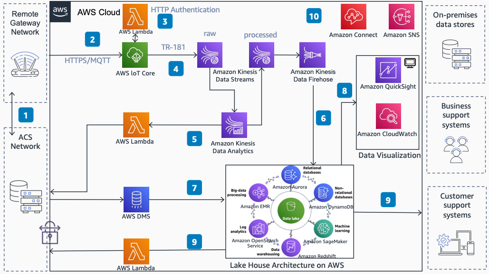

# TR-069 and AWS

Publication date: **2021 ([Diagram history](#tr069-history "#tr069-history"))**

With this architecture, you can connect TR-069 customer premises equipment (CPE) fleets
with AWS for bulk data collection and analytics. The solution uses [AWS IoT Core](../../../iot/latest/developerguide.md "../../../iot/latest/developerguide.md") for device connectivity, [Amazon Kinesis Data Streams](../../../streams/latest/dev.md "../../../streams/latest/dev.md") for
ingestion, and Amazon Managed Service for Apache Flink for real-time
analytics.

## TR-069 and AWS diagram

The following steps describe the data flow and analytics pipeline for this
architecture:

1. Configure remote gateways to send key performance indicators to AWS IoT Core
   through an Auto Configuration Server (ACS) instance. The ACS uses the TR-069 protocol to
   configure remote gateways. Deploy the ACS on-premises or on AWS.
2. Send TR-181 data model parameters from remote gateways to AWS IoT Core by using
   HTTPS with custom domains or Message Queuing Telemetry Transport (MQTT).
3. (Optional) Use an AWS IoT Core custom authorizer for authentication if ingestion
   is done over HTTPS.
4. Route authenticated messages to the rules engine through the Amazon Kinesis Data
   Streams action.
5. Normalize the TR-181 payload by using Amazon Managed Service for Apache
   Flink. Output the processed data to another stream in Amazon Kinesis Data
   Streams. Perform real-time analytics to detect CPE problems. Use findings to start actions
   on the ACS.
6. Store normalized TR-181 data in a data lake repository by using Amazon Data
   Firehose.
7. Bring metrics collected by the ACS (outside TR-069) into the data lake through [AWS Database Migration Service](../../../dms/latest/userguide.md "../../../dms/latest/userguide.md").
8. Visualize data and monitor fleet health by using [Amazon Quick Sight](../../../quicksight/latest/developerguide/welcome.md "../../../quicksight/latest/developerguide/welcome.md"), [Amazon CloudWatch](../../../AmazonCloudWatch/latest/monitoring.md "../../../AmazonCloudWatch/latest/monitoring.md"), and other tools.
9. Use data and insights collected at the data lake to feed external systems. Start
   actions on the ACS based on findings.
10. Notify operational personnel and end customers based on findings by using [Connect Customer](../../../connect/latest/adminguide.md "../../../connect/latest/adminguide.md") and [Amazon Simple Notification Service](../../../sns/latest/dg.md "../../../sns/latest/dg.md").

## Further reading

For additional information, see the following resources:

- [AWS Architecture Icons](https://aws.amazon.com/architecture/icons "https://aws.amazon.com/architecture/icons")
- [AWS Architecture Center](https://aws.amazon.com/architecture/ "https://aws.amazon.com/architecture/")
- [AWS
  Well-Architected](https://aws.amazon.com/architecture/well-architected "https://aws.amazon.com/architecture/well-architected")

## Diagram history

To receive updates about this reference architecture diagram, subscribe to the RSS
feed.

| Change              | Description                                     | Date            |
| ------------------- | ----------------------------------------------- | --------------- |
| Initial publication | Reference architecture diagram first published. | January 1, 2021 |

###### RSS subscription requirement

To subscribe to RSS updates, you must have an RSS plugin enabled for the browser you are
using.
