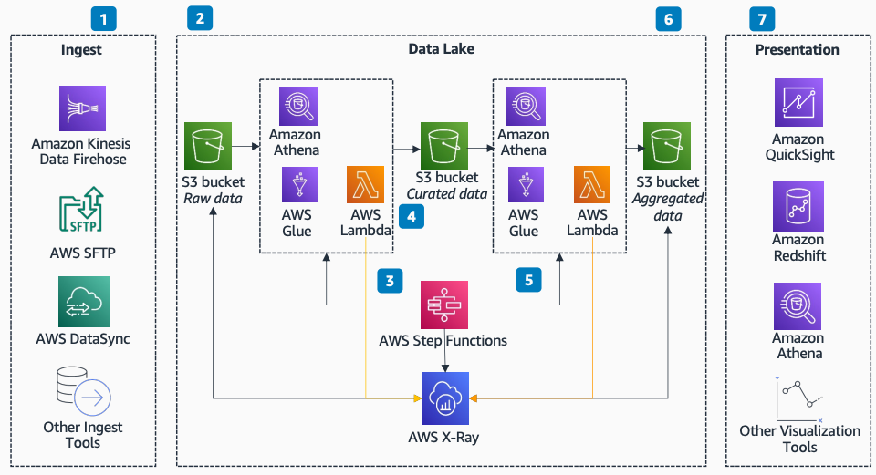

# Tracing Data Lake Ingest and Processing

Publication date: **July 15, 2021 ([Diagram history](#diagram-history "#diagram-history"))**

This architecture shows how to trace your data lake ingestion and processing using AWS X-Ray. You can emit traces from key checkpoints in the flow to diagnose data lake processing lifecycle issues and identify performance bottlenecks.

## Tracing Data Lake Ingest and Processing Using AWS X-Ray

The following steps describe the architecture:

1. Diverse producers deliver data into the data lake built on [Amazon Simple Storage Service](../../../AmazonS3/latest/userguide/Welcome.md "../../../AmazonS3/latest/userguide/Welcome.md").
2. The data first lands in an Amazon S3 bucket for raw data. This is the first trace since AWS X-Ray enables trace messages for Amazon S3 Event Notifications.
3. Data lake curation blocks prepare the data for analytics. [AWS Step Functions](../../../step-functions/latest/dg/welcome.md "../../../step-functions/latest/dg/welcome.md") triggers these processing blocks. AWS X-Ray integrates with Step Functions to help you identify performance bottlenecks and troubleshoot requests that resulted in an error.
4. AWS X-Ray can trace [AWS Lambda](../../../lambda/latest/dg/welcome.md "../../../lambda/latest/dg/welcome.md") functions. Lambda runs the X-Ray daemon and records a segment with details about the function invocation and results. For further instrumentation, bundle the X-Ray SDK with the function to record outgoing calls and add annotations and metadata.
5. Data curation continues with the Step Functions state machine triggering the next curation block. Like the first block, X-Ray can capture Step Functions and Lambda functions.
6. The data lands in an aggregated bucket ready for analytics. This is the last trace in the data lake ingestion flow. With traces emitting from all key checkpoints, you can diagnose data lake processing lifecycle issues.
7. Diverse analytics tools such as [Amazon Quick Sight](../../../quicksight/latest/user/welcome.md "../../../quicksight/latest/user/welcome.md"), Amazon Redshift, and [Amazon Athena](../../../athena/latest/ug/what-is.md "../../../athena/latest/ug/what-is.md") enable you to visualize the data from the data lake built on Amazon S3.

## Further reading

For additional information, refer to the following resources:

- [AWS Architecture Icons](https://aws.amazon.com/architecture/icons "https://aws.amazon.com/architecture/icons")
- [AWS Architecture Center](https://aws.amazon.com/architecture "https://aws.amazon.com/architecture")
- [AWS Well-Architected](https://aws.amazon.com/architecture/well-architected "https://aws.amazon.com/architecture/well-architected")
- [Quick editions](../../../quicksight/latest/user/editions.md "../../../quicksight/latest/user/editions.md")

## Diagram history

To be notified about updates to this reference architecture diagram, subscribe to the RSS feed.

| Change                                                                                                                                 | Description                                     | Date          |
| -------------------------------------------------------------------------------------------------------------------------------------- | ----------------------------------------------- | ------------- |
| Initial publication                                                                                                                    | Reference architecture diagram first published. | July 15, 2021 |
| [Initial publication](traceability-downstream-analytics.md#diagram-history-2 "traceability-downstream-analytics.md#diagram-history-2") | Reference architecture diagram first published. | July 15, 2021 |

###### Note

To subscribe to RSS updates, you must have an RSS plugin enabled for the browser you are using.
