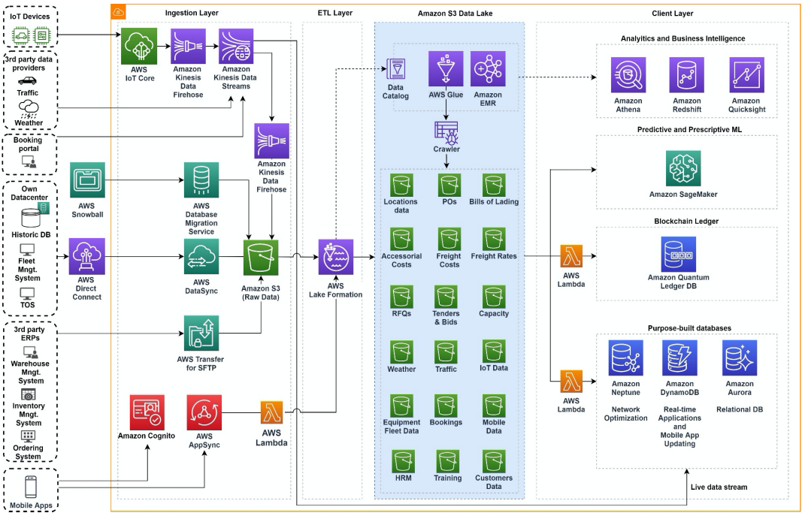

# Transportation and Logistics Data Lake

Publication date: **March 15, 2020 ([Diagram history](#diagram-history "#diagram-history"))**

This architecture shows how to break data silos and create a single repository for transportation and logistics data from multiple sources. You can use a fully managed, pay-per-use, and scalable architecture to remove the complexity and costs of managing on-premises databases.

## Transportation and Logistics Data Lake

The following steps describe the architecture:

1. Ingest data from multiple sources: historical and large databases with AWS Snowball, real-time data with [Amazon Kinesis](../../../streams/latest/dev/introduction.md "../../../streams/latest/dev/introduction.md"), ERP data synchronization with AWS DataSync, and mobile app data with [Amazon AppSync](../../../appsync/latest/devguide/what-is-appsync.md "../../../appsync/latest/devguide/what-is-appsync.md").
2. Automatically extract, transform, and load raw data with [Lake Formation](../../../lake-formation/latest/dg/what-is-lake-formation.md "../../../lake-formation/latest/dg/what-is-lake-formation.md"). Discover schemas and create a data catalog for further data exploration.
3. Create an [Amazon Simple Storage Service](../../../AmazonS3/latest/userguide/Welcome.md "../../../AmazonS3/latest/userguide/Welcome.md") data lake where you can store, organize, and access business-critical data securely. Use Amazon EMR for fine-grained control over extraction, transformation, and loading (ETL) jobs. Use [AWS Glue](../../../glue/latest/dg/what-is-glue.md "../../../glue/latest/dg/what-is-glue.md") to manage your data catalog.
4. Turn raw data into actionable knowledge with [Athena](../../../athena/latest/ug/what-is.md "../../../athena/latest/ug/what-is.md") and [Amazon Quick Sight](../../../quicksight/latest/user/welcome.md "../../../quicksight/latest/user/welcome.md"). Disseminate key business intelligence insights across your organization. Use SageMaker AI to deliver ML-based predictive and prescriptive analytics.
5. Use AWS fully managed databases to deliver specific capabilities: Amazon Neptune graph database for network optimization, Amazon Aurora for fast relational queries, and [Amazon DynamoDB](../../../amazondynamodb/latest/developerguide/Introduction.md "../../../amazondynamodb/latest/developerguide/Introduction.md") for interactive mobile and web apps with real-time updates. Avoid data latency with live data stream ingestion from Amazon Kinesis.

## Further reading

For additional information, refer to the following resources:

- [AWS Architecture Icons](https://aws.amazon.com/architecture/icons "https://aws.amazon.com/architecture/icons")
- [AWS Architecture Center](https://aws.amazon.com/architecture "https://aws.amazon.com/architecture")
- [AWS Well-Architected](https://aws.amazon.com/architecture/well-architected "https://aws.amazon.com/architecture/well-architected")

## Diagram history

To be notified about updates to this reference architecture diagram, subscribe to the RSS feed.

| Change              | Description                                     | Date           |
| ------------------- | ----------------------------------------------- | -------------- |
| Initial publication | Reference architecture diagram first published. | March 15, 2020 |

###### Note

To subscribe to RSS updates, you must have an RSS plugin enabled for the browser you are using.
