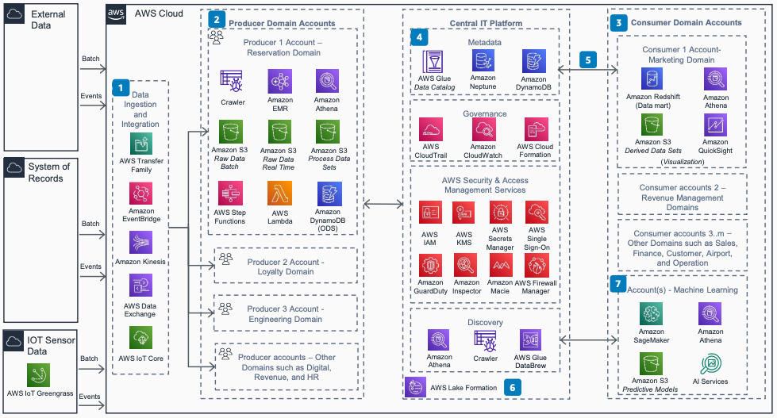
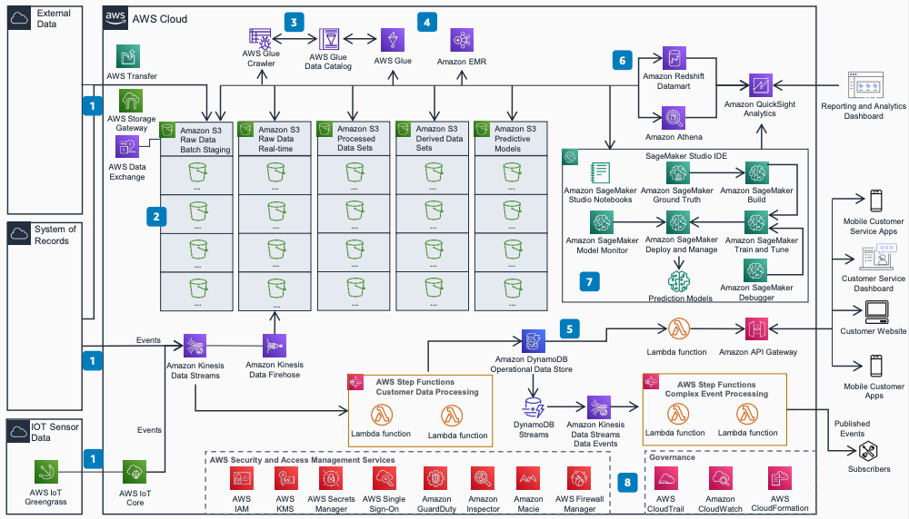

# Implementing Travel and Hospitality Data Mesh

Publication date: **August 3, 2021 ([Diagram history](#travel-hospitality-data-mesh-history "#travel-hospitality-data-mesh-history"))**

The travel and hospitality industries face challenges when generating, accessing,
and analyzing data at scale. Use this approach to build a data platform that serves
both operational and analytical needs.

This architecture uses domain-owned design, maintained data properties, open data
standards, purpose-built databases, and extensible serverless architecture. It helps
relieve and eventually replace on-premises data platform load.

## Domain architecture diagram

The following steps describe the domain architecture:

1. Data flows into AWS through batch processing, real-time data, SFTP, and
   Internet of Things (IoT) sensors.
2. Data sources are managed by the business domain. Producers use
   organization-level blueprints for security, governance, and open standards.
   Producers build the operational data store by using [Amazon DynamoDB](../../../amazondynamodb/latest/developerguide.md "../../../amazondynamodb/latest/developerguide.md") and DynamoDB
   Accelerator (DAX) for consistent single-digit-millisecond latency.
3. Consumer domains process data sets from multiple producer domains based on
   business needs. Build data marts in [Amazon Redshift](../../../redshift/latest/dg.md "../../../redshift/latest/dg.md") and analytics in [Amazon Quick Sight](../../../quicksight/latest/user/welcome.md "../../../quicksight/latest/user/welcome.md").
4. Manage metadata through multiple services. Use [AWS Glue](../../../glue/latest/dg.md "../../../glue/latest/dg.md") for data cataloging. Store data lineage in
   [Amazon Neptune](../../../neptune/latest/userguide.md "../../../neptune/latest/userguide.md"). Store data contracts in
   DynamoDB.
5. Consumers search and filter data sets in the central data catalog. Filter by
   name, contents, sensitivity, or custom labels.
6. [Lake Formation](../../../lake-formation/latest/dg.md "../../../lake-formation/latest/dg.md")
   provides centralized management of security, governance, and auditing with
   fine-grained permissions. It provides automatic schema discovery and format
   conversion.
7. Perform machine learning (ML) by using Lake Formation. Use [Amazon SageMaker AI](../../../sagemaker/latest/dg.md "../../../sagemaker/latest/dg.md") for standard AI/ML models. Use
   [Amazon Personalize](../../../personalize/latest/dg.md "../../../personalize/latest/dg.md") for actionable insights.

## Service architecture diagram

The following steps describe the service architecture:

1. Data flows into AWS through batch, real-time, SFTP, and IoT sensors.
2. Stage all batch and real-time data in [Amazon S3](../../../AmazonS3/latest/userguide.md "../../../AmazonS3/latest/userguide.md").
3. AWS Glue crawler creates table metadata in the data catalog.
4. Use open standards to build the data lake. Use a read-pattern schema for raw
   and curated data.
5. Use purpose-built databases like DynamoDB and serverless architecture for
   microservices and events in the operational data store.
6. Build reportable data sets in Amazon S3. Use Amazon Redshift and [Athena](../../../athena/latest/ug.md "../../../athena/latest/ug.md") for analytics. For ad hoc requirements,
   use Athena with standard SQL.
7. Use SageMaker AI for AI/ML models.
8. Use a [multi-account
   strategy](../account-security-data-platform/account-security-data-platform.md "../account-security-data-platform/account-security-data-platform.md") for resource and security isolation.

## Further reading

For additional information, see the following resources:

- [AWS Architecture Icons](https://aws.amazon.com/architecture/icons "https://aws.amazon.com/architecture/icons")
- [AWS Architecture Center](https://aws.amazon.com/architecture/ "https://aws.amazon.com/architecture/")
- [AWS Well-Architected](https://aws.amazon.com/architecture/well-architected "https://aws.amazon.com/architecture/well-architected")

## Diagram history

To receive updates about this reference architecture diagram, subscribe to the RSS
feed.

| Change              | Description                                     | Date           |
| ------------------- | ----------------------------------------------- | -------------- |
| Initial publication | Reference architecture diagram first published. | August 3, 2021 |

###### RSS subscription requirement

To subscribe to RSS updates, you must have an RSS plugin enabled for the browser you
are using.
