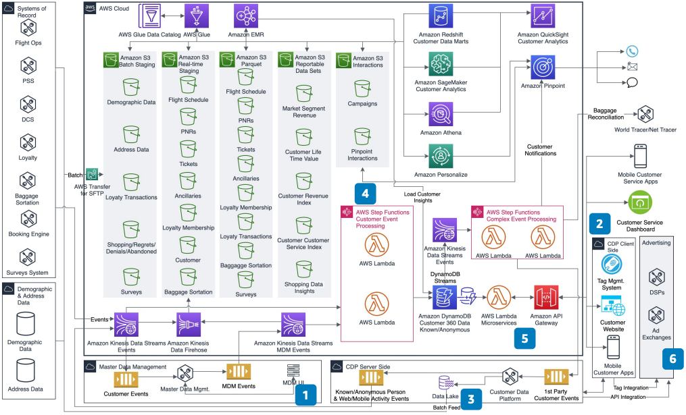

# Traveler 360 Data Platform for Airlines

Publication date: **November 11, 2020 ([Diagram history](#traveler-360-history "#traveler-360-history"))**

With this architecture, you can identify known and unknown travelers across all channels.
Use customer interaction activity to execute offers and campaigns with high return on investment
(ROI).

Airline companies often rely on a single vendor solution such as a customer data platform
(CDP) or master data management (MDM) platform. This approach leaves gaps in capability,
creates data silos, and prevents a full view of guests and activity across all channels. This
architecture combines the best capabilities from CDP and MDM to build a true traveler 360 data
platform. It provides unfettered access to business users and data scientists. It
operationalizes traveler insights by making them available as services and business
events.

This reference architecture builds upon the [Personalization
Using AI/ML for Airlines](../personalization-ai-ml-airlines/personalization-ai-ml-airlines.md "../personalization-ai-ml-airlines/personalization-ai-ml-airlines.md"). It extends personalization to known and
anonymous customers by using CDPs.

## Traveler 360 data platform diagram

The following steps describe the architecture:

1. Use MDM tools to create a unified traveler profile. Identify loyalty members
   through addressable attributes such as email and phone.
2. The CDP client-side uses tag management and first-party cookies. Collect web and
   mobile activity from travelers.
3. The CDP server-side collects activity and identifies anonymous users. Augment
   profiles with loyalty and unified traveler data.
4. Process and curate all traveler activity in a data lake. Activity includes loyalty,
   reservations, check-ins, purchases, marketing, web, mobile, and call center data.
5. Traveler 360 microservices and business events personalize offers. Deliver targeted
   campaigns based on traveler profiles.
6. (Optional) Use the CDP to share anonymous traveler attributes with partners. Share
   only non-identifiable attributes.

## Further reading

For additional information, see the following resources:

- [AWS Architecture Icons](https://aws.amazon.com/architecture/icons "https://aws.amazon.com/architecture/icons")
- [AWS Architecture Center](https://aws.amazon.com/architecture/ "https://aws.amazon.com/architecture/")
- [AWS Well-Architected](https://aws.amazon.com/architecture/well-architected "https://aws.amazon.com/architecture/well-architected")

## Diagram history

To receive updates about this reference architecture diagram, subscribe to the RSS
feed.

| Change              | Description                                     | Date              |
| ------------------- | ----------------------------------------------- | ----------------- |
| Initial publication | Reference architecture diagram first published. | November 11, 2020 |

###### RSS subscription requirement

To subscribe to RSS updates, you must have an RSS plugin enabled for the browser you
are using.
