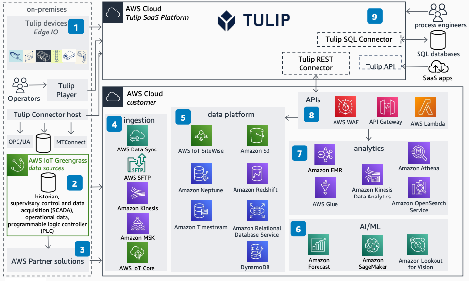

# Tulip Next-Gen MES on AWS

Publication date: **October 11, 2022 ([Diagram history](#tulip-diagram-history "#tulip-diagram-history"))**

With this architecture, you can build end-to-end data flows between the
Tulip Frontline Operations Platform and your Amazon VPC. You can generate actionable
insights for operational excellence using a manufacturing execution system (MES). This
architecture uses [AWS IoT Greengrass](../../../greengrass/v2/developerguide.md "../../../greengrass/v2/developerguide.md"), [AWS IoT Core](../../../iot/latest/developerguide.md "../../../iot/latest/developerguide.md"), [Amazon S3](../../../AmazonS3/latest/userguide.md "../../../AmazonS3/latest/userguide.md"), [Amazon SageMaker AI](../../../sagemaker/latest/dg.md "../../../sagemaker/latest/dg.md"), and [Amazon API Gateway](../../../apigateway/latest/developerguide.md "../../../apigateway/latest/developerguide.md").

## Tulip Next-Gen MES architecture diagram

The following steps describe the architecture:

1. Tulip Edge IO device provides connectivity to barcode scanners,
   cameras, printers, and scales. Tulip Connector host connects to local
   devices on-premises.
2. Ingest data from multiple sources. AWS IoT Greengrass connectors provide OPC-UA,
   Modbus-TCP, Modbus-RTU, and EtherNet/IP connectivity.
3. AWS Partner solutions connect to additional data sources and provide
   context.
4. Select ingestion services based on source. Use [AWS DataSync](../../../datasync/latest/userguide.md "../../../datasync/latest/userguide.md") for file shares. Use [Amazon Kinesis](../../../kinesis/latest/dev.md "../../../kinesis/latest/dev.md"), [Amazon Managed Streaming for Apache Kafka](../../../msk/latest/developerguide.md "../../../msk/latest/developerguide.md"), AWS IoT Core, or
   [AWS Transfer Family](../../../transfer/latest/userguide.md "../../../transfer/latest/userguide.md") for
   streaming data.
5. Store data optimized for workload. Use [Amazon DynamoDB](../../../amazondynamodb/latest/developerguide.md "../../../amazondynamodb/latest/developerguide.md") for key-value, Amazon S3 for
   objects, [Amazon Neptune](../../../neptune/latest/userguide.md "../../../neptune/latest/userguide.md") for graphs, [Amazon Redshift](../../../redshift/latest/dg.md "../../../redshift/latest/dg.md") for warehousing, [Amazon Timestream](../../../timestream/latest/developerguide.md "../../../timestream/latest/developerguide.md") for
   time series, and [AWS IoT SiteWise](../../../iot-sitewise/latest/userguide.md "../../../iot-sitewise/latest/userguide.md") for industrial equipment data.
6. Use AI and ML services such as [Amazon Forecast](../../../forecast/latest/dg.md "../../../forecast/latest/dg.md") and Amazon SageMaker AI to build, train, and deploy
   ML models.
7. Use analytics services including [Amazon EMR](../../../emr/latest/ManagementGuide.md "../../../emr/latest/ManagementGuide.md"), [AWS Glue](../../../glue/latest/dg.md "../../../glue/latest/dg.md"), [Amazon Athena](../../../athena/latest/ug.md "../../../athena/latest/ug.md"), [Amazon Data Firehose](../../../firehose/latest/dev.md "../../../firehose/latest/dev.md"), and [Amazon OpenSearch Service](../../../opensearch-service/latest/developerguide.md "../../../opensearch-service/latest/developerguide.md") for data
   processing.
8. [AWS WAF](../../../waf/latest/developerguide.md "../../../waf/latest/developerguide.md") provides
   protection. Amazon API Gateway supports REST methods for Amazon S3, [Amazon Lookout for Vision](https://aws.amazon.com/blogs/machine-learning/exploring-alternatives-and-seamlessly-migrating-data-from-amazon-lookout-for-vision/ "https://aws.amazon.com/blogs/machine-learning/exploring-alternatives-and-seamlessly-migrating-data-from-amazon-lookout-for-vision/"), [Amazon Textract](../../../textract/latest/dg.md "../../../textract/latest/dg.md"), and [Amazon Rekognition](../../../rekognition/latest/dg.md "../../../rekognition/latest/dg.md").
9. The Tulip platform provides a no-code environment to create
   applications. Ingest data through Tulip Connectors.

## Further reading

For additional information, see the following resources:

- [AWS Architecture Icons](https://aws.amazon.com/architecture/icons "https://aws.amazon.com/architecture/icons")
- [AWS Architecture Center](https://aws.amazon.com/architecture "https://aws.amazon.com/architecture")
- [AWS Well-Architected](https://aws.amazon.com/architecture/well-architected "https://aws.amazon.com/architecture/well-architected")
- [Industrial Data Platform on AWS](../industrial-data-platform/industrial-data-platform.md "../industrial-data-platform/industrial-data-platform.md")

## Diagram history

To be notified about updates to this reference architecture diagram, subscribe to the RSS feed.

| Change              | Description                                     | Date             |
| ------------------- | ----------------------------------------------- | ---------------- |
| Initial publication | Reference architecture diagram first published. | October 11, 2022 |

###### RSS subscription

To subscribe to RSS updates, you must have an RSS plugin enabled for the browser that you are using.
