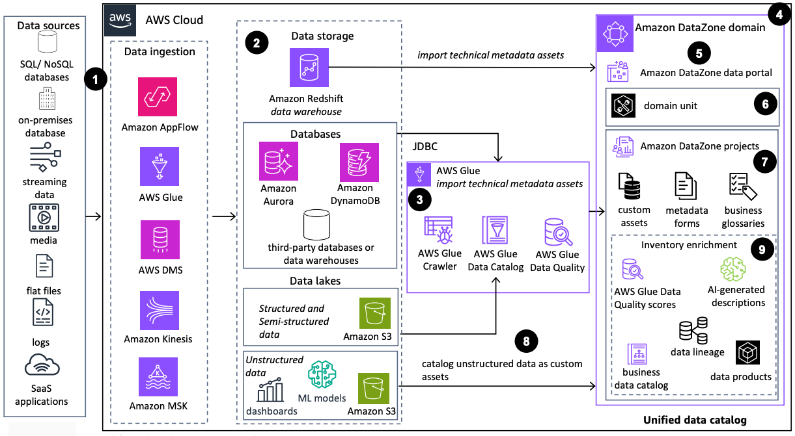

# Building a Unified Catalog with Amazon DataZone

Publication date: **November 20, 2024 ([Diagram history](#diagram-history "#diagram-history"))**

The unified data catalog acts as a central repository for all your organization's data assets. This architecture shows how [Amazon DataZone](../../../datazone/latest/userguide/what-is-datazone.md "../../../datazone/latest/userguide/what-is-datazone.md") breaks down data silos by bringing data from various sources together and fostering improved search functionality and trust in data.

## Building a Unified Catalog with Amazon DataZone

The following steps describe the architecture:

1. Extract data using [Amazon AppFlow](../../../appflow/latest/userguide/what-is-appflow.md "../../../appflow/latest/userguide/what-is-appflow.md"), [AWS Glue](../../../glue/latest/dg/what-is-glue.md "../../../glue/latest/dg/what-is-glue.md"), [Amazon Kinesis](../../../streams/latest/dev/introduction.md "../../../streams/latest/dev/introduction.md"), Amazon Managed Streaming for Apache Kafka (Amazon MSK), or [AWS Database Migration Service](../../../dms/latest/userguide/Welcome.md "../../../dms/latest/userguide/Welcome.md") (AWS DMS).
2. Based on end user requirements, store the data in [Amazon S3](../../../AmazonS3/latest/userguide/Welcome.md "../../../AmazonS3/latest/userguide/Welcome.md"), [Amazon Redshift](../../../redshift/latest/dg/welcome.md "../../../redshift/latest/dg/welcome.md"), or purpose-built databases like [Amazon Aurora](../../../AmazonRDS/latest/AuroraUserGuide/CHAP_AuroraOverview.md "../../../AmazonRDS/latest/AuroraUserGuide/CHAP_AuroraOverview.md") or [DynamoDB](../../../amazondynamodb/latest/developerguide/Introduction.md "../../../amazondynamodb/latest/developerguide/Introduction.md"). Design data lakes to store raw structured, semi-structured, and unstructured data at low cost.
3. Crawl structured and semi-structured data from Amazon S3 using [AWS Glue Crawler](../../../glue/latest/dg/add-crawler.md "../../../glue/latest/dg/add-crawler.md"), which writes metadata to [AWS Glue Data Catalog](../../../glue/latest/dg/catalog-and-crawler.md "../../../glue/latest/dg/catalog-and-crawler.md"). Perform [data quality](https://aws.amazon.com/glue/features/data-quality/ "https://aws.amazon.com/glue/features/data-quality/") checks on catalog tables at rest using AWS Glue Data Quality. Use Java Database Connectivity (JDBC) data sources to crawl and catalog the data.
4. The [Amazon DataZone](../../../datazone/latest/userguide/what-is-datazone.md "../../../datazone/latest/userguide/what-is-datazone.md") domain acts as the central catalog repository hub. Use the AWS Glue Data Catalog data source to onboard existing data assets from data lakes and databases. With Amazon Redshift, automatically extract technical metadata of database tables and views to Amazon DataZone.
5. Use the [Amazon DataZone data portal](https://aws.amazon.com/datazone/features/data-discovery/ "https://aws.amazon.com/datazone/features/data-discovery/") to discover, catalog, share, and govern data in a self-serve fashion.
6. Organize Amazon DataZone entities under different levels of hierarchy using [domain units](../../../datazone/latest/userguide/create-domain-unit.md "../../../datazone/latest/userguide/create-domain-unit.md").
7. [Amazon DataZone data projects](../../../datazone/latest/userguide/create-new-project.md "../../../datazone/latest/userguide/create-new-project.md") provide a collaborative space where members onboard data assets from their respective business units. [Business glossaries](../../../datazone/latest/userguide/create-maintain-business-glossary.md "../../../datazone/latest/userguide/create-maintain-business-glossary.md") define business terms associated with data assets. [Metadata forms](../../../datazone/latest/userguide/create-metadata-form.md "../../../datazone/latest/userguide/create-metadata-form.md") augment business context of asset metadata. [Custom assets](../../../datazone/latest/userguide/create-asset-types.md "../../../datazone/latest/userguide/create-asset-types.md") expand the catalog beyond predefined system assets.
8. Catalog unstructured data assets stored in Amazon S3 and publish them to Amazon DataZone by tagging them with relevant [custom asset types](../../../datazone/latest/userguide/create-asset-types.md "../../../datazone/latest/userguide/create-asset-types.md").
9. Every data asset onboarded to Amazon DataZone is part of Inventory. Enrich the data asset with business catalogs, data lineage, and data quality to aid discoverability.

## Further reading

For additional information, refer to the following resources:

- [AWS Architecture Icons](https://aws.amazon.com/architecture/icons "https://aws.amazon.com/architecture/icons")
- [AWS Architecture Center](https://aws.amazon.com/architecture "https://aws.amazon.com/architecture")
- [AWS Well-Architected](https://aws.amazon.com/architecture/well-architected "https://aws.amazon.com/architecture/well-architected")

## Diagram history

To be notified about updates to this reference architecture diagram, subscribe to the RSS feed.

| Change              | Description                                     | Date              |
| ------------------- | ----------------------------------------------- | ----------------- |
| Initial publication | Reference architecture diagram first published. | November 20, 2024 |

###### Note

To subscribe to RSS updates, you must have an RSS plugin enabled for the browser you are using.
