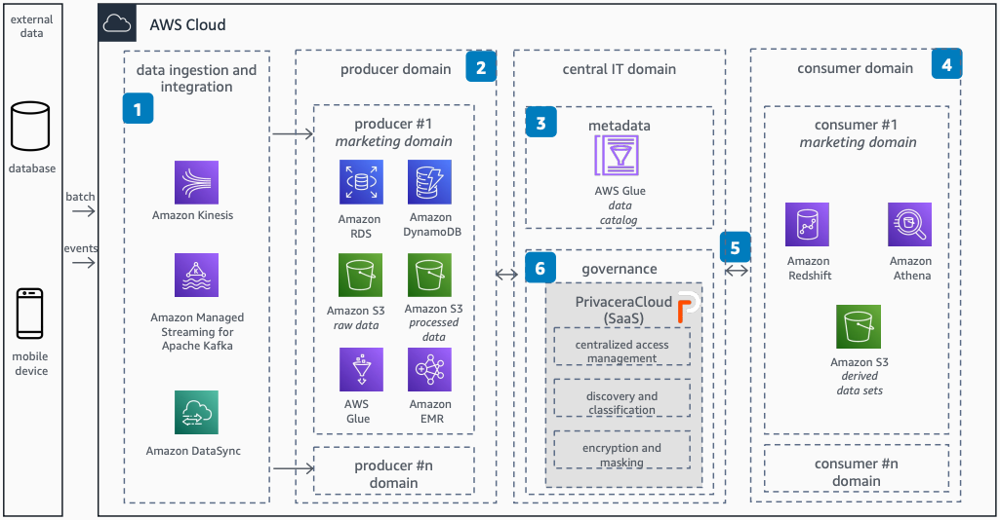

# Unified Data Access Governance in a Data Mesh

Publication date: **February 13, 2023 ([Diagram history](#diagram-history "#diagram-history"))**

PrivaceraCloud provides federated computation governance for consistent data access control, governed data sharing, and compliance across AWS services and external on-premises data sources.

## Unified Data Access Governance in a Data Mesh Using PrivaceraCloud on AWS

The following steps describe the architecture:

1. Data flows into AWS through batch processing, real-time data, or change data capture (CDC).
2. The producer domain manages data sources. Raw data is stored in [Amazon S3](../../../AmazonS3/latest/userguide/Welcome.md "../../../AmazonS3/latest/userguide/Welcome.md") and processed using [Amazon EMR](../../../emr/latest/ManagementGuide/emr-what-is-emr.md "../../../emr/latest/ManagementGuide/emr-what-is-emr.md"), [AWS Glue](../../../glue/latest/dg/what-is-glue.md "../../../glue/latest/dg/what-is-glue.md"), [DynamoDB](../../../amazondynamodb/latest/developerguide/Introduction.md "../../../amazondynamodb/latest/developerguide/Introduction.md"), and [Amazon RDS](../../../AmazonRDS/latest/UserGuide/Welcome.md "../../../AmazonRDS/latest/UserGuide/Welcome.md").
3. Metadata is managed through multiple services. AWS Glue provides data cataloging for discovery and governance.
4. The consumer domain uses processed data sets from multiple producer domains based on business needs. Consumers build a data mart using [Amazon Redshift](../../../redshift/latest/dg/welcome.md "../../../redshift/latest/dg/welcome.md") and [Athena](../../../athena/latest/ug/what-is.md "../../../athena/latest/ug/what-is.md").
5. Consumers search and filter data sets recorded in the central data catalog by name, contents, sensitivity, or custom labels.
6. PrivaceraCloud delivers unified data access governance as a fully managed SaaS solution. Built on the attribute-based access control (ABAC) policy model of Apache Ranger, it applies governance to Amazon S3, AWS Glue, Amazon EMR, Amazon RDS, DynamoDB, Athena, and Amazon Redshift.

## Further reading

For additional information, refer to the following resources:

- [AWS Architecture Icons](https://aws.amazon.com/architecture/icons "https://aws.amazon.com/architecture/icons")
- [AWS Architecture Center](https://aws.amazon.com/architecture "https://aws.amazon.com/architecture")
- [AWS Well-Architected](https://aws.amazon.com/architecture/well-architected "https://aws.amazon.com/architecture/well-architected")

## Diagram history

To be notified about updates to this reference architecture diagram, subscribe to the RSS feed.

| Change              | Description                                     | Date              |
| ------------------- | ----------------------------------------------- | ----------------- |
| Initial publication | Reference architecture diagram first published. | February 13, 2023 |

###### Note

To subscribe to RSS updates, you must have an RSS plugin enabled for the browser you are using.
