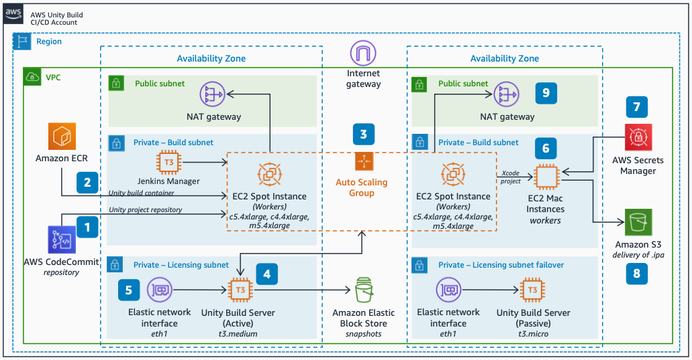

# Unity Build Pipeline: iOS Games on AWS Cloud

Publication date: **November 24, 2021 ([Diagram history](#diagram-history "#diagram-history"))**

This architecture shows how to build Unity-based games for iOS in the AWS Cloud with Jenkins by using a two-stage pipeline on Amazon EC2 Spot Instances and Amazon EC2 Mac Instances.

## Unity Build Pipeline: iOS Games on AWS Cloud

1. Source code is stored in an [AWS CodeCommit](../../../codecommit/latest/userguide/welcome.md "../../../codecommit/latest/userguide/welcome.md") repository. Jenkins pulls it on a build start.
2. A Unity container image is pulled from Amazon Elastic Container Registry and deployed by the Jenkins Docker agent on a worker node.
3. The first build stage runs on [Amazon EC2](../../../AWSEC2/latest/UserGuide/concepts.md "../../../AWSEC2/latest/UserGuide/concepts.md") Spot Instances. It generates an Xcode project from Unity source code. These instances are placed into an Auto Scaling group for scalability and redundancy.
4. A Unity Build Server vends floating licenses to workers in the Auto Scaling group.
5. The Unity license binds to the Amazon EC2 instance's Ethernet interface MAC address. An elastic network interface preserves the MAC address if the instance is recreated.
6. The resulting Xcode project transfers to a Jenkins worker on an Amazon EC2 Mac Instance. This worker finalizes and signs the build and exports an .ipa file.
7. Certificates, private keys, and provisioning profiles are stored in AWS Secrets Manager. The Mac dynamically pulls them during a build.
8. An .ipa archive file is exported as a Jenkins artifact and stored in an [Amazon S3](../../../AmazonS3/latest/userguide/Welcome.md "../../../AmazonS3/latest/userguide/Welcome.md") bucket.

## Further reading

For additional information, refer to

- [AWS Architecture Icons](https://aws.amazon.com/architecture/icons "https://aws.amazon.com/architecture/icons")
- [AWS Architecture Center](https://aws.amazon.com/architecture "https://aws.amazon.com/architecture")
- [AWS Well-Architected](https://aws.amazon.com/architecture/well-architected "https://aws.amazon.com/architecture/well-architected")
- [AWS Game Tech product page](https://aws.amazon.com/gametech/ "https://aws.amazon.com/gametech/")

## Diagram history

To be notified about updates to this reference architecture diagram, subscribe to the RSS feed.

| Change              | Description                                     | Date              |
| ------------------- | ----------------------------------------------- | ----------------- |
| Initial publication | Reference architecture diagram first published. | November 24, 2021 |

###### Note

To subscribe to RSS updates, you must have an RSS plugin enabled for the browser you are using.
