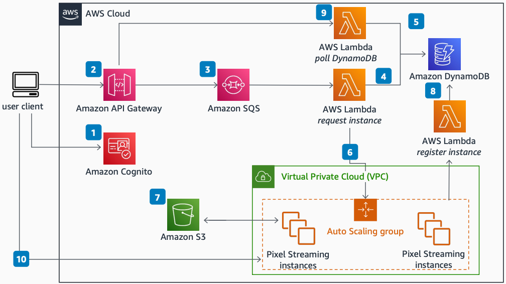

# Unreal Engine's Pixel Streaming on AWS

Publication date: **January 6, 2023 ([Diagram history](#pixel-history "#pixel-history"))**

This architecture shows a simple implementation of Unreal Engine's Pixel
Streaming feature on AWS. The architecture uses a serverless matchmaker composed of [Amazon Simple Queue Service](../../../AWSSimpleQueueService/latest/SQSDeveloperGuide.md "../../../AWSSimpleQueueService/latest/SQSDeveloperGuide.md"),
[AWS Lambda](../../../lambda/latest/dg.md "../../../lambda/latest/dg.md"), and [Amazon DynamoDB](../../../amazondynamodb/latest/developerguide.md "../../../amazondynamodb/latest/developerguide.md"). Both the
streaming instance and signaling servers are hosted in the same [Amazon Elastic Compute Cloud](../../../AWSEC2/latest/UserGuide.md "../../../AWSEC2/latest/UserGuide.md") instance.

## Unreal Engine's Pixel Streaming on AWS diagram

The following steps describe the architecture:

1. The client requests an [Amazon Cognito](../../../cognito/latest/developerguide.md "../../../cognito/latest/developerguide.md") identity and temporary AWS
   credentials.
2. The client signs a request to [Amazon API Gateway](../../../apigateway/latest/developerguide.md "../../../apigateway/latest/developerguide.md") with the temporary
   credentials.
3. API Gateway forwards the request to Amazon SQS to ensure requests are handled in order.
4. Lambda checks DynamoDB for an available streaming instance. If none are available, it can
   request a new instance.
5. DynamoDB stores required metadata such as the instance status, IP address, port number,
   and user reservation details.
6. If an instance is not available, Lambda requests that a new one be created.
7. [Amazon Simple Storage Service](../../../AmazonS3/latest/userguide.md "../../../AmazonS3/latest/userguide.md") stores
   static assets such as game builds and bootstrap scripts.
8. After a new instance is created, its metadata is written to DynamoDB by using
   Lambda.
9. A separate route in API Gateway lets the client poll DynamoDB for their assigned
   instance.
10. The client uses the IP and port returned from DynamoDB to connect to their assigned
    instance.

## Further reading

For additional information, see the following resources:

- [AWS Architecture Icons](https://aws.amazon.com/architecture/icons "https://aws.amazon.com/architecture/icons")
- [AWS Architecture Center](https://aws.amazon.com/architecture/ "https://aws.amazon.com/architecture/")
- [AWS
  Well-Architected](https://aws.amazon.com/architecture/well-architected "https://aws.amazon.com/architecture/well-architected")

## Diagram history

To be notified about updates to this reference architecture diagram, subscribe to the RSS
feed.

| Change              | Description                                     | Date            |
| ------------------- | ----------------------------------------------- | --------------- |
| Initial publication | Reference architecture diagram first published. | January 6, 2023 |

###### Note

To subscribe to RSS updates, you must have an RSS plugin enabled for the browser you are
using.
