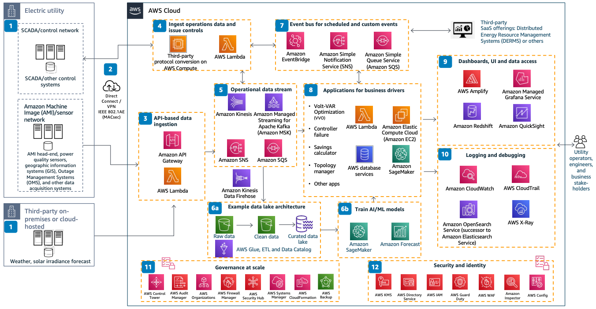

# Utility Volt-VAR Management Framework

Publication date: **February 22, 2022 ([Diagram history](#vvo-history "#vvo-history"))**

With this architecture, you can build highly scalable distribution grid management
applications such as Volt-VAR Optimization (VVO). You can also build sensor and controller
abnormality detection and grid analytics applications. The solution uses an event-driven,
microservices-oriented framework with [Amazon Managed Streaming for Apache Kafka](../../../msk/latest/developerguide.md "../../../msk/latest/developerguide.md") for streaming, [AWS Lambda](../../../lambda/latest/dg.md "../../../lambda/latest/dg.md") for serverless compute, and [Amazon SageMaker AI](../../../sagemaker/latest/dg.md "../../../sagemaker/latest/dg.md") for machine learning
(ML).

## Utility Volt-VAR Management Framework diagram

The following steps describe the data ingestion, processing, and application components
for this architecture:

1. Integrate with existing utility Operations Technology (OT) systems and third-party
   systems to activate the distribution Volt-VAR management framework. Connect the Advanced
   Metering Infrastructure (AMI) head-end, power quality sensors, Geographic Information
   Systems (GIS), Outage Management Systems (OMS), SCADA, and other data acquisition
   systems.
2. Connect to AWS through a VPN with high reliability. For guaranteed bandwidth, use
   [AWS Direct Connect](../../../directconnect/latest/UserGuide.md "../../../directconnect/latest/UserGuide.md")
   with IEEE 802.1AE (MACSec) encryption.
3. Ingest API-based data by using serverless technologies such as [Amazon API Gateway](../../../apigateway/latest/developerguide.md "../../../apigateway/latest/developerguide.md") and
   Lambda. This provides cost-effective and highly scalable data ingestion from measurement
   and topology source systems.
4. Ingest data and issue controls through existing on-premises supervisory control and
   data acquisition (SCADA) systems with protocol-based integration. Maintain supervisory
   control of AWS-based applications through the existing SCADA system.
5. Stream all measurement data by using the technology or service of your choice. Trade
   off ease of use against real-time streaming needs with [Amazon Kinesis](../../../streams/latest/dev.md "../../../streams/latest/dev.md") or Amazon MSK.
6. 6A. Load real-time data streams reliably into a data lake by using [Amazon Data Firehose](../../../firehose/latest/dev.md "../../../firehose/latest/dev.md"). Store data durably and cost-effectively in [Amazon Simple Storage Service](../../../AmazonS3/latest/userguide.md "../../../AmazonS3/latest/userguide.md") for your data lake. Automate the
   extract, transform, and load (ETL) process with [AWS Glue](../../../glue/latest/dg.md "../../../glue/latest/dg.md") to clean and transform data into business-ready
   formats.

6B. Derive valuable insights from your curated data lake by using AI/ML services such
as SageMaker AI and [Amazon Forecast](../../../forecast/latest/dg.md "../../../forecast/latest/dg.md"). Retrain ML models every few hours or days
and publish an inference endpoint for use by real-time applications. 7. Activate event-driven architectural patterns with a serverless event bus by using
[Amazon EventBridge](../../../eventbridge/latest/userguide.md "../../../eventbridge/latest/userguide.md") or a
combination of [Amazon Simple Notification Service](../../../sns/latest/dg.md "../../../sns/latest/dg.md") and [Amazon Simple Queue Service](../../../AWSSimpleQueueService/latest/SQSDeveloperGuide.md "../../../AWSSimpleQueueService/latest/SQSDeveloperGuide.md"). Use
Amazon EventBridge for integration with third-party SaaS offerings such as Distributed Energy
Resource Management Systems (DERMS). 8. Develop event-driven VVO applications. Use real-time operational data streams as
input. Build cost-effective, highly scalable microservices with serverless Lambda. Use high
performance computing (HPC)-optimized [Amazon Elastic Compute Cloud](../../../AWSEC2/latest/UserGuide.md "../../../AWSEC2/latest/UserGuide.md") instances for power-flow-based
calculations. Choose from a broad selection of database services for
application-specific data access patterns. Run online inferences on pre-trained ML models
by using SageMaker AI endpoints. 9. Create real-time operational dashboards by using [Amazon Managed Service for
Grafana](../../../grafana/latest/userguide.md "../../../grafana/latest/userguide.md"). Create BI dashboards by using [Amazon Quick Sight](../../../quicksight/latest/developerguide/welcome.md "../../../quicksight/latest/developerguide/welcome.md"). Accelerate custom web application UI
development and hosting with [AWS Amplify](../../../amplify/latest/userguide.md "../../../amplify/latest/userguide.md"). Query petabytes of data across
your data warehouse and data lake by using standard SQL with [Amazon Redshift](../../../redshift/latest/mgmt.md "../../../redshift/latest/mgmt.md"). 10. Log all account activity with [AWS CloudTrail](../../../awscloudtrail/latest/userguide.md "../../../awscloudtrail/latest/userguide.md"). Monitor cloud resources and
applications by using [Amazon CloudWatch](../../../AmazonCloudWatch/latest/monitoring.md "../../../AmazonCloudWatch/latest/monitoring.md") to collect and track
metrics, monitor log files, and set alarms. Search, analyze, and visualize logs for
real-time insights with [Amazon OpenSearch Service](../../../opensearch-service/latest/developerguide.md "../../../opensearch-service/latest/developerguide.md"). Analyze and debug
distributed, microservices-based VVO applications by using [AWS X-Ray](../../../xray/latest/devguide.md "../../../xray/latest/devguide.md"). 11. Govern cloud resources and apply security controls at scale from a centralized
location by using services such as [AWS Control Tower](../../../controltower/latest/userguide.md "../../../controltower/latest/userguide.md"), [AWS Audit Manager](../../../audit-manager/latest/userguide.md "../../../audit-manager/latest/userguide.md"), AWS Systems Manager,
[AWS Firewall Manager](../../../waf/latest/developerguide/fms-chapter.md "../../../waf/latest/developerguide/fms-chapter.md"), and [AWS Security Hub CSPM](../../../securityhub/latest/userguide.md "../../../securityhub/latest/userguide.md"). 12. Control access with [AWS Identity and Access Management](../../../IAM/latest/UserGuide.md "../../../IAM/latest/UserGuide.md") and [Directory Service](../../../directoryservice/latest/admin-guide.md "../../../directoryservice/latest/admin-guide.md"). Monitor network traffic for
malicious activity by using [Amazon GuardDuty](../../../guardduty/latest/ug.md "../../../guardduty/latest/ug.md"). Encrypt all data at rest with
[AWS Key Management Service](../../../kms/latest/developerguide.md "../../../kms/latest/developerguide.md") and data in transit by using
Transport Layer Security (TLS) encryption. Use [AWS Config](../../../config/latest/developerguide.md "../../../config/latest/developerguide.md") to assess all cloud configurations
and any changes.

## Further reading

For additional information, see the following resources:

- [AWS Architecture Icons](https://aws.amazon.com/architecture/icons "https://aws.amazon.com/architecture/icons")
- [AWS Architecture Center](https://aws.amazon.com/architecture/ "https://aws.amazon.com/architecture/")
- [AWS
  Well-Architected](https://aws.amazon.com/architecture/well-architected "https://aws.amazon.com/architecture/well-architected")

## Diagram history

To receive updates about this reference architecture diagram, subscribe to the RSS
feed.

| Change              | Description                                     | Date              |
| ------------------- | ----------------------------------------------- | ----------------- |
| Initial publication | Reference architecture diagram first published. | February 22, 2022 |

###### RSS subscription requirement

To subscribe to RSS updates, you must have an RSS plugin enabled for the browser you are
using.
