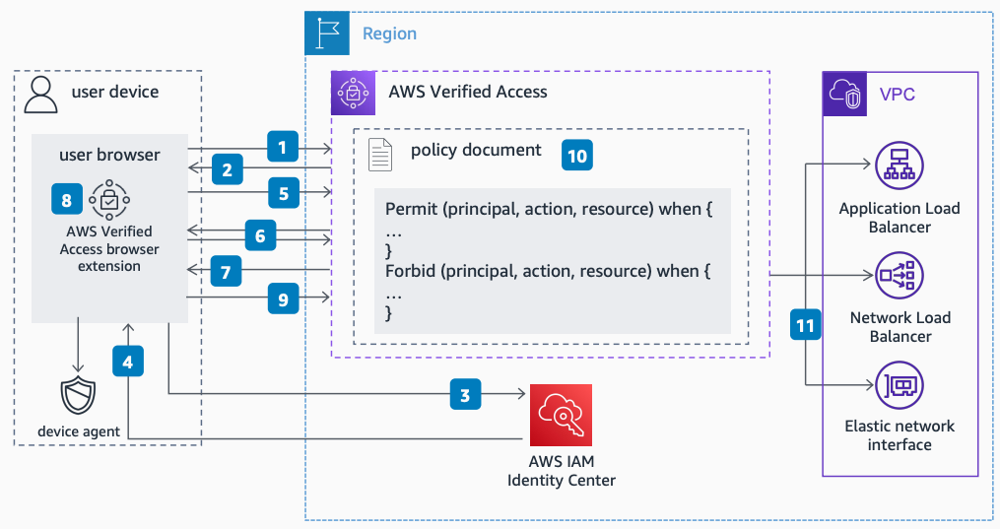

# With IAM Identity Center and Device Trust Provider - Initial Request

Publication date: **February 22, 2023 ([Diagram history](#vdi-diagram-history "#vdi-diagram-history"))**

This flow shows how AWS Verified Access handles an initial request when both [IAM Identity Center](../../../singlesignon/latest/userguide/what-is.md "../../../singlesignon/latest/userguide/what-is.md") and a device trust provider are configured. The browser extension detects redirects and provides device information cookies for combined identity and device posture validation.

## AWS Verified Access with IAM Identity Center and device trust - initial request flow

The following steps describe the request verification flow:

1. Steps 1 through 5 are the same as the IAM Identity Center initial request flow.
2. The browser extension detects the 302 redirect but does not identify the application domain as an AWS Verified Access domain. No device information cookie is added.
3. AWS Verified Access expects device information but does not receive it. It redirects the user to the device validation domain. AWS Verified Access repeats the authentication steps, but IAM Identity Center bypasses sign-in because cookies from the previous sign-in exist.
4. The device validation domain sends a 302 redirect. This tells the browser extension to pass the device information cookie to the application domain.
5. The browser extension extracts the application domain from the redirect and adds it to the cache of trusted AWS Verified Access domains. It sets the device information cookie on the application domain.
6. The browser extension allows the redirect to continue.
7. AWS Verified Access receives the request with the user identity cookie and device information cookie. For each request, it validates the user request against the policy using both the user identity and device posture.
8. AWS Verified Access proxies validated requests to application endpoints in the customer Amazon VPC.

###### Note

The local device agent continuously gathers device posture information. The browser extension transmits up-to-date information for each request to an AWS Verified Access endpoint.

## Further reading

For additional information, see the following resources:

- [AWS Architecture Icons](https://aws.amazon.com/architecture/icons "https://aws.amazon.com/architecture/icons")
- [AWS Architecture Center](https://aws.amazon.com/architecture "https://aws.amazon.com/architecture")
- [AWS Well-Architected](https://aws.amazon.com/architecture/well-architected "https://aws.amazon.com/architecture/well-architected")

## Diagram history

To be notified about updates to this reference architecture diagram, subscribe to the RSS feed.

| Change                                                                                                                                     | Description                                     | Date              |
| ------------------------------------------------------------------------------------------------------------------------------------------ | ----------------------------------------------- | ----------------- |
| [Initial publication](verified-access-idc-initial.md#vai-diagram-history "verified-access-idc-initial.md#vai-diagram-history")             | Reference architecture diagram first published. | February 22, 2023 |
| [Initial publication](verified-access-idc-subsequent.md#vas-diagram-history "verified-access-idc-subsequent.md#vas-diagram-history")       | Reference architecture diagram first published. | February 22, 2023 |
| Initial publication                                                                                                                        | Reference architecture diagram first published. | February 22, 2023 |
| [Initial publication](verified-access-device-subsequent.md#vds-diagram-history "verified-access-device-subsequent.md#vds-diagram-history") | Reference architecture diagram first published. | February 22, 2023 |

###### Note

To subscribe to RSS updates, you must have an RSS plugin enabled for the browser you are using.
