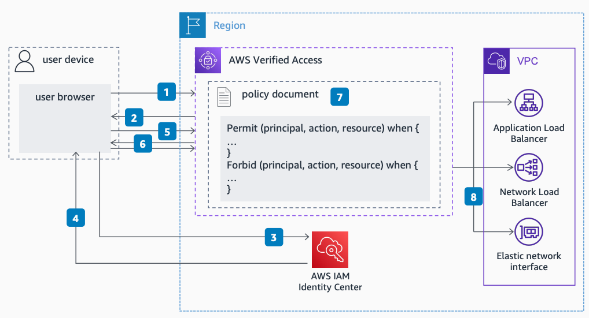

# With IAM Identity Center - Initial Request

Publication date: **February 22, 2023 ([Diagram history](#vai-diagram-history "#vai-diagram-history"))**

This flow shows how AWS Verified Access handles an initial request that does not have an identity cookie. AWS Verified Access redirects the user to [IAM Identity Center](../../../singlesignon/latest/userguide/what-is.md "../../../singlesignon/latest/userguide/what-is.md") to collect the user identity before validating the request against the application policy.

## AWS Verified Access with IAM Identity Center - initial request flow

The following steps describe the request verification flow:

1. The initial request targets the application domain hosted on an AWS Verified Access endpoint. This request does not have an identity cookie.
2. AWS Verified Access redirects the request to the identity provider, IAM Identity Center, to collect the user identity.
3. The browser redirects to the IAM Identity Center URL. The user completes the sign-in process.
4. IAM Identity Center redirects the user to the application domain to validate the identity token.
5. The browser sends the IAM Identity Center token to the application domain endpoint. AWS Verified Access uses it to set the user identity cookie.
6. AWS Verified Access redirects the user with the identity cookie to the original URI.
7. AWS Verified Access receives the request with the user identity cookie. For each request, it validates the user request against the application policy using the user identity.
8. AWS Verified Access proxies validated requests to application endpoints in the customer Amazon VPC.

## Further reading

For additional information, see the following resources:

- [AWS Architecture Icons](https://aws.amazon.com/architecture/icons "https://aws.amazon.com/architecture/icons")
- [AWS Architecture Center](https://aws.amazon.com/architecture "https://aws.amazon.com/architecture")
- [AWS Well-Architected](https://aws.amazon.com/architecture/well-architected "https://aws.amazon.com/architecture/well-architected")

## Diagram history

To be notified about updates to this reference architecture diagram, subscribe to the RSS feed.

| Change                                                                                                                                     | Description                                     | Date              |
| ------------------------------------------------------------------------------------------------------------------------------------------ | ----------------------------------------------- | ----------------- |
| Initial publication                                                                                                                        | Reference architecture diagram first published. | February 22, 2023 |
| [Initial publication](verified-access-idc-subsequent.md#vas-diagram-history "verified-access-idc-subsequent.md#vas-diagram-history")       | Reference architecture diagram first published. | February 22, 2023 |
| [Initial publication](verified-access-device-initial.md#vdi-diagram-history "verified-access-device-initial.md#vdi-diagram-history")       | Reference architecture diagram first published. | February 22, 2023 |
| [Initial publication](verified-access-device-subsequent.md#vds-diagram-history "verified-access-device-subsequent.md#vds-diagram-history") | Reference architecture diagram first published. | February 22, 2023 |

###### Note

To subscribe to RSS updates, you must have an RSS plugin enabled for the browser you are using.
