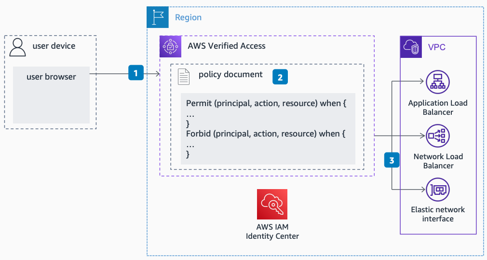

# With IAM Identity Center - After Initial Request

Publication date: **February 22, 2023 ([Diagram history](#vas-diagram-history "#vas-diagram-history"))**

This flow shows how AWS Verified Access handles subsequent requests after the user has a valid identity cookie. The request skips the IAM Identity Center authentication step and proceeds directly to policy validation.

## AWS Verified Access with IAM Identity Center - subsequent request flow

The following steps describe the request verification flow:

1. The request targets the application domain hosted on an AWS Verified Access endpoint. This request includes a user identity cookie.
2. AWS Verified Access validates the user request against the application policy using the user identity.
3. AWS Verified Access proxies validated requests to application endpoints in the customer Amazon VPC.

###### Note

The identity cookie has a lifetime associated with it. When that lifetime expires, the user must re-authenticate with IAM Identity Center.

## Further reading

For additional information, see the following resources:

- [AWS Architecture Icons](https://aws.amazon.com/architecture/icons "https://aws.amazon.com/architecture/icons")
- [AWS Architecture Center](https://aws.amazon.com/architecture "https://aws.amazon.com/architecture")
- [AWS Well-Architected](https://aws.amazon.com/architecture/well-architected "https://aws.amazon.com/architecture/well-architected")

## Diagram history

To be notified about updates to this reference architecture diagram, subscribe to the RSS feed.

| Change                                                                                                                                     | Description                                     | Date              |
| ------------------------------------------------------------------------------------------------------------------------------------------ | ----------------------------------------------- | ----------------- |
| [Initial publication](verified-access-idc-initial.md#vai-diagram-history "verified-access-idc-initial.md#vai-diagram-history")             | Reference architecture diagram first published. | February 22, 2023 |
| Initial publication                                                                                                                        | Reference architecture diagram first published. | February 22, 2023 |
| [Initial publication](verified-access-device-initial.md#vdi-diagram-history "verified-access-device-initial.md#vdi-diagram-history")       | Reference architecture diagram first published. | February 22, 2023 |
| [Initial publication](verified-access-device-subsequent.md#vds-diagram-history "verified-access-device-subsequent.md#vds-diagram-history") | Reference architecture diagram first published. | February 22, 2023 |

###### Note

To subscribe to RSS updates, you must have an RSS plugin enabled for the browser you are using.
