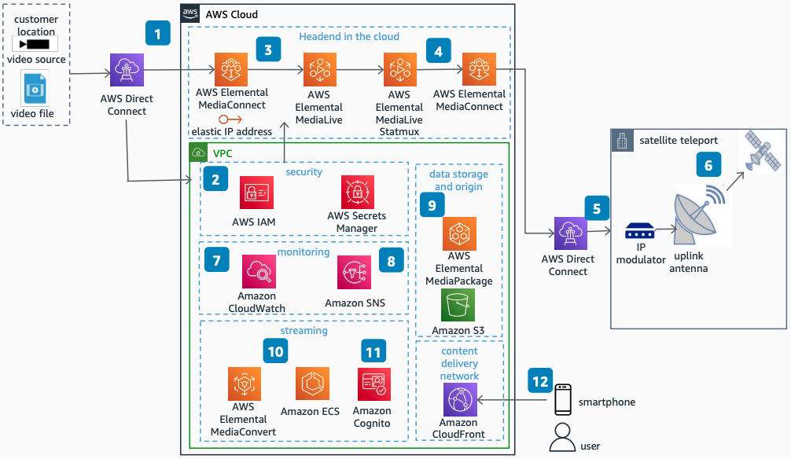

# Video Stream from Cloud to Satellite and Internet

Publication date: **March 28, 2023 ([Diagram history](#video-sat-history "#video-sat-history"))**

With this architecture, you can build a highly reliable, available, scalable, and secure
video workflow with AWS managed services. The solution uses [AWS Elemental MediaConnect](../../../mediaconnect/latest/ug.md "../../../mediaconnect/latest/ug.md") and [AWS Elemental MediaLive](../../../medialive/latest/ug.md "../../../medialive/latest/ug.md") to distribute
high-quality video content over satellite and internet.

## Video stream from cloud to satellite diagram

The following steps describe the data flow and key configuration points for this architecture:

1. Ingest video streams into the AWS Cloud by using AWS Direct Connect. AWS Elemental
   MediaConnect supports multiple streaming protocols and can also be sourced through
   MediaConnect entitlements granted by other AWS accounts. MediaConnect supports the
   private Elastic IP address from your Amazon VPC.
2. Use [AWS Identity and Access Management](../../../IAM/latest/UserGuide.md "../../../IAM/latest/UserGuide.md") roles
   with appropriate policies and [AWS Secrets Manager](../../../secretsmanager/latest/userguide.md "../../../secretsmanager/latest/userguide.md") to store the
   passwords to decrypt the video stream.
3. Forward the video stream to AWS Elemental MediaLive to transcode the Single Program
   Transport Stream (SPTS).
4. Use AWS Elemental MediaLive StatMux to multiplex multiple SPTS streams and deliver a
   single Multiple Program Transport Stream (MPTS) through AWS Elemental
   MediaConnect.
5. Deliver the single MPTS stream by using AWS Direct Connect from the AWS Region to
   the satellite teleport.
6. Uplink the MPTS stream by using the Digital Video Broadcast (DVB S/S2) standard to
   the satellite with C-Band or Ku Band frequencies.
7. Monitor the quality of your video streams by using customized dashboards on [Amazon CloudWatch](../../../AmazonCloudWatch/latest/monitoring.md "../../../AmazonCloudWatch/latest/monitoring.md").
8. Configure alarm thresholds to monitor alarms and send notifications to operators by
   using [Amazon Simple Notification Service](../../../sns/latest/dg.md "../../../sns/latest/dg.md").
9. Use [AWS Elemental MediaPackage](../../../mediapackage/latest/ug.md "../../../mediapackage/latest/ug.md") and AWS Elemental
   MediaTailor to deliver video on demand through a streaming application.
10. Use [AWS Elemental MediaConvert](../../../mediaconvert/latest/ug.md "../../../mediaconvert/latest/ug.md") to deliver video on
    demand from [Amazon Simple Storage Service](../../../AmazonS3/latest/userguide.md "../../../AmazonS3/latest/userguide.md"). Run the Over The Top (OTT) streaming
    application in [Amazon Elastic Container Service](../../../AmazonECS/latest/developerguide.md "../../../AmazonECS/latest/developerguide.md") containers.
11. Use [Amazon Cognito](../../../cognito/latest/developerguide.md "../../../cognito/latest/developerguide.md") for user authentication and
    authorization to manage user subscriptions to the OTT streaming service.
12. Use [Amazon CloudFront](../../../AmazonCloudFront/latest/DeveloperGuide.md "../../../AmazonCloudFront/latest/DeveloperGuide.md") to deliver a low-latency,
    high-speed video viewing experience to end users on the streaming application.

## Further reading

For additional information, see the following resources:

- [AWS Architecture Icons](https://aws.amazon.com/architecture/icons "https://aws.amazon.com/architecture/icons")
- [AWS Architecture Center](https://aws.amazon.com/architecture/ "https://aws.amazon.com/architecture/")
- [AWS
  Well-Architected](https://aws.amazon.com/architecture/well-architected "https://aws.amazon.com/architecture/well-architected")

## Diagram history

To receive updates about this reference architecture diagram, subscribe to the RSS
feed.

| Change              | Description                                     | Date           |
| ------------------- | ----------------------------------------------- | -------------- |
| Initial publication | Reference architecture diagram first published. | March 28, 2023 |

###### RSS subscription requirement

To subscribe to RSS updates, you must have an RSS plugin enabled for the browser you are
using.
