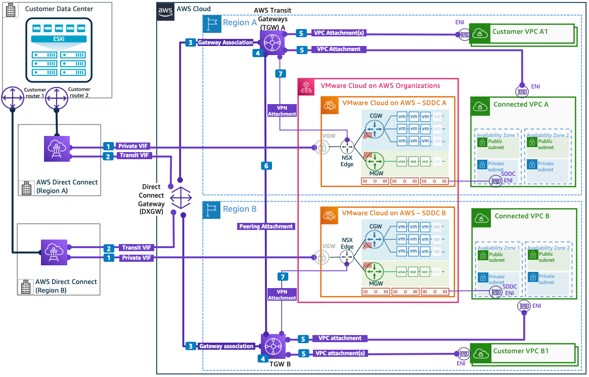

# On-Premises Connectivity Using AWS Direct Connect with Direct Connect Gateway and AWS Transit Gateway

Publication date: **March 10, 2022 ([Diagram history](#vmdxg-diagram-history "#vmdxg-diagram-history"))**

This architecture shows on-premises connectivity to VMware Cloud on AWS using AWS Direct Connect with a Direct Connect gateway (DXGW) associated to AWS Transit Gateway instances in multiple Regions for scalable transitive routing.

## VMware Cloud on AWS networking with Direct Connect gateway and Transit Gateway architecture

The following numbered items describe the key components in this architecture:

1. The [AWS Direct Connect](../../../directconnect/latest/UserGuide/Welcome.md "../../../directconnect/latest/UserGuide/Welcome.md") private VIF in Region A establishes connectivity from the on-premises network to the SDDC in Region A. Similarly, the AWS Direct Connect private VIF from Region B establishes connectivity from the on-premises network to the SDDC in Region B.
2. Dual transit VIFs establish redundant, resilient connectivity from on-premises to the Direct Connect gateway (DXGW).
3. The DXGW is associated with [AWS Transit Gateway](../../../vpc/latest/tgw/what-is-transit-gateway.md "../../../vpc/latest/tgw/what-is-transit-gateway.md") in both Regions to provide on-premises connectivity to [Amazon VPC](../../../vpc/latest/userguide/what-is-amazon-vpc.md "../../../vpc/latest/userguide/what-is-amazon-vpc.md")s.
4. The Transit Gateway is a regional virtual router that is capable of transitive routing between networks connected to it using VPC attachments, VPN attachments, DXGW attachments, and peering attachments.
5. VPC attachments enable VPCs to establish communication with other VPCs and networks connected to the Transit Gateway.
6. The Transit Gateway peering attachment enables cross-Region communication between networks connected to Transit Gateway A and Transit Gateway B.
7. Transit Gateway VPN attachments enable communication between the SDDC and networks connected to the Transit Gateway in the respective Regions. However, the VMware VMkernel traffic (including ESXi Management, vMotion, and vSphere Replication traffic) is prioritized over the private VIF, making the VPN attachments unusable for this traffic. Ensure the VPN does not learn the on-premises routes that are used with a private VIF.

## Further reading

For additional information, see the following resources:

- [AWS Architecture Icons](https://aws.amazon.com/architecture/icons "https://aws.amazon.com/architecture/icons")
- [AWS Well-Architected](https://aws.amazon.com/architecture/well-architected "https://aws.amazon.com/architecture/well-architected")

## Diagram history

To be notified about updates to this reference architecture diagram, subscribe to the RSS feed.

| Change                                                                                                                 | Description                                     | Date           |
| ---------------------------------------------------------------------------------------------------------------------- | ----------------------------------------------- | -------------- |
| [Initial publication](vmware-dx-vgw-vpn.md#vmvgw-diagram-history "vmware-dx-vgw-vpn.md#vmvgw-diagram-history")         | Reference architecture diagram first published. | March 10, 2022 |
| Initial publication                                                                                                    | Reference architecture diagram first published. | March 10, 2022 |
| [Initial publication](vmware-transit-connect.md#vmtc-diagram-history "vmware-transit-connect.md#vmtc-diagram-history") | Reference architecture diagram first published. | March 10, 2022 |
| [Initial publication](vmware-security-vpc.md#vmsec-diagram-history "vmware-security-vpc.md#vmsec-diagram-history")     | Reference architecture diagram first published. | March 10, 2022 |

###### Note

To subscribe to RSS updates, you must have an RSS plugin enabled for the browser you are using.
