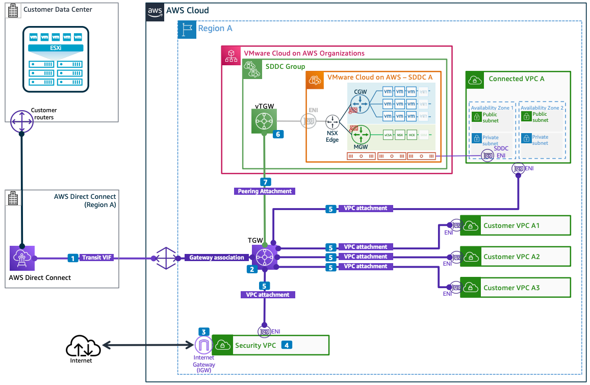

# Using a Security VPC for Inspecting SDDC Traffic

Publication date: **March 10, 2022 ([Diagram history](#vmsec-diagram-history "#vmsec-diagram-history"))**

This architecture shows how to use a security [Amazon VPC](../../../vpc/latest/userguide/what-is-amazon-vpc.md "../../../vpc/latest/userguide/what-is-amazon-vpc.md") for inspecting north-south internet-to-SDDC traffic, VPC-to-SDDC traffic, and on-premises-to-SDDC traffic in VMware Cloud on AWS. The security VPC can be configured with AWS Network Firewall or third-party firewalls for SDDC egress and ingress traffic inspection and perimeter security.

## Security VPC inspection for VMware Cloud on AWS traffic architecture

The following numbered items describe the key components in this architecture:

1. A transit VIF over an [AWS Direct Connect](../../../directconnect/latest/UserGuide/Welcome.md "../../../directconnect/latest/UserGuide/Welcome.md") instance is used to connect to an AWS Direct Connect gateway (DXGW) which is associated with [AWS Transit Gateway](../../../vpc/latest/tgw/what-is-transit-gateway.md "../../../vpc/latest/tgw/what-is-transit-gateway.md") (TGW) instances to complete the on-premises connectivity to the AWS Region.
2. The Transit Gateway (TGW) is a regional virtual router that is capable of transitive routing between networks. The TGW is capable of redirecting all the incoming traffic from on-premises towards the **security VPC**.
3. The internet gateway (IGW) is a VPC component that provides centralized internet access for the AWS workloads.
4. The **security VPC** can be configured with AWS Network Firewall or third-party firewalls for SDDC egress and ingress traffic inspection and perimeter security.
5. VPC attachments are used to connect to one or more spoke VPCs. Traffic between the spoke VPCs and SDDCs always traverses through the **security VPC**.
6. The SDDC group uses a VMware Transit Connect (vTGW) to provide high-bandwidth, low-latency connectivity between SDDCs in an SDDC group, SDDCs and attached VPCs, and SDDCs and on-premises through the DXGW.
7. The external TGW peering attachment ensures that all SDDC ingress and egress traffic traverses through the **security VPC**. This includes AWS VPC traffic, on-premises traffic, and internet traffic.

## Further reading

For additional information, see the following resources:

- [AWS Architecture Icons](https://aws.amazon.com/architecture/icons "https://aws.amazon.com/architecture/icons")
- [AWS Well-Architected](https://aws.amazon.com/architecture/well-architected "https://aws.amazon.com/architecture/well-architected")

## Diagram history

To be notified about updates to this reference architecture diagram, subscribe to the RSS feed.

| Change                                                                                                                 | Description                                     | Date           |
| ---------------------------------------------------------------------------------------------------------------------- | ----------------------------------------------- | -------------- |
| [Initial publication](vmware-dx-vgw-vpn.md#vmvgw-diagram-history "vmware-dx-vgw-vpn.md#vmvgw-diagram-history")         | Reference architecture diagram first published. | March 10, 2022 |
| [Initial publication](vmware-dx-dxgw-tgw.md#vmdxg-diagram-history "vmware-dx-dxgw-tgw.md#vmdxg-diagram-history")       | Reference architecture diagram first published. | March 10, 2022 |
| [Initial publication](vmware-transit-connect.md#vmtc-diagram-history "vmware-transit-connect.md#vmtc-diagram-history") | Reference architecture diagram first published. | March 10, 2022 |
| Initial publication                                                                                                    | Reference architecture diagram first published. | March 10, 2022 |

###### Note

To subscribe to RSS updates, you must have an RSS plugin enabled for the browser you are using.
