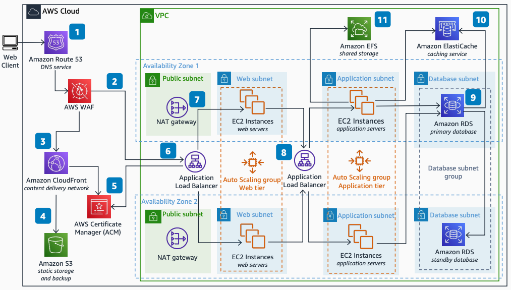

# Web Application Architecture on AWS

Publication date: **November 19, 2021 ([Diagram history](#diagram-history "#diagram-history"))**

This architecture shows how you can host a classic web application on AWS. You use multiple Availability Zones for high availability, Application Load Balancers for traffic distribution, and managed services for database, caching, and shared storage.

## Web Application Architecture on AWS

The following steps describe the architecture:

1. Route traffic from the web client based on the request path for static and dynamic content using [Route 53](../../../Route53/latest/DeveloperGuide/Welcome.md "../../../Route53/latest/DeveloperGuide/Welcome.md").
2. Use a content delivery network (CDN) like [Amazon CloudFront](../../../AmazonCloudFront/latest/DeveloperGuide/Introduction.md "../../../AmazonCloudFront/latest/DeveloperGuide/Introduction.md") to reduce latency when delivering your static content.
3. Use [Amazon Simple Storage Service](../../../AmazonS3/latest/userguide/Welcome.md "../../../AmazonS3/latest/userguide/Welcome.md") to store static content and backups.
4. Protect your web application from common web exploits with a web application firewall like AWS WAF.
5. Simplify your SSL certificates management using AWS Certificate Manager (ACM).
6. Use an internet-facing Application Load Balancer to distribute web traffic to your web servers spread across multiple Availability Zones.
7. Use NAT gateways in each public subnet to enable [Amazon Elastic Compute Cloud](../../../AWSEC2/latest/UserGuide/concepts.md "../../../AWSEC2/latest/UserGuide/concepts.md") instances in private subnets to access the internet.
8. Use an internal Application Load Balancer to distribute traffic to your application servers spread across multiple Availability Zones.
9. Simplify your database administration by running your database layer in [Amazon RDS](../../../AmazonRDS/latest/UserGuide/Welcome.md "../../../AmazonRDS/latest/UserGuide/Welcome.md").
10. If database access patterns are read-heavy, take advantage of a caching layer like [Amazon ElastiCache](../../../AmazonElastiCache/latest/red-ug/WhatIs.md "../../../AmazonElastiCache/latest/red-ug/WhatIs.md").
11. Consider using a shared storage service like Amazon Elastic File System (Amazon EFS) if your servers access shared files.

## Further reading

For additional information, refer to the following resources:

- [AWS Architecture Icons](https://aws.amazon.com/architecture/icons "https://aws.amazon.com/architecture/icons")
- [AWS Architecture Center](https://aws.amazon.com/architecture "https://aws.amazon.com/architecture")
- [AWS Well-Architected](https://aws.amazon.com/architecture/well-architected "https://aws.amazon.com/architecture/well-architected")

## Diagram history

To be notified about updates to this reference architecture diagram, subscribe to the RSS feed.

| Change              | Description                                     | Date              |
| ------------------- | ----------------------------------------------- | ----------------- |
| Initial publication | Reference architecture diagram first published. | November 19, 2021 |

###### Note

To subscribe to RSS updates, you must have an RSS plugin enabled for the browser you are using.
