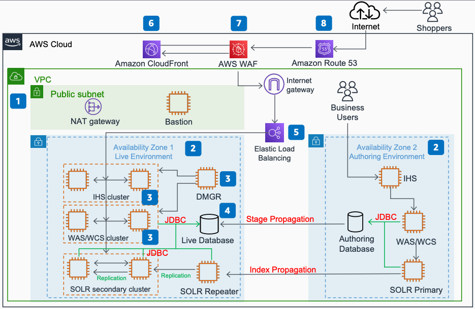

# WebSphere Commerce on AWS

Publication date: **May 20, 2021 ([Diagram history](#wcs-history "#wcs-history"))**

With this architecture, you can lift and shift a legacy WebSphere Commerce
(WCS) ecommerce website from on-premises to AWS. On-premises ecommerce platforms often
struggle to scale during peak traffic periods. By migrating to AWS, you gain unlimited
resources to scale when you need them. You use [Amazon CloudFront](../../../AmazonCloudFront/latest/DeveloperGuide.md "../../../AmazonCloudFront/latest/DeveloperGuide.md") for content delivery, [AWS WAF](../../../waf/latest/developerguide.md "../../../waf/latest/developerguide.md") for security, and
Elastic Load Balancing for traffic distribution.

For more information, see [Three
Steps for Modernizing Your DTC Ecommerce Website](https://aws.amazon.com/blogs/industries/three-steps-for-modernizing-your-dtc-ecommerce-website/ "https://aws.amazon.com/blogs/industries/three-steps-for-modernizing-your-dtc-ecommerce-website/") on the AWS Blog.

## WebSphere Commerce diagram

The following steps describe the architecture:

1. A single AWS Region and single [Amazon VPC](../../../vpc/latest/userguide.md "../../../vpc/latest/userguide.md") provide similar architecture to an
   on-premises data center setup.
2. Multiple Availability Zones provide resilience and separate the authoring workload
   from the live environment.
3. Out-of-the-box WebSphere Commerce clusters provide high availability
   and instance management through DMGR (deployment manager).
4. Use an AWS Partner solution to run the production workload on Oracle
   RAC. Alternatively, [create
   highly available IBM Db2 databases on AWS](https://aws.amazon.com/blogs/database/creating-highly-available-ibm-db2-databases-in-aws/ "https://aws.amazon.com/blogs/database/creating-highly-available-ibm-db2-databases-in-aws/").
5. Elastic Load Balancing distributes network traffic to improve the scalability and
   availability of your applications across multiple instances.
6. CloudFront provides a highly secure and programmable content delivery network
   (CDN).
7. AWS WAF protects the ecommerce website against common web exploits.
8. [Amazon Route 53](../../../Route53/latest/DeveloperGuide.md "../../../Route53/latest/DeveloperGuide.md") provides DNS
   configuration.

## Further reading

For additional information, see the following resources:

- [AWS Architecture Icons](https://aws.amazon.com/architecture/icons "https://aws.amazon.com/architecture/icons")
- [AWS Architecture Center](https://aws.amazon.com/architecture/ "https://aws.amazon.com/architecture/")
- [AWS Well-Architected](https://aws.amazon.com/architecture/well-architected "https://aws.amazon.com/architecture/well-architected")

## Diagram history

To receive updates about this reference architecture diagram, subscribe to the RSS
feed.

| Change              | Description                                     | Date         |
| ------------------- | ----------------------------------------------- | ------------ |
| Initial publication | Reference architecture diagram first published. | May 20, 2021 |

###### RSS subscription requirement

To subscribe to RSS updates, you must have an RSS plugin enabled for the browser you
are using.
