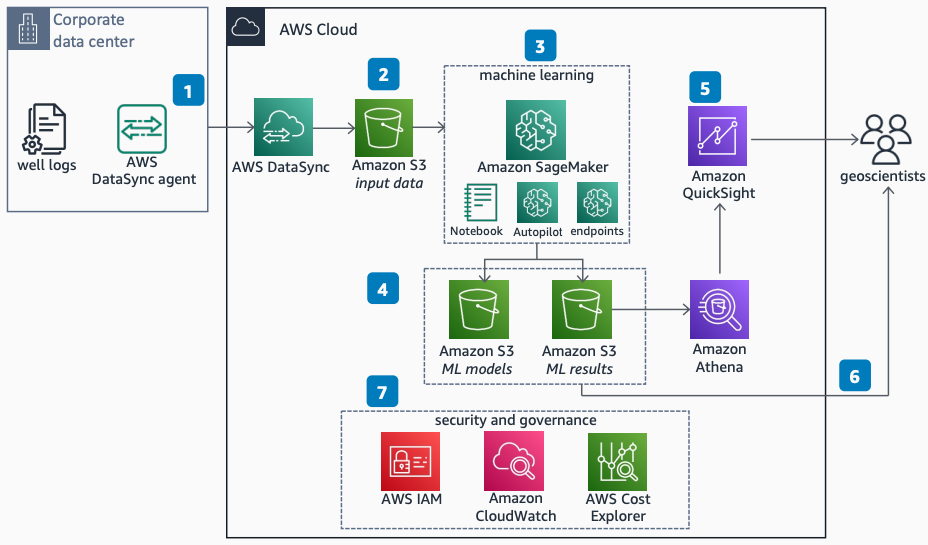

# Well Log Facies Classification Using Machine Learning

Publication date: **September 16, 2022 ([Diagram history](#diagram-history "#diagram-history"))**

This solution incorporates [well logs](https://en.wikipedia.org/wiki/Well_logging "https://en.wikipedia.org/wiki/Well_logging") (borehole measurements) from the corporate data center and applies a low-code ML model on the data by using SageMaker AI Autopilot to obtain a [facies](https://en.wikipedia.org/wiki/Facies "https://en.wikipedia.org/wiki/Facies") (rock type) classification at each measured depth.

## Well Log Facies Classification Using Machine Learning

The following steps describe the architecture:

1. Use [AWS DataSync](../../../datasync/latest/userguide/what-is-datasync.md "../../../datasync/latest/userguide/what-is-datasync.md") to transfer well logs stored in the corporate data center to the AWS Cloud.
2. Use an [Amazon Simple Storage Service](../../../AmazonS3/latest/userguide/Welcome.md "../../../AmazonS3/latest/userguide/Welcome.md") bucket to store all input data for ML models.
3. Use [Amazon SageMaker AI](../../../sagemaker/latest/dg/whatis.md "../../../sagemaker/latest/dg/whatis.md") to prepare, build, train, and deploy ML models. SageMaker AI Notebook is a fully managed notebook instance pre-loaded with useful libraries. Use SageMaker AI Autopilot to automatically train ML models. Deploy trained models to SageMaker AI inference endpoints.
4. Use Amazon S3 buckets to store all data and results for ML models.
5. Use [Amazon Quick Sight](../../../quicksight/latest/user/welcome.md "../../../quicksight/latest/user/welcome.md") to generate dashboards for end users. Quick uses the predictions from ML models stored in Amazon S3 through [Amazon Athena](../../../athena/latest/ug/what-is.md "../../../athena/latest/ug/what-is.md").
6. Geoscientists can download the ML-classified facies at each well log depth from the Amazon S3 bucket. They can integrate the results with their geoscientific workflow to improve business decisions.
7. Use [AWS Identity and Access Management](../../../IAM/latest/UserGuide/introduction.md "../../../IAM/latest/UserGuide/introduction.md") for fine-grained access control across all services. [Amazon CloudWatch](../../../AmazonCloudWatch/latest/monitoring/WhatIsCloudWatch.md "../../../AmazonCloudWatch/latest/monitoring/WhatIsCloudWatch.md") collects monitoring and operational data. [AWS Cost Explorer](../../../cost-management/latest/userguide/ce-what-is.md "../../../cost-management/latest/userguide/ce-what-is.md") provides an interface to visualize and manage AWS costs.

## Further reading

For additional information, refer to the following resources:

- [AWS Architecture Icons](https://aws.amazon.com/architecture/icons "https://aws.amazon.com/architecture/icons")
- [AWS Architecture Center](https://aws.amazon.com/architecture "https://aws.amazon.com/architecture")
- [AWS Well-Architected](https://aws.amazon.com/architecture/well-architected "https://aws.amazon.com/architecture/well-architected")
- [Amazon SageMaker AI product page](https://aws.amazon.com/sagemaker/ "https://aws.amazon.com/sagemaker/")

## Diagram history

To be notified about updates to this reference architecture diagram, subscribe to the RSS feed.

| Change              | Description                                     | Date               |
| ------------------- | ----------------------------------------------- | ------------------ |
| Initial publication | Reference architecture diagram first published. | September 16, 2022 |

###### Note

To subscribe to RSS updates, you must have an RSS plugin enabled for the browser you are using.
