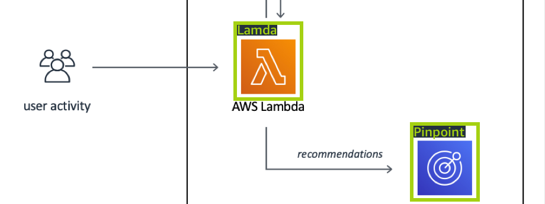
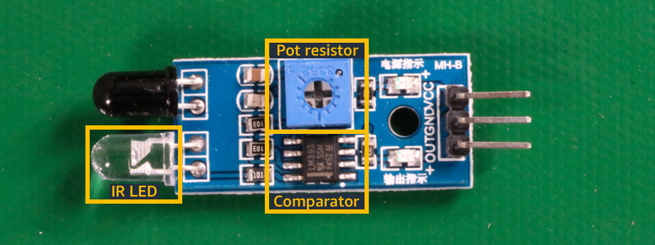

# Getting started with Amazon Rekognition Custom Labels

Before starting these _Getting started_ instructions, we recommend that
you read [Understanding Amazon Rekognition Custom Labels](understanding-custom-labels.md "understanding-custom-labels.md").

You use Amazon Rekognition Custom Labels to train a machine learning model. The trained model analyzes images to find
the objects, scenes, and concepts that are unique to your business needs. For example, you
can train a model to classify images of houses, or find the location of electronic parts on
a printed circuit board.

To help you get started, Amazon Rekognition Custom Labels includes tutorial videos and example projects.

###### Note

For information about the AWS Regions and endpoints that
Amazon Rekognition Custom Labels supports, see
[Rekognition
endpoints and quotas](../../../general/latest/gr/rekognition.md "../../../general/latest/gr/rekognition.md").

## Tutorial videos

The videos show you how to use Amazon Rekognition Custom Labels to train and use a model.

###### To view the tutorial videos

1. Sign in to the AWS Management Console and open the Amazon Rekognition console at
   [https://console.aws.amazon.com/rekognition/](https://console.aws.amazon.com/rekognition/ "https://console.aws.amazon.com/rekognition/").
2. In the left pane, choose **Use Custom Labels**. The Amazon Rekognition Custom Labels landing page is shown.
   If you don't see **Use Custom Labels**, check that the [AWS Region](../../../general/latest/gr/rekognition_region.md "../../../general/latest/gr/rekognition_region.md") you are using supports Amazon Rekognition Custom Labels.
3. In the navigation pane, choose **Get started**.
4. In **What is Amazon Rekognition Custom Labels?**, choose the video to watch the overview video.
5. In the navigation pane, choose **Tutorials**.
6. On the **Tutorials** page, choose the tutorial videos that you want to watch.

## Example projects

Amazon Rekognition Custom Labels provides the following example projects.

### Image classification

The image classification project (Rooms) trains a model that finds one or more household
locations in an image, such as _backyard_, _kitchen_, and
_patio_.
The training and test images represent a single location. Each image is labeled with a single
image-level label,
such as _kitchen_, _patio_, or _living_space_.
For an analyzed image, the trained model returns one or more matching
labels from the set of image-level labels used for training.
For example, the model might find the label _living_space_ in
the following image. For more information,
see [Find objects, scenes, and concepts](md-dataset-purpose.md#md-dataset-purpose-classification "md-dataset-purpose.md#md-dataset-purpose-classification").

### Multi-label image classification

The multi-label image classification project (Flowers) trains a model that categorizes images of flowers into
three concepts (flower type, leaf presence, and growth stage).

The training and test images have image-level labels for each concept, such as _camellia_ for
a flower type, _with_leaves_ for a flower with leaves, and _fully_grown_ for
a flower that is fully grown.

For an analyzed image, the trained model returns matching labels from the set of image-level labels used for training.
For example, the model returns the labels _mediterranean_spurge_ and _with_leaves_ for the following image.
For more information,
see [Find objects, scenes, and concepts](md-dataset-purpose.md#md-dataset-purpose-classification "md-dataset-purpose.md#md-dataset-purpose-classification").

### Brand detection

The brand detection project (Logos) trains a model that model finds the location
of certain AWS logos such as _Amazon Textract_, and
_AWS lambda_. The training images are of the logo only and
have a single image level-label, such as _lambda_ or
_textract_. It is also possible to train a brand detection
model with training images that have bounding boxes for brand locations. The test
images have labeled bounding boxes that represent the location of logos in natural
locations, such as an architectural diagram. The trained model finds the logos and
returns a labeled bounding box for each logo found. For more information, see [Find brand locations](md-dataset-purpose.md#md-dataset-purpose-brands "md-dataset-purpose.md#md-dataset-purpose-brands").

### Object localization

The object localization project (Circuit boards) trains a model that finds the
location of parts on a printed circuit board, such as a
_comparator_ or an _infra red light emitting
diode_. The training and test images include bounding boxes that
surround the circuit board parts and a label that identifies the part within the
bounding box. In the following example image, the label names are
_ir_phototransistor_, _ir_led_,
_pot_resistor_, and _comparator_. The
trained model finds the circuit board parts and returns a labeled bounding for each
circuit part found. For more information, see [Find object locations](md-dataset-purpose.md#md-dataset-purpose-localization "md-dataset-purpose.md#md-dataset-purpose-localization").

## Using the example projects

These Getting Started instructions show you how to train a
model by using example projects that Amazon Rekognition Custom Labels creates for you.
It also shows you how to start the model and use
it to analyze an image.

### Creating the example project

To get started, decide which project to use. For more information, see [Step 1: Choose an example project](gs-step-choose-example-project.md "gs-step-choose-example-project.md").

Amazon Rekognition Custom Labels uses datasets to train and evaluate (test) a model. A dataset
manages images and the labels that identify the contents of images.
The example projects include a training dataset and a test dataset in which
all images are labeled. You don't need to make any changes before
training your model. The example projects show the two ways in which Amazon Rekognition Custom Labels
uses labels to train different types of models.

- _image-level_ – The label identifies an object, scene, or concept
  that represents the entire image.
- _bounding box_ – The label identifies the contents of a bounding
  box. A bounding box is a set of image coordinates that surround an object in
  an image.

Later, when you create a project with your own images, you must create training
and test datasets, and also label your images. For more information, see [Decide your model type](understanding-custom-labels.md#tm-intro-model-type "understanding-custom-labels.md#tm-intro-model-type").

### Training the model

After Amazon Rekognition Custom Labels creates the example project, you can train the model. For more
information, see [Step 2: Train your model](gs-step-train-model.md "gs-step-train-model.md"). After training finishes, you normally
evaluate the performance of the model. The images in the example dataset already
create a high-performance model, and you don't need to evaluate the model before
running the model. For more information, see [Improving a trained Amazon Rekognition Custom Labels model](improving-model.md "improving-model.md").

### Using the model

Next you start the model. For more information, see
[Step 3: Start your model](gs-step-start-model.md "gs-step-start-model.md").

After you start running your model, you can use it to analyze new images.
For more information, see
[Step 4: Analyze an image with your
model](gs-step-get-a-prediction.md "gs-step-get-a-prediction.md").

You are charged for the amount of time that your model runs. When you finish using
the example model, you should stop the model. For more information,
see [Step 5: Stop your model](gs-step-stop-model.md "gs-step-stop-model.md").

### Next steps

When you're ready, you can create your own projects. For more information,
see [Step 6: Next steps](gs-step-next.md "gs-step-next.md").
