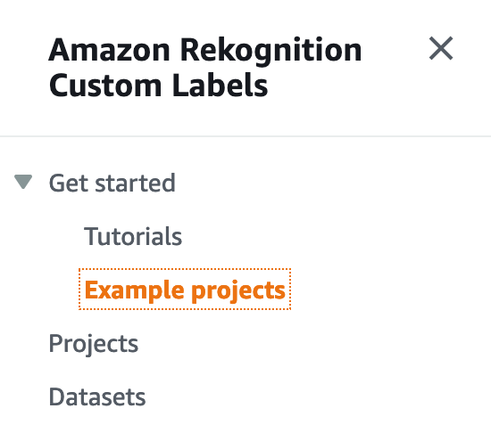
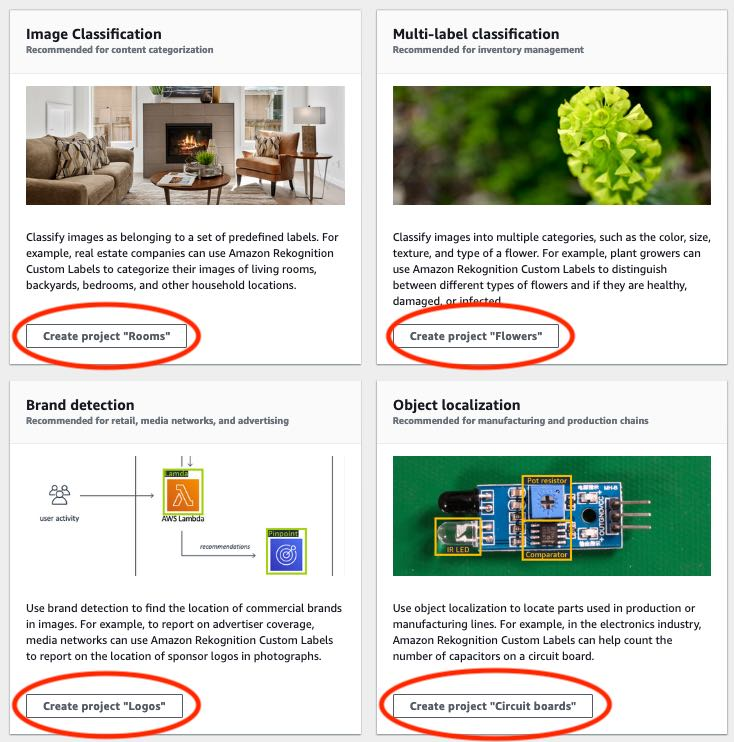
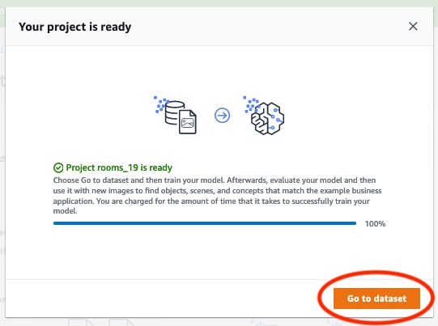

# Step 1: Choose an example project

In this step you use choose an example project. Amazon Rekognition Custom Labels then creates a project
and a dataset for you. A project manages the files used to train your model.
For more information, see [Managing an Amazon Rekognition Custom Labels project](managing-project.md "managing-project.md"). Datasets contain the images,
assigned labels, and bounding boxes that you use to train and test a model. For
more information, see [Managing datasets](managing-dataset.md "managing-dataset.md").

For information about the example projects, see [Example projects](getting-started.md#gs-example-projects "getting-started.md#gs-example-projects").

###### Choose an example project

1. Sign in to the AWS Management Console and open the Amazon Rekognition console at
   [https://console.aws.amazon.com/rekognition/](https://console.aws.amazon.com/rekognition/ "https://console.aws.amazon.com/rekognition/").
2. In the left pane, choose **Use Custom Labels**. The Amazon Rekognition Custom Labels landing page is shown.
   If you don't see **Use Custom Labels**, check that the [AWS Region](../../../general/latest/gr/rekognition_region.md "../../../general/latest/gr/rekognition_region.md")
   you are using supports Amazon Rekognition Custom Labels.
3. Choose **Get started**.

Amazon Rekognition Custom Labels section showing Get started,
Tutorials with "Example projects" highlighted, Projects, and
Datasets.

 4. In **Explore example projects**, choose **Try example projects**. 5. Decide which project you want to use and choose **Create project "`project name`"** within the example section.
Amazon Rekognition Custom Labels then creates the example project for you.

###### Note

If this is the first time that you've opened the console in the current AWS Region, the **First Time Set
Up** dialog box is shown. Do the following:

    1. Note the name of the Amazon S3 bucket that's shown.
    2. Choose **Continue** to let Amazon Rekognition Custom Labels create an Amazon S3 bucket (console
     bucket) on your behalf. The image of the console below shows
     examples with "Create project" buttons for Image Classification
     (Rooms), Multi-label classification (Flowers), Brand detection
     (Logos), and Object Localization (Circuit boards).

 6. After your project is ready, choose **Go to dataset**. The following image
shows what the project panel looks like when the project is ready.

