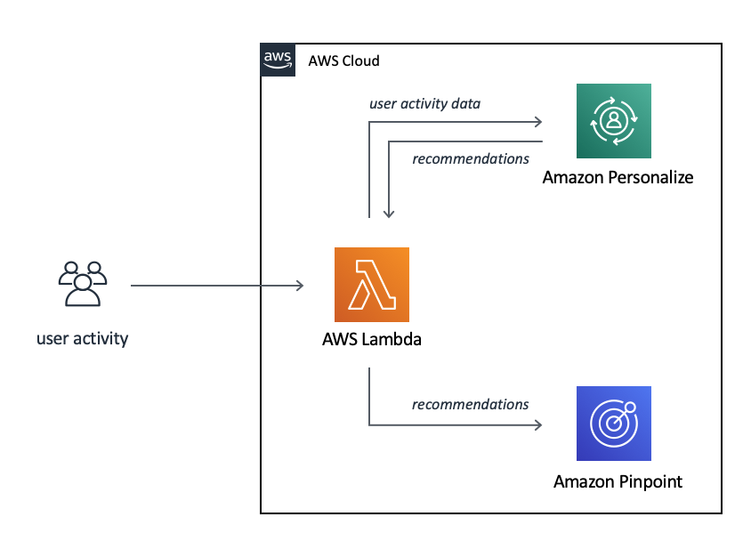
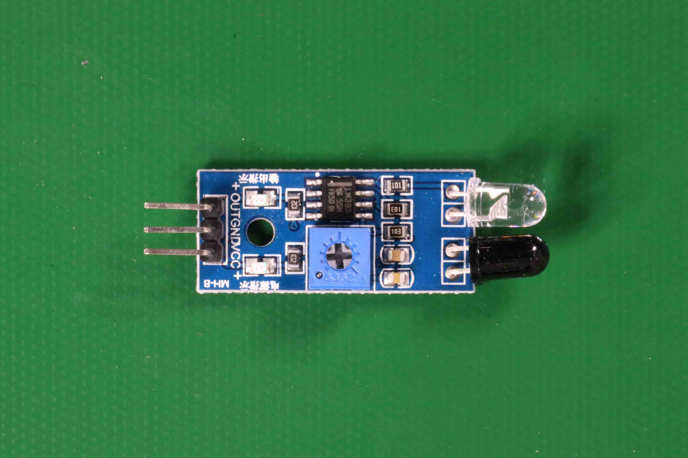

# Step 4: Analyze an image with your

model

You analyze an image by calling the [DetectCustomLabels](../APIReference/API_DetectCustomLabels.md "../APIReference/API_DetectCustomLabels.md") API. In this step, you use the
`detect-custom-labels` AWS Command Line Interface (AWS CLI) command to analyze an example
image. You get the AWS CLI command from the Amazon Rekognition Custom Labels console. The console configures
the AWS CLI command to use your model. You only need to supply an image that's stored in
an Amazon S3 bucket. This topic provides an image that you can use for each example project.

###### Note

The console also provides Python example code.

The output from `detect-custom-labels` includes a list of labels found in
the image, bounding boxes (if the model finds object locations), and the confidence that
the model has in the accuracy of the predictions.

For more information, see [Analyzing an image with a trained model](detecting-custom-labels.md "detecting-custom-labels.md").

###### To analyze an image (console)

1. <textobject><phrase>Model status showing as Running, with Stop button to
   stop the running model.</phrase></textobject>

If you haven't already, set up the AWS CLI. For instructions, see [Step 4: Set up the AWS CLI and AWS SDKs](su-awscli-sdk.md "su-awscli-sdk.md"). 2. If you haven't already, start running your model. For more information, see
[Step 3: Start your model](gs-step-start-model.md "gs-step-start-model.md"). 3. Choose the **Use Model** tab and then choose **API
code**. The model status panel shown below shows the model as
Running, with a Stop button to stop the running model, and an option to display
the API.

 4. Choose **AWS CLI command**. 5. In the **Analyze image** section, copy the AWS CLI command that
calls `detect-custom-labels`. The following image of the Rekognition
console shows the "Analyze Image" section with the AWS CLI command to detect
custom labels on an image using a machine learning model, and instructions to
start the model and provide image details.

 6. Upload an example image to an Amazon S3 bucket. For instructions, see [Getting an example image](#gs-example-images "#gs-example-images"). 7. At the command prompt, enter the AWS CLI command that you copied in the previous
step. It should look like the following example.

The value of `--project-version-arn` should be Amazon Resource Name
(ARN) of your model. The value of `--region` should be the AWS
Region in which you created the model.

Change `MY_BUCKET` and `PATH_TO_MY_IMAGE` to the Amazon S3
bucket and image that you used in the previous step.

If you are using the [custom-labels-access](su-sdk-programmatic-access.md#su-sdk-programmatic-access-customlabels-examples "su-sdk-programmatic-access.md#su-sdk-programmatic-access-customlabels-examples") profile to get credentials, add the
`--profile custom-labels-access` parameter.

```
aws rekognition detect-custom-labels \
  --project-version-arn "`model_arn`" \
  --image '{"S3Object": {"Bucket": "`MY_BUCKET`","Name": "`PATH_TO_MY_IMAGE`"}}' \
  --region `us-east-1` \
  --profile custom-labels-access
```

If the model finds objects, scenes, and concepts, the JSON output from the
AWS CLI command should look similar to the following. `Name` is the
name of the image-level label that the model found. `Confidence`
(0-100) is the model's confidence in the accuracy of the prediction.

```
{
    "CustomLabels": [
        {
            "Name": "living_space",
            "Confidence": 83.41299819946289
        }
    ]
}
```

If the model finds object locations or finds brand, labeled bounding boxes are
returned. `BoundingBox` contains the location of a box that surrounds
the object. `Name` is the object that the model found in the bounding
box. `Confidence` is the model's confidence that the bounding box
contains the object.

```
{
    "CustomLabels": [
        {
            "Name": "textract",
            "Confidence": 87.7729721069336,
            "Geometry": {
                "BoundingBox": {
                    "Width": 0.198987677693367,
                    "Height": 0.31296101212501526,
                    "Left": 0.07924537360668182,
                    "Top": 0.4037395715713501
                }
            }
        }
    ]
}
```

8. Continue to use the model to analyze other images. Stop the model if you are
   no longer using it. For more information, see [Step 5: Stop your model](gs-step-stop-model.md "gs-step-stop-model.md").

## Getting an example image

You can use the following images with the `DetectCustomLabels`
operation. There is one image for each project. To use the images, you upload them
to an S3 bucket.

###### To use an example image

1. Right-click the following image that matches the example project that you
   are using. Then choose **Save image** to save the image to
   your computer. The menu option might be different, depending on which
   browser you are using.
2. Upload the image to an Amazon S3 bucket that's owned by your AWS account and
   is in the same AWS region in which you are using Amazon Rekognition Custom Labels.

For instructions, see [Uploading Objects
into Amazon S3](../../../AmazonS3/latest/userguide/UploadingObjectsintoAmazonS3.md "../../../AmazonS3/latest/userguide/UploadingObjectsintoAmazonS3.md") in the
_Amazon Simple Storage Service User Guide_.

### Image classification


### Multi-label

classification


### Brand detection



### Object

localization


