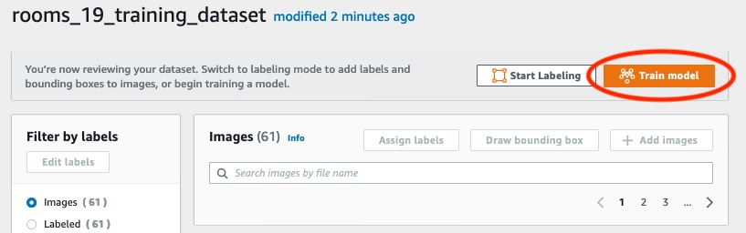

# Step 2: Train your model

In this step you train your model. The training and test datasets are automatically configured for you.
After training successfully completes, you can see the overall
evaluation results, and evaluation results for individual test images.
For more information, see [Training an Amazon Rekognition Custom Labels model](training-model.md "training-model.md").

###### To train your model

1. On the dataset page, choose the **Train model**. The following image shows
   the console with the train model button.

 2. On the **Train model** page, Choose **Train model**. The
image belows shows the **Train model** button,
notice that the Amazon Resource Name (ARN) for your project is in the
**Choose project** edit box.

 3. In the **Do you want to train your model?** dialog box, shown in the
following image, choose **Train model**.

 4. After training completes, choose the model name. Training is finished when the model status is
**TRAINING_COMPLETED**, as demonstrated in the following
console screenshot.

 5. Choose the **Evaluate** button to see the evaluation results.
For information about evaluating a model, see [Improving a trained Amazon Rekognition Custom Labels model](improving-model.md "improving-model.md"). 6. Choose **View test results** to see the results for individual test images.
As seen in the following screenshot, the evaluation dashboard shows metrics such
as F1 score, precision, and recall for each label along with number of test
images. Overall metrics like average, precision, and recall are also
displayed.

 7. After viewing the test results, choose the model name to return to the model page. The
following screenshot of the performance dashboard where you can click to the
return to the model page.

