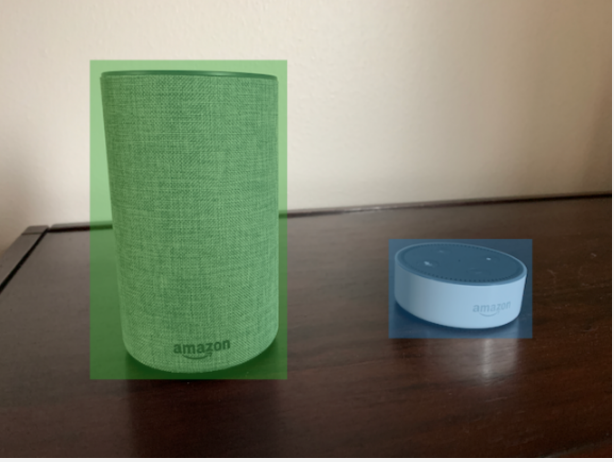

# Object

localization in manifest files

You can import images labeled with object localization information by
adding SageMaker AI Ground Truth [Bounding Box Job Output](../../../sagemaker/latest/dg/sms-data-output.md#sms-output-box "../../../sagemaker/latest/dg/sms-data-output.md#sms-output-box") format JSON lines to a manifest file.

Localization information represents the location of an object on an image.
The location is represented by a bounding box that surrounds the object. The
bounding box structure contains the upper-left coordinates of the bounding
box and the bounding box's width and height. A bounding box format JSON line
includes bounding boxes for the locations of one or more an objects on an
image and the class of each object on the image.

A manifest file is made of one or more JSON lines, each line contains the
information for a single image.

###### To create a manifest file for object localization

1. Create an empty text file.
2. Add a JSON line for each image the that you want to import. Each
   JSON line should look similar to the following.

```
{"source-ref": "s3://bucket/images/IMG_1186.png", "bounding-box": {"image_size": [{"width": 640, "height": 480, "depth": 3}], "annotations": [{ "class_id": 1,	"top": 251,	"left": 399, "width": 155, "height": 101}, {"class_id": 0, "top": 65, "left": 86, "width": 220,	"height": 334}]}, "bounding-box-metadata": {"objects": [{ "confidence": 1}, {"confidence": 1}],	"class-map": {"0": "Echo",	"1": "Echo Dot"}, "type": "groundtruth/object-detection", "human-annotated": "yes",	"creation-date": "2013-11-18T02:53:27", "job-name": "my job"}}
```

3. Save the file. You can use the extension
   `.manifest`, but it is not required.
4. Create a dataset using the file that you just created. For more
   information, see [To create a dataset
   using a SageMaker AI Ground Truth format manifest file (console)](md-create-manifest-file.md#create-dataset-procedure-manifest-file "md-create-manifest-file.md#create-dataset-procedure-manifest-file").

## Object bounding

Box JSON lines

In this section, we show you how to create a JSON line for a single
image. The following image shows bounding boxes around Amazon Echo and
Amazon Echo Dot devices.



The following is the bounding box JSON line for the preceding image.

```
{
	"source-ref": "s3://custom-labels-bucket/images/IMG_1186.png",
	"bounding-box": {
		"image_size": [{
			"width": 640,
			"height": 480,
			"depth": 3
		}],
		"annotations": [{
			"class_id": 1,
			"top": 251,
			"left": 399,
			"width": 155,
			"height": 101
		}, {
			"class_id": 0,
			"top": 65,
			"left": 86,
			"width": 220,
			"height": 334
		}]
	},
	"bounding-box-metadata": {
		"objects": [{
			"confidence": 1
		}, {
			"confidence": 1
		}],
		"class-map": {
			"0": "Echo",
			"1": "Echo Dot"
		},
		"type": "groundtruth/object-detection",
		"human-annotated": "yes",
		"creation-date": "2013-11-18T02:53:27",
		"job-name": "my job"
	}
}
```

Note the following information.

### source-ref

(Required) The Amazon S3 location of the image. The format is
`"s3://`BUCKET`/`OBJECT_PATH`"`.
Images in an imported dataset must be stored in the same Amazon S3
bucket.

### `bounding-box`

(Required) The label attribute. You choose the field name.
Contains the image size and the bounding boxes for each object
detected in the image. There must be corresponding metadata
identified by the field name with _-metadata_
appended. For example, `"bounding-box-metadata"`.

_image_size_

(Required) A single element array containing the size
of the image in pixels.

- _height_ –
  (Required) The height of the image in pixels.
- _width_ – (Required)
  The depth of the image in pixels.
- _depth_ – (Required)
  The number of channels in the image. For RGB
  images, the value is 3. Not currently used by
  Amazon Rekognition Custom Labels, but a value is required.

_annotations_

(Required) An array of bounding box information for
each object detected in the image.

- _class_id_ –
  (Required) Maps to the label in
  _class-map_. In the preceding
  example, the object with the
  _class_id_ of `1` is
  the Echo Dot in the image.
- _top_ – (Required)
  The distance from the top of the image to the top
  of the bounding box, in pixels.
- _left_ – (Required)
  The distance from the left of the image to the
  left of the bounding box, in pixels.
- _width_ – (Required)
  The width of the bounding box, in pixels.
- _height_ –
  (Required) The height of the bounding box, in
  pixels.

### `bounding-box`-metadata

(Required) Metadata about the label attribute. The field name must
be the same as the label attribute with
_-metadata_ appended. An array of bounding
box information for each object detected in the image.

_Objects_

(Required) An array of objects that are in the image.
Maps to the _annotations_ array by
index. The confidence attribute isn't used by
Amazon Rekognition Custom Labels.

_class-map_

(Required) A map of the classes that apply to objects
detected in the image.

_type_

(Required) The type of classification job.
`"groundtruth/object-detection"`
identifies the job as object detection.

_creation-date_

(Required) The Coordinated Universal Time (UTC) date
and time that the label was created.

_human-annotated_

(Required) Specify `"yes"`, if the
annotation was completed by a human. Otherwise
`"no"`.

_job-name_

(Optional) The name of the job that processes the
image.
