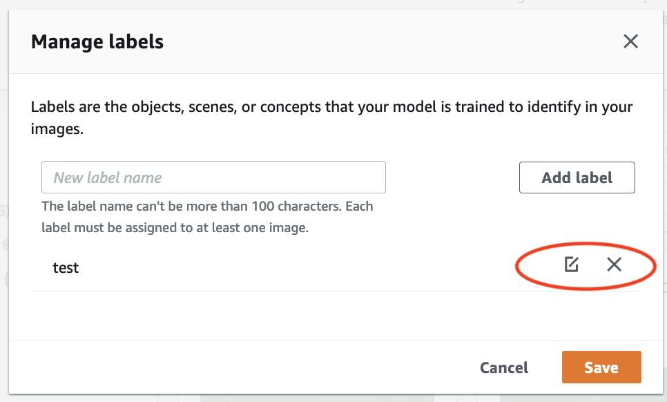

# Managing labels

You can manage labels by using the Amazon Rekognition Custom Labels console.
There isn't a specific API for managing labels – labels are added to the dataset when you create the dataset
with `CreateDataset` or when you
add more images to the dataset with `UpdateDatasetEntries`.

###### Topics

- [Managing labels (Console)](#md-labels-console "#md-labels-console")
- [Managing Labels (SDK)](#md-labels-sdk "#md-labels-sdk")

## Managing labels (Console)

You can use the Amazon Rekognition Custom Labels console to add, change, or remove labels from a
dataset. To add a label to a dataset, you can add a new label that you create or import
labels from an existing dataset in Rekognition.

###### Topics

- [Add new labels (Console)](#md-add-new-labels "#md-add-new-labels")
- [Change and remove labels (Console)](#md-edit-labels-after-adding "#md-edit-labels-after-adding")

### Add new labels (Console)

You can specify new labels that you want to add to your dataset.

#### Add labels using the editing window

###### To add a new label (console)

1. Open the Amazon Rekognition console at
   [https://console.aws.amazon.com/rekognition/](https://console.aws.amazon.com/rekognition/ "https://console.aws.amazon.com/rekognition/").
2. Choose **Use Custom Labels**.
3. Choose **Get started**.
4. In the left navigation pane, choose **Projects**.
5. In the **Projects** page, choose the project that you want to use.
   The details page for your project is displayed.
6. If you want to add labels to your training dataset, choose the **Training** tab.
   Otherwise choose the **Test** tab to add labels to the test dataset.
7. Choose **Start labeling** to enter labeling mode.
8. In the **Labels** section of the dataset gallery,
   choose **Manage labels** to open the
   **Manage labels** dialog box.
9. In the edit box, enter a new label name.
10. Choose **Add label**.
11. Repeat steps 9 and 10 until you have created all the labels you need.
12. Choose **Save** to save the labels that you added.

### Change and remove labels (Console)

You can rename or remove labels after adding them to a dataset. You can only remove labels that are not assigned
to any images.

###### To rename or remove an existing label (console)

1. Open the Amazon Rekognition console at
   [https://console.aws.amazon.com/rekognition/](https://console.aws.amazon.com/rekognition/ "https://console.aws.amazon.com/rekognition/").
2. Choose **Use Custom Labels**.
3. Choose **Get started**.
4. In the left navigation pane, choose **Projects**.
5. In the **Projects** page, choose the project that you want to use.
   The details page for your project is displayed.
6. If you want to change or delete labels in your training dataset, choose the **Training** tab.
   Otherwise choose the **Test** tab to change or delete labels to the test dataset.
7. Choose **Start labeling** to enter labeling mode.
8. In the **Labels** section of the dataset gallery,
   choose **Manage labels** to open the
   **Manage labels** dialog box.
9. Choose the label that you want to edit or delete.

    1. If you
     choose
     the delete icon (X), the label is removed from the
     list.
    2. If you want to change the label, choose the edit icon (pencil and paper pad) and enter
     a new label name in the edit box.

10. Choose **Save** to save your changes.

## Managing Labels (SDK)

There isn't a unique API that manages dataset labels. If you create a dataset
with `CreateDataset`, the labels found in the manifest file or copied
dataset, create the initial set of labels. If you add more images with the
`UpdateDatasetEntries` API, new labels found in the entries are
added to the dataset. For more information, see [Adding more images (SDK)](md-add-images.md#md-add-images-sdk "md-add-images.md#md-add-images-sdk"). To delete
labels from a dataset, you must remove all label annotations in the
dataset.

###### To delete labels from a dataset

1. Call `ListDatasetEntries` to get the dataset entries. For example code,
   see [Listing dataset entries (SDK)](md-listing-dataset-entries-sdk.md "md-listing-dataset-entries-sdk.md").
2. In the file, remove any label annotations. For more information, see
   [Importing
   image-level labels in manifest files](md-create-manifest-file-classification.md "md-create-manifest-file-classification.md") and
   [Object
   localization in manifest files](md-create-manifest-file-object-detection.md "md-create-manifest-file-object-detection.md").
3. Use the file to update the dataset with the `UpdateDatasetEntries` API. For more information,
   see [Adding more images (SDK)](md-add-images.md#md-add-images-sdk "md-add-images.md#md-add-images-sdk").
