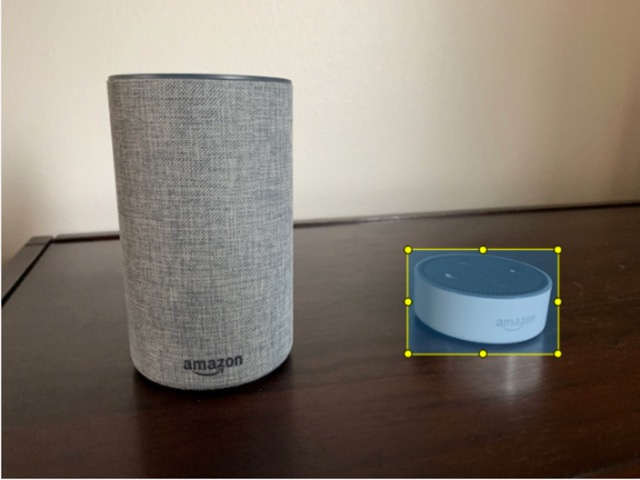
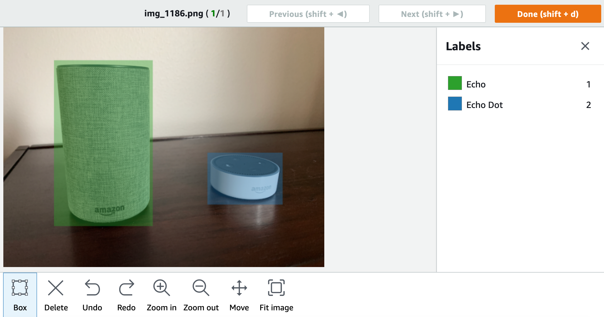

# Labeling objects with bounding boxes

If you want your model to detect the location of objects within an image, you must
identify what the object is and where it is in the image. A bounding box is a box
that isolates an object in an image. You use bounding boxes to train a model to
detect different objects in the same image. You identify the object by assigning a
label to the bounding box.

###### Note

If you're training a model to find objects, scenes, and concepts with image-level labels, you don't need to do this step.

For example, if you want to train a model that detects Amazon Echo Dot devices,
you draw a bounding box around each Echo Dot in an image and
assign a label named _Echo Dot_ to the bounding box. The following
image shows a bounding box around an Echo Dot device. The image also contains an Amazon Echo
without a bounding box.



## Locate objects with bounding boxes (Console)

In this procedure, you use the console to draw bounding boxes around the objects in
your images. You also can identify objects within the image by assigning labels
to the bounding box.

###### Note

You can't use the Safari browser to add bounding boxes to images. For supported
browsers, see [Setting up Amazon Rekognition Custom Labels](setting-up.md "setting-up.md").

Before you can add bounding boxes, you must add at least one label to the dataset.
For more information, see
[Add new labels (Console)](md-labels.md#md-add-new-labels "md-labels.md#md-add-new-labels").

######

###### To add a bounding boxes to images (console)

1. Open the Amazon Rekognition console at
   [https://console.aws.amazon.com/rekognition/](https://console.aws.amazon.com/rekognition/ "https://console.aws.amazon.com/rekognition/").
2. Choose **Use Custom Labels**.
3. Choose **Get started**.
4. In the left navigation pane, choose **Projects**.
5. In the **Projects** page, choose the project that you want to use.
   The details page for your project is displayed.
6. On the project details page, choose **Label images**
7. If you want to add bounding boxes to your training dataset images, choose the **Training** tab.
   Otherwise choose the **Test** tab to add bounding boxes to the test dataset images.
8. Choose **Start labeling** to enter labeling mode.
9. In the image gallery, choose the images that you want to add bounding
   boxes to.
10. Choose **Draw bounding box**. A series of tips are shown
    before the bounding box editor is displayed.
11. In the **Labels** pane on the right, select the label
    that you want to assign to a bounding box.
12. In the drawing tool, place your pointer at the top-left area of the
    desired object.
13. Press the left
    mouse
    button and draw a box around the object. Try to draw the bounding box as
    close as possible to the object.
14. Release the mouse button. The bounding box is highlighted.
15. Choose **Next** if you have more images to label.
    Otherwise, choose **Done** to finish labeling.

 16. Repeat steps 1–7 until you have created a bounding box in each
image that contains objects. 17. Choose **Save changes** to save your changes. 18. Choose **Exit** to exit labeling mode.

## Locate objects with bounding boxes (SDK)

You can use the `UpdateDatasetEntries` API to add or update object location information for an image.
`UpdateDatasetEntries` takes one or more JSON lines. Each JSON Line represents a single image.
For object localization, a JSON Line looks similar to the following.

```
{"source-ref": "s3://bucket/images/IMG_1186.png", "bounding-box": {"image_size": [{"width": 640, "height": 480, "depth": 3}], "annotations": [{ "class_id": 1,	"top": 251,	"left": 399, "width": 155, "height": 101}, {"class_id": 0, "top": 65, "left": 86, "width": 220,	"height": 334}]}, "bounding-box-metadata": {"objects": [{ "confidence": 1}, {"confidence": 1}],	"class-map": {"0": "Echo",	"1": "Echo Dot"}, "type": "groundtruth/object-detection", "human-annotated": "yes",	"creation-date": "2013-11-18T02:53:27", "job-name": "my job"}}
```

The `source-ref` field indicates the location of the image. The JSON line also includes labeled bounding boxes for each object on the image.
For more information, see [Object
localization in manifest files](md-create-manifest-file-object-detection.md "md-create-manifest-file-object-detection.md").

###### To assign bounding boxes to an image

1. Get the get JSON Line for the existing image by using the `ListDatasetEntries`. For the `source-ref` field, specify
   the location of the image that you want to assign the image-level label to.
   For more information, see [Listing dataset entries (SDK)](md-listing-dataset-entries-sdk.md "md-listing-dataset-entries-sdk.md").
2. Update the JSON Line returned in the previous step using the information at [Object
   localization in manifest files](md-create-manifest-file-object-detection.md "md-create-manifest-file-object-detection.md").
3. Call `UpdateDatasetEntries` to update the image.
   For more information, see [Adding more images to a dataset](md-add-images.md "md-add-images.md").
