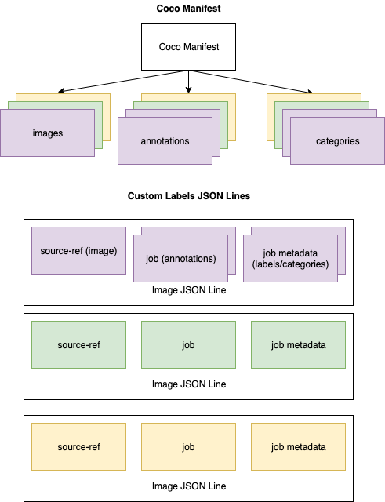

# Transforming a COCO dataset into a

manifest file format

[COCO](http://cocodataset.org/#home "http://cocodataset.org/#home") is a format for
specifying large-scale object detection, segmentation, and captioning
datasets. This Python [example](md-coco-transform-example.md "md-coco-transform-example.md") shows you how to transform a COCO object detection
format dataset into an Amazon Rekognition Custom Labels [bounding box format
manifest file](md-create-manifest-file-object-detection.md "md-create-manifest-file-object-detection.md"). This section also includes information that you
can use to write your own code.

A COCO format JSON file consists of
five
sections providing information for _an entire dataset_.
For more information, see [The COCO dataset format](md-coco-overview.md "md-coco-overview.md").

- `info` – general information about the dataset.
- `licenses` – license information for the images
  in the dataset.
- [images](md-coco-overview.md#md-coco-images "md-coco-overview.md#md-coco-images") –
  a list of images in the dataset.
- [annotations](md-coco-overview.md#md-coco-annotations "md-coco-overview.md#md-coco-annotations") – a list of annotations
  (including bounding boxes) that are present in all images in the
  dataset.
- [categories](md-coco-overview.md#md-coco-categories "md-coco-overview.md#md-coco-categories")
  – a list of label categories.
  You need information from the `images`,
  `annotations`, and `categories` lists to create an
  Amazon Rekognition Custom Labels manifest file.

An Amazon Rekognition Custom Labels manifest file is in JSON lines format where each line has
the bounding box and label information for one or more objects _on
an image_. For more information, see [Object
localization in manifest files](md-create-manifest-file-object-detection.md "md-create-manifest-file-object-detection.md").

## Mapping COCO Objects to a Custom

Labels JSON Line

To transform a COCO format dataset, you map the COCO dataset to an
Amazon Rekognition Custom Labels manifest file for object localization. For more information,
see [Object
localization in manifest files](md-create-manifest-file-object-detection.md "md-create-manifest-file-object-detection.md"). To build
a JSON line for each image, the manifest file needs to map the COCO
dataset `image`, `annotation`, and
`category` object field IDs.

The following is an example COCO manifest file. For more information,
see [The COCO dataset format](md-coco-overview.md "md-coco-overview.md").

```
{
    "info": {
        "description": "COCO 2017 Dataset","url": "http://cocodataset.org","version": "1.0","year": 2017,"contributor": "COCO Consortium","date_created": "2017/09/01"
    },
    "licenses": [
        {"url": "http://creativecommons.org/licenses/by/2.0/","id": 4,"name": "Attribution License"}
    ],
    "images": [
        {"id": 242287, "license": 4, "coco_url": "http://images.cocodataset.org/val2017/xxxxxxxxxxxx.jpg", "flickr_url": "http://farm3.staticflickr.com/2626/xxxxxxxxxxxx.jpg", "width": 426, "height": 640, "file_name": "xxxxxxxxx.jpg", "date_captured": "2013-11-15 02:41:42"},
        {"id": 245915, "license": 4, "coco_url": "http://images.cocodataset.org/val2017/nnnnnnnnnnnn.jpg", "flickr_url": "http://farm1.staticflickr.com/88/xxxxxxxxxxxx.jpg", "width": 640, "height": 480, "file_name": "nnnnnnnnnn.jpg", "date_captured": "2013-11-18 02:53:27"}
    ],
    "annotations": [
        {"id": 125686, "category_id": 0, "iscrowd": 0, "segmentation": [[164.81, 417.51,......167.55, 410.64]], "image_id": 242287, "area": 42061.80340000001, "bbox": [19.23, 383.18, 314.5, 244.46]},
        {"id": 1409619, "category_id": 0, "iscrowd": 0, "segmentation": [[376.81, 238.8,........382.74, 241.17]], "image_id": 245915, "area": 3556.2197000000015, "bbox": [399, 251, 155, 101]},
        {"id": 1410165, "category_id": 1, "iscrowd": 0, "segmentation": [[486.34, 239.01,..........495.95, 244.39]], "image_id": 245915, "area": 1775.8932499999994, "bbox": [86, 65, 220, 334]}
    ],
    "categories": [
        {"supercategory": "speaker","id": 0,"name": "echo"},
        {"supercategory": "speaker","id": 1,"name": "echo dot"}
    ]
}
```

The following diagram shows how the COCO dataset lists for a
_dataset_ map to Amazon Rekognition Custom Labels JSON lines for an
_image_. Every JSON line for an image posseess a
source-ref, job, and job metadata field. Matching colors indicate
information for a single image. Note that in the manifest an individual
image may have multiple annotations and metadata/categories.



###### To get the COCO objects for a single JSON line

1. For each image in the images list, get the annotation from the
   annotations list where the value of the annotation field
   `image_id` matches the image `id`
   field.
2. For each annotation matched in step 1, read through the
   `categories` list and get each
   `category` where the value of the
   `category` field `id` matches the
   `annotation` object `category_id`
   field.
3. Create a JSON line for the image using the matched
   `image`, `annotation`, and
   `category` objects. To map the fields, see [Mapping COCO object fields to a
   Custom Labels JSON line object fields](#md-mapping-fields-coco "#md-mapping-fields-coco").
4. Repeat steps 1–3 until you have created JSON lines for each
   `image` object in the `images`
   list.

For example code, see [Transforming a COCO
dataset](md-coco-transform-example.md "md-coco-transform-example.md").

## Mapping COCO object fields to a

Custom Labels JSON line object fields

After you identify the COCO objects for an Amazon Rekognition Custom Labels JSON line, you
need to map the COCO object fields to the respective Amazon Rekognition Custom Labels JSON
line object fields. The following example Amazon Rekognition Custom Labels JSON line maps one
image (`id`=`000000245915`) to the preceding COCO
JSON example. Note the following information.

- `source-ref` is the location of the image in an
  Amazon S3 bucket. If your COCO images aren't stored in an Amazon S3
  bucket, you need to move them to an Amazon S3 bucket.
- The `annotations` list
  contains
  an `annotation` object for each object on the image.
  An `annotation` object includes bounding box
  information (`top`,
  `left`,`width`, `height`)
  and a label identifier (`class_id`).
- The label identifier (`class_id`) maps to the
  `class-map` list in the metadata. It lists the
  labels used on the image.

```
{
	"source-ref": "s3://custom-labels-bucket/images/000000245915.jpg",
	"bounding-box": {
		"image_size": {
			"width": 640,
			"height": 480,
			"depth": 3
		},
		"annotations": [{
			"class_id": 0,
			"top": 251,
			"left": 399,
			"width": 155,
			"height": 101
		}, {
			"class_id": 1,
			"top": 65,
			"left": 86,
			"width": 220,
			"height": 334
		}]
	},
	"bounding-box-metadata": {
		"objects": [{
			"confidence": 1
		}, {
			"confidence": 1
		}],
		"class-map": {
			"0": "Echo",
			"1": "Echo Dot"
		},
		"type": "groundtruth/object-detection",
		"human-annotated": "yes",
		"creation-date": "2018-10-18T22:18:13.527256",
		"job-name": "my job"
	}
}
```

Use the following information to map Amazon Rekognition Custom Labels manifest file fields
to COCO dataset JSON fields.

### source-ref

The S3 format URL for the location of the image. The image must be
stored in an S3 bucket. For more information, see [source-ref](md-create-manifest-file-object-detection.md#cd-manifest-source-ref "md-create-manifest-file-object-detection.md#cd-manifest-source-ref"). If the
`coco_url` COCO field points to an S3 bucket
location, you can use the value of `coco_url` for the
value of `source-ref`. Alternatively, you can map
`source-ref` to the `file_name` (COCO)
field and in your transform code, add the required S3 path to where
the image is stored.

### `bounding-box`

A label attribute name of your choosing. For more information, see
[bounding-box](md-create-manifest-file-object-detection.md#md-manifest-source-bounding-box "md-create-manifest-file-object-detection.md#md-manifest-source-bounding-box").

#### image_size

The size of the image in pixels. Maps to an `image`
object in the [images](md-coco-overview.md#md-coco-images "md-coco-overview.md#md-coco-images")
list.

- `height`-> `image.height`
- `width`-> `image.width`
- `depth`-> Not used by Amazon Rekognition Custom Labels but a
  value must be supplied.

#### annotations

A list of `annotation` objects. There’s one
`annotation` for each object on the image.

#### annotation

Contains bounding box information for
one
instance of an object on the image.

- `class_id` -> numerical id mapping to
  Custom Label’s `class-map` list.
- `top` -> `bbox[1]`
- `left` -> `bbox[0]`
- `width` -> `bbox[2]`
- `height` -> `bbox[3]`

### `bounding-box`-metadata

Metadata for the label attribute. Includes the labels and label
identifiers. For more information, see [bounding-box-metadata](md-create-manifest-file-object-detection.md#md-manifest-source-bounding-box-metadata "md-create-manifest-file-object-detection.md#md-manifest-source-bounding-box-metadata").

#### Objects

An array of objects in the image. Maps to the
`annotations` list by index.

##### Object

- `confidence`->Not used by Amazon Rekognition Custom Labels,
  but a value (1) is required.

#### class-map

A map of the labels (classes) that apply to objects detected
in the image. Maps to category objects in the [categories](md-coco-overview.md#md-coco-categories "md-coco-overview.md#md-coco-categories") list.

- `id` -> `category.id`
- `id value` -> `category.name`

#### type

Must be `groundtruth/object-detection`

#### human-annotated

Specify `yes` or `no`. For more
information, see [bounding-box-metadata](md-create-manifest-file-object-detection.md#md-manifest-source-bounding-box-metadata "md-create-manifest-file-object-detection.md#md-manifest-source-bounding-box-metadata").

#### creation-date -> [image](md-coco-overview.md#md-coco-images "md-coco-overview.md#md-coco-images").date_captured

The creation date and time of the image. Maps to the [image](md-coco-overview.md#md-coco-images "md-coco-overview.md#md-coco-images").date_captured field of
an image in the COCO images list. Amazon Rekognition Custom Labels expects the format
of `creation-date` to be
_Y-M-DTH:M:S_.

#### job-name

A job name of your choosing.
