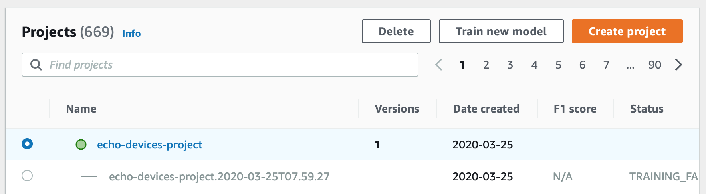
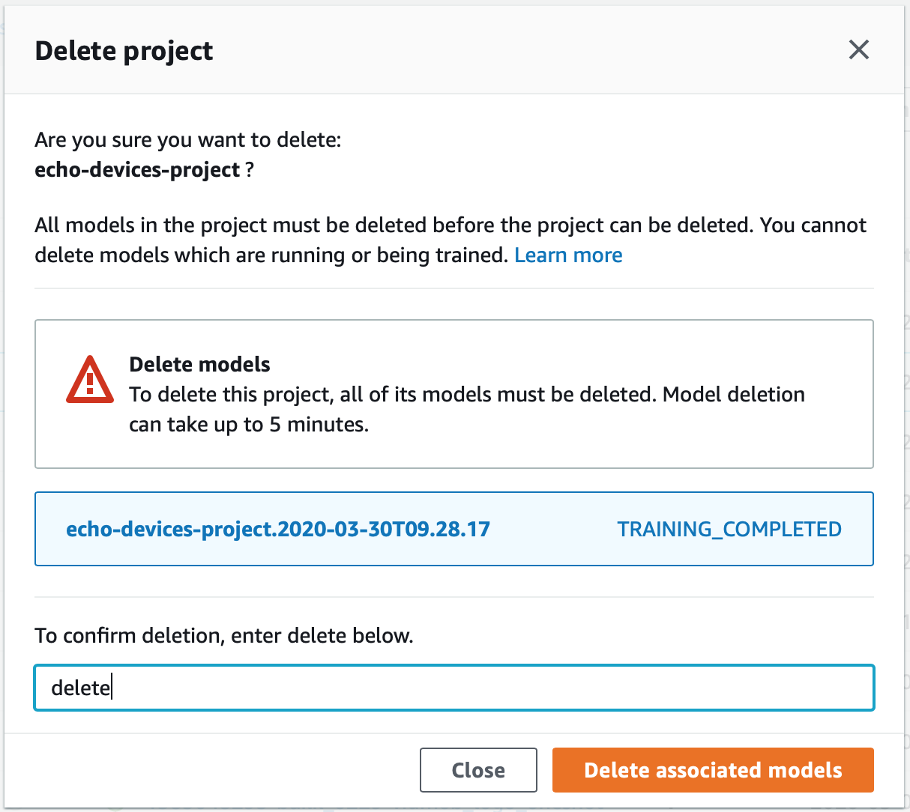
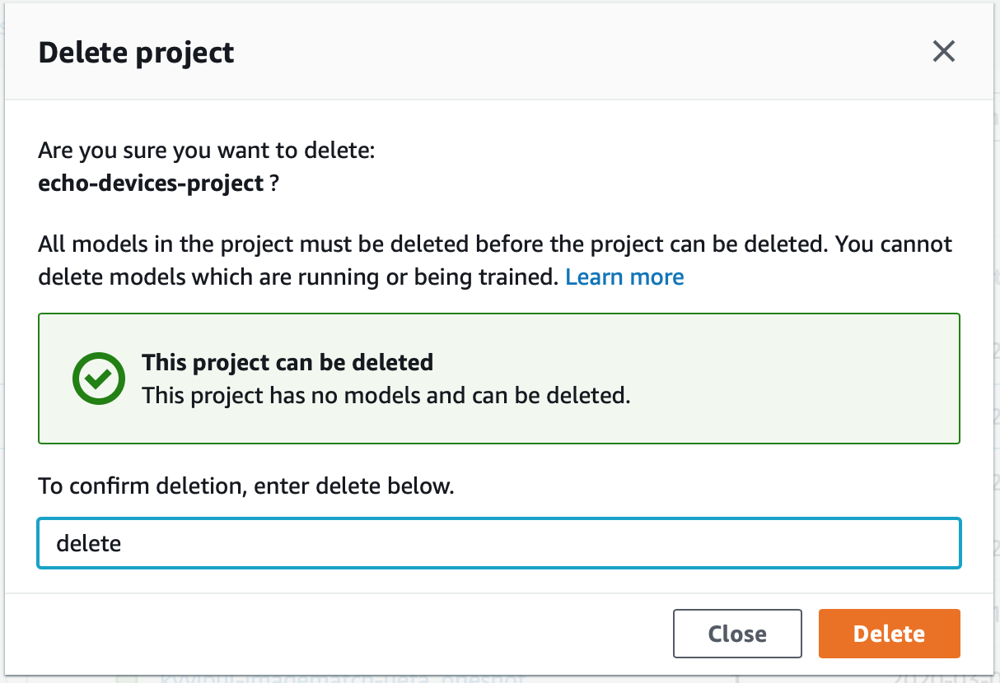

# Deleting an Amazon Rekognition Custom Labels project

You can delete a project by using the Amazon Rekognition console or by calling the [DeleteProject](../APIReference/API_DeleteProject.md "../APIReference/API_DeleteProject.md") API. To delete a project, you must first delete
each associated model. A deleted project or model can't be undeleted.

###### Topics

- [Deleting an Amazon Rekognition Custom Labels project (Console)](#mp-delete-project-console "#mp-delete-project-console")
- [Deleting an Amazon Rekognition Custom Labels project (SDK)](#mp-delete-project-sdk "#mp-delete-project-sdk")

## Deleting an Amazon Rekognition Custom Labels project (Console)

You can delete a project from the projects page, or you can delete a project from a project's detail page.
The following procedure shows you how to delete a project using the projects page.

The Amazon Rekognition Custom Labels console deletes associated models and datasets for you during project deletion.
You can't delete a project if any of its models are running or training.
To stop a running model, see [Stopping an Amazon Rekognition Custom Labels model (SDK)](rm-stop.md#rm-stop-sdk "rm-stop.md#rm-stop-sdk"). If a model is training, wait
until it finishes before you delete the project.

###### To delete a project (console)

1. Open the Amazon Rekognition console at
   [https://console.aws.amazon.com/rekognition/](https://console.aws.amazon.com/rekognition/ "https://console.aws.amazon.com/rekognition/").
2. Choose **Use Custom Labels**.
3. Choose **Get started**.
4. In the left navigation pane, choose **Projects**.
5. On the **Projects** page, select the radio button for the project that you
   want to delete. The project list showing echo-devices-project, with 1
   version created on 2020-03-25, and options to Delete, Train new model, or
   Create project.

 6. Choose **Delete** at the top of the page. The **Delete project**
dialog box is shown. 7. If the project has no associated models:

    1. Enter **delete** to delete the project.
    2. Choose **Delete** to delete the project.

8. If the project has associated models or datasets:
   1. Enter **delete** to confirm that you want to delete the model(s) and datasets.
   2. Choose either **Delete associated models** or **Delete associated datasets** or
      **Delete associated datasets and models**, depending on whether the model has datasets, models, or both.
      Model deletion might take a while to complete.

   ###### Note

   The console can't delete models that are in-training or running. Try again after stopping
   any running models that are listed, and wait until models listed as training finish.

   If you **Close** the dialog box during model deletion,
   the models are still deleted. Later, you can delete the project by repeating this procedure.

   The panel for deleting a model gives you explicit instructions to delete associated models.

    3. Enter **delete** to confirm that you want to delete the project. 4. Choose **Delete** to delete the project.

   

## Deleting an Amazon Rekognition Custom Labels project (SDK)

You delete an Amazon Rekognition Custom Labels project by calling [DeleteProject](../APIReference/API_DeleteProject.md "../APIReference/API_DeleteProject.md") and supplying the Amazon
Resource Name (ARN) of the project that you want to delete. To get the ARNs of the projects
in your AWS account, call [DescribeProjects](../APIReference/API_DescribeProjects.md "../APIReference/API_DescribeProjects.md"). The response includes an array
of [ProjectDescription](../APIReference/API_ProjectDescription.md "../APIReference/API_ProjectDescription.md") objects.
The project ARN is the `ProjectArn` field. You can use the
project name to identify the ARN of the project.
For example,
`arn:aws:rekognition:us-east-1:123456789010:project/`project name`/1234567890123`.

Before you can delete a
project, you must first delete all models and datasets in the project. For more information, see
[Deleting an Amazon Rekognition Custom Labels model (SDK)](tm-delete-model.md#tm-delete-model-sdk "tm-delete-model.md#tm-delete-model-sdk") and
[Deleting a dataset](md-delete-dataset.md "md-delete-dataset.md").

The project might take a few moments to delete. During that time, the status of the project is
`DELETING`. The project is deleted if a subsequent call to [DescribeProjects](../APIReference/API_DescribeProjects.md "../APIReference/API_DescribeProjects.md") doesn't include the
project that you deleted.

###### To delete a project (SDK)

1. If you haven't already done so, install and configure the AWS CLI and the AWS SDKs. For more information, see
   [Step 4: Set up the AWS CLI and AWS SDKs](su-awscli-sdk.md "su-awscli-sdk.md").
2. Use the following code to delete a project.

AWS CLI
Change the value of `project-arn` to the name of the
project that you want to delete.

```
aws rekognition delete-project --project-arn `project_arn` \
  --profile custom-labels-access

```

Python
Use the following code. Supply the following command line parameters:

    * `project_arn`— the ARN of the project that you want to delete.

```
# Copyright Amazon.com, Inc. or its affiliates. All Rights Reserved.
# SPDX-License-Identifier: Apache-2.0

"""
Purpose
Amazon Rekognition Custom Labels project example used in the service documentation:
https://docs.aws.amazon.com/rekognition/latest/customlabels-dg/mp-delete-project.html
Shows how to delete an existing Amazon Rekognition Custom Labels project.
You must first delete any models and datasets that belong to the project.
"""

import argparse
import logging
import time
import boto3


from botocore.exceptions import ClientError

logger = logging.getLogger(__name__)


def find_forward_slash(input_string, n):
    """
    Returns the location of '/' after n number of occurences.
    :param input_string: The string you want to search
    : n: the occurence that you want to find.
    """
    position = input_string.find('/')
    while position >= 0 and n > 1:
        position = input_string.find('/', position + 1)
        n -= 1
    return position


def delete_project(rek_client, project_arn):
    """
    Deletes an Amazon Rekognition Custom Labels project.
    :param rek_client: The Amazon Rekognition Custom Labels Boto3 client.
    :param project_arn: The ARN of the project that you want to delete.
    """

    try:
        # Delete the project
        logger.info("Deleting project: %s", project_arn)

        response = rek_client.delete_project(ProjectArn=project_arn)

        logger.info("project status: %s",response['Status'])

        deleted = False

        logger.info("waiting for project deletion: %s", project_arn)

        # Get the project name
        start = find_forward_slash(project_arn, 1) + 1
        end = find_forward_slash(project_arn, 2)
        project_name = project_arn[start:end]

        project_names = [project_name]

        while deleted is False:

            project_descriptions = rek_client.describe_projects(
                ProjectNames=project_names)['ProjectDescriptions']

            if len(project_descriptions) == 0:
                deleted = True

            else:
                time.sleep(5)

        logger.info("project deleted: %s",project_arn)

        return True

    except ClientError as err:
        logger.exception(
            "Couldn't delete project - %s: %s",
            project_arn, err.response['Error']['Message'])
        raise


def add_arguments(parser):
    """
    Adds command line arguments to the parser.
    :param parser: The command line parser.
    """

    parser.add_argument(
        "project_arn", help="The ARN of the project that you want to delete."
    )


def main():

    logging.basicConfig(level=logging.INFO,
                        format="%(levelname)s: %(message)s")

    try:

        # get command line arguments
        parser = argparse.ArgumentParser(usage=argparse.SUPPRESS)
        add_arguments(parser)
        args = parser.parse_args()

        print(f"Deleting project: {args.project_arn}")

        # Delete the project.
        session = boto3.Session(profile_name='custom-labels-access')
        rekognition_client = session.client("rekognition")

        delete_project(rekognition_client,
                       args.project_arn)

        print(f"Finished deleting project: {args.project_arn}")

    except ClientError as err:
        error_message = f"Problem deleting project: {err}"
        logger.exception(error_message)
        print(error_message)


if __name__ == "__main__":
    main()

```

Java V2
Use the following code. Supply the following command line parameters:

    * `project_arn`— the ARN of the project that you want to delete.

```
/*
Copyright Amazon.com, Inc. or its affiliates. All Rights Reserved.
SPDX-License-Identifier: Apache-2.0
*/

package com.example.rekognition;

import java.util.List;
import java.util.Objects;
import java.util.logging.Level;
import java.util.logging.Logger;

import software.amazon.awssdk.auth.credentials.ProfileCredentialsProvider;
import software.amazon.awssdk.regions.Region;
import software.amazon.awssdk.services.rekognition.RekognitionClient;
import software.amazon.awssdk.services.rekognition.model.DeleteProjectRequest;
import software.amazon.awssdk.services.rekognition.model.DeleteProjectResponse;
import software.amazon.awssdk.services.rekognition.model.DescribeProjectsRequest;
import software.amazon.awssdk.services.rekognition.model.DescribeProjectsResponse;
import software.amazon.awssdk.services.rekognition.model.ProjectDescription;
import software.amazon.awssdk.services.rekognition.model.RekognitionException;

public class DeleteProject {

    public static final Logger logger = Logger.getLogger(DeleteProject.class.getName());

    public static void deleteMyProject(RekognitionClient rekClient, String projectArn) throws InterruptedException {

        try {

            logger.log(Level.INFO, "Deleting project: {0}", projectArn);

            // Delete the project

            DeleteProjectRequest deleteProjectRequest = DeleteProjectRequest.builder().projectArn(projectArn).build();
            DeleteProjectResponse response = rekClient.deleteProject(deleteProjectRequest);

            logger.log(Level.INFO, "Status: {0}", response.status());

            // Wait until deletion finishes

            Boolean deleted = false;

            do {

				    DescribeProjectsRequest describeProjectsRequest = DescribeProjectsRequest.builder().build();
                    DescribeProjectsResponse describeResponse = rekClient.describeProjects(describeProjectsRequest);
                    List<ProjectDescription> projectDescriptions = describeResponse.projectDescriptions();

                    deleted = true;

                    for (ProjectDescription projectDescription : projectDescriptions) {

                        if (Objects.equals(projectDescription.projectArn(), projectArn)) {
                            deleted = false;
                            logger.log(Level.INFO, "Not deleted: {0}", projectDescription.projectArn());
                            Thread.sleep(5000);
                            break;
                        }
                    }

            } while (Boolean.FALSE.equals(deleted));

            logger.log(Level.INFO, "Project deleted: {0} ", projectArn);

        } catch (

        RekognitionException e) {
            logger.log(Level.SEVERE, "Client error occurred: {0}", e.getMessage());
            throw e;
        }

    }

    public static void main(String[] args) {

        final String USAGE = "\n" + "Usage: " + "<project_arn>\n\n" + "Where:\n"
             + "   project_arn - The ARN of the project that you want to delete.\n\n";

        if (args.length != 1) {
             System.out.println(USAGE);
	         System.exit(1);
        }

        String projectArn = args[0];

        try {

            RekognitionClient rekClient = RekognitionClient.builder()
                .region(Region.US_WEST_2)
                .credentialsProvider(ProfileCredentialsProvider.create("custom-labels-access"))
                .build();

            // Delete the project.
            deleteMyProject(rekClient, projectArn);

            System.out.println(String.format("Project deleted: %s", projectArn));

            rekClient.close();

        } catch (RekognitionException rekError) {
            logger.log(Level.SEVERE, "Rekognition client error: {0}", rekError.getMessage());
            System.exit(1);
        }

        catch (InterruptedException intError) {
            logger.log(Level.SEVERE, "Exception while sleeping: {0}", intError.getMessage());
            System.exit(1);
        }
    }

}
```
