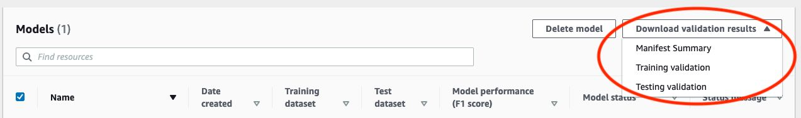
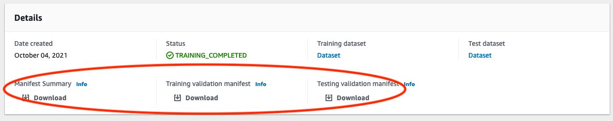

# Getting the validation results

The validation results contain error information for [List of terminal manifest
content errors](tm-debugging.md#tm-error-category-combined-terminal "tm-debugging.md#tm-error-category-combined-terminal") and
[List of non-terminal
JSON line validation errors](tm-debugging.md#tm-error-category-non-terminal-errors "tm-debugging.md#tm-error-category-non-terminal-errors").
There are three validation results files.

- _training_manifest_with_validation.json_ – A copy of the training dataset manifest file with JSON Line error information added.
- _testing_manifest_with_validation.json_ – A copy of the testing dataset manifest file with JSON Line error error information added.
- _manifest_summary.json_ – A summary of manifest content errors and JSON Line errors found in the
  training and testing datasets. For more information, see [Understanding the manifest summary](tm-debugging-summary.md "tm-debugging-summary.md").
  For information about the contents of the training and testing validation manifests, see [Debugging a failed model training](tm-debugging.md "tm-debugging.md").

###### Note

- The validation results are created only if no [List of terminal manifest file
  errors](tm-debugging.md#tm-error-category-terminal "tm-debugging.md#tm-error-category-terminal")
  are generated during training.
- If a [service error](tm-debugging.md#tm-error-category-service "tm-debugging.md#tm-error-category-service") occurs after the training and testing manifest are validated, the validation
  results are created, but the response from [DescribeProjectVersions](../APIReference/API_DescribeProjectVersions.md "../APIReference/API_DescribeProjectVersions.md") doesn't include the validation
  results file locations.
  After training completes or fails, you can download the validation results by using the Amazon Rekognition Custom Labels console or get the Amazon S3 bucket location by calling
  [DescribeProjectVersions](../APIReference/API_DescribeProjectVersions.md "../APIReference/API_DescribeProjectVersions.md") API.

## Getting validation results (Console)

If you are using the console to train your model, you can download the
validation results from a project's list of models, as shown in the following
diagram. The Models panel shows model training and validation results with option to
download validation results.



You can also access download the validation results from a model's details
page. The details page shows the dataset details with status, training and test
datasets, and download links for manifest summary, training validation manifest, and
testing validation manifest.



For more information, see [Training a model (Console)](training-model.md#tm-console "training-model.md#tm-console").

## Getting validation results (SDK)

After model training completes, Amazon Rekognition Custom Labels stores the validation results in the Amazon S3 bucket specified during training.
You can get the S3 bucket location by calling the
[DescribeProjectVersions](../APIReference/API_DescribeProjectVersions.md "../APIReference/API_DescribeProjectVersions.md") API, after training completes.
To train a model, see [Training a model (SDK)](training-model.md#tm-sdk "training-model.md#tm-sdk").

A [ValidationData](../APIReference/API_ValidationData.md "../APIReference/API_ValidationData.md") object is returned for the training dataset
([TrainingDataResult](../APIReference/API_TrainingDataResult.md "../APIReference/API_TrainingDataResult.md")) and the testing dataset
([TestingDataResult](../APIReference/API_TestingDataResult.md "../APIReference/API_TestingDataResult.md")). The manifest summary is returned in
`ManifestSummary`.

After you get the Amazon S3 bucket location, you can download the validation results. For more information, see
[How do I download an object from an S3 bucket?](../../../AmazonS3/latest/user-guide/download-objects.md "../../../AmazonS3/latest/user-guide/download-objects.md").
You can also use the [GetObject](../../../AmazonS3/latest/dev/GettingObjectsUsingAPIs.md "../../../AmazonS3/latest/dev/GettingObjectsUsingAPIs.md") operation.

###### To get validation data (SDK)

1. If you haven't already done so, install and configure the AWS CLI and the AWS SDKs. For more information, see
   [Step 4: Set up the AWS CLI and AWS SDKs](su-awscli-sdk.md "su-awscli-sdk.md").
2. Use the following example to get the location of the validation results.

Python
Replace `project_arn` with the Amazon Resource Name (ARN) of the project that contains the model.
For more information, see [Managing an Amazon Rekognition Custom Labels project](managing-project.md "managing-project.md").
Replace `version_name` with the name of the model version. For more information, see [Training a model (SDK)](training-model.md#tm-sdk "training-model.md#tm-sdk").

```
import boto3
import io
from io import BytesIO
import sys
import json


def describe_model(project_arn, version_name):

    client=boto3.client('rekognition')

    response=client.describe_project_versions(ProjectArn=project_arn,
        VersionNames=[version_name])

    for model in response['ProjectVersionDescriptions']:
        print(json.dumps(model,indent=4,default=str))

def main():

    project_arn='project_arn'
    version_name='version_name'

    describe_model(project_arn, version_name)

if __name__ == "__main__":
    main()
```

3. In the program output, note the `Validation` field within the `TestingDataResult`
   and `TrainingDataResult` objects. The manifest summary is in `ManifestSummary`.
