# Classifying images

This tutorial shows you how to create the project and datasets for a model that classifies
objects, scenes, and concepts found in an image. The model classifies the entire image. For
example, by following this tutorial, you can train a model to recognize household locations
such as a living room or kitchen. The tutorial also shows you how to use the model to
analyze images.

Before starting the tutorial, we recommend that you read [Understanding Amazon Rekognition Custom Labels](understanding-custom-labels.md "understanding-custom-labels.md").

In this tutorial, you create the training and test datasets by uploading images from your local computer.
Later you assign image-level labels to the images in your training and test datasets.

The model you create classifies images as belonging to the set of image-level labels that
you assign to the training dataset images. For example, if the set of image-level labels in
your training dataset is `kitchen`, `living_room`, `patio`,
and `backyard`, the model can potentially find all of those image-level labels in
a single image.

###### Note

You can create models for different purposes such as finding the location of objects on an image. For
more information, see [Decide your model type](understanding-custom-labels.md#tm-intro-model-type "understanding-custom-labels.md#tm-intro-model-type").

## Step 1: Collect your images

You need two sets of images. One set to add to your training dataset. Another set to
add to your test dataset. The images should represent the objects, scenes, and concepts
that you want your model to classify. The images must be in PNG or JPEG format. For more
information, see [Preparing images](md-prepare-images.md "md-prepare-images.md").

You should have at least 10 images for your training dataset and 10 images for your test dataset.

If you don't yet have images, use the images from the _Rooms_
example classification project. After creating the project, the training and test images
are at the following Amazon S3 bucket locations:

- Training images — `s3://custom-labels-console-`region`-`numbers`/assets/rooms_`version number`_test_dataset/`
- Test images — `s3://custom-labels-console-`region`-`numbers`/assets/rooms_`version number`_test_dataset/`

`region` is the AWS Region in which you are using the Amazon Rekognition Custom Labels
console. `numbers` is a value that the console assigns to the bucket name.
`Version number` is the version number for the example project, starting
at 1.

The following procedure stores images from the Rooms project into local folders on your computer named `training` and `test`.

###### To download the Rooms example project image files

1. Create the Rooms project. For more information, see [Step 1: Choose an example project](gs-step-choose-example-project.md "gs-step-choose-example-project.md").
2. Open the command prompt and enter the following command to download the training
   images.

```
aws s3 cp s3://custom-labels-console-`region`-`numbers`/assets/rooms_`version number`_training_dataset/ training --recursive
```

3. At the commend prompt, enter the following command to download the test images.

```
aws s3 cp s3://custom-labels-console-`region`-`numbers`/assets/rooms_`version number`_test_dataset/ test --recursive
```

4. Move two of the images from the training folder to a separate folder of your choosing. You'll
   use the images to try your trained model in [Step 9: Analyze an image with your
   model](#tutorial-step-get-a-prediction "#tutorial-step-get-a-prediction").

## Step 2: Decide your classes

Make a list of the classes that you want your model to find.
For example, if you're training a model to recognize rooms in a house, you can classify the following image as `living_room`.


Each class maps to an image-level label. Later you assign image-level labels to the images in your training and test datasets.

If you're using the images from the Rooms example project, the image-level labels are _backyard_, _bathroom_, _bedroom_, _closet_,
_entry_way_, _floor_plan_, _front_yard_, _kitchen_, _living_space_, and _patio_.

## Step 3: Create a project

To manage your datasets and models you create a project. Each project should address a single use case,
such as recognizing rooms in a house.

###### To create a project (console)

1. If you haven't already, set up the Amazon Rekognition Custom Labels console. For more information, see [Setting up Amazon Rekognition Custom Labels](setting-up.md "setting-up.md").
2. Sign in to the AWS Management Console and open the Amazon Rekognition console at
   [https://console.aws.amazon.com/rekognition/](https://console.aws.amazon.com/rekognition/ "https://console.aws.amazon.com/rekognition/").
3. In the left pane, choose **Use Custom Labels**. The Amazon Rekognition Custom Labels landing page is shown.
4. The Amazon Rekognition Custom Labels landing page, choose **Get started**
5. In the left navigation pane, choose **Projects**.
6. On the projects page, choose **Create Project**.
7. In **Project name**, enter a name for your project.
8. Choose **Create project** to create your project.

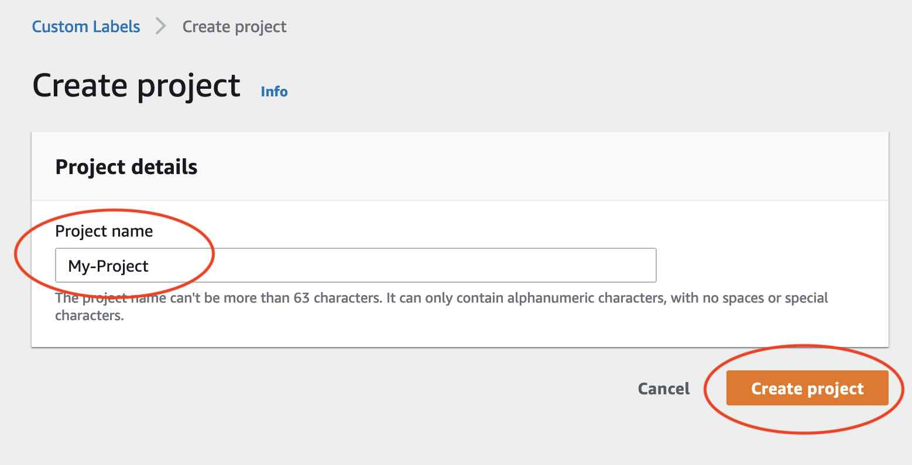

## Step 4: Create training and test datasets

In this step you create a training dataset and a test dataset by uploading images from
your local computer. You can upload as many as 30 images at a time. If you have a lot
of images to upload, consider creating the datasets by importing the images from an Amazon S3
bucket. For more information, see [Importing images from an Amazon S3 bucket](md-create-dataset-s3.md "md-create-dataset-s3.md").

For more information about datasets, see [Managing datasets](managing-dataset.md "managing-dataset.md").

###### To create a dataset using images on a local computer (console)

1. On the project details page, choose **Create
   dataset**.

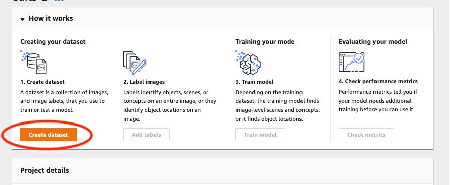 2. In the **Starting configuration** section,
choose **Start with a training dataset and a test dataset**. 3. In the **Training dataset details**
section, choose **Upload images from your
computer**. 4. In the **Test dataset details**
section, choose **Upload images from your
computer**. 5. Choose **Create datasets**.

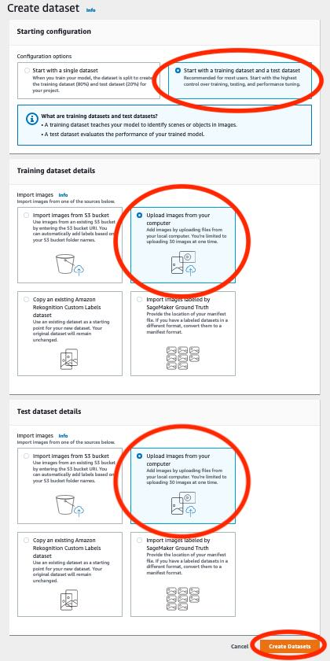 6. A dataset
page appears with a **Training** tab
and a **Test** tab for the respective
datasets. 7. On the dataset page, choose the **Training** tab. 8. Choose **Actions** and then choose
**Add images to training
dataset**.

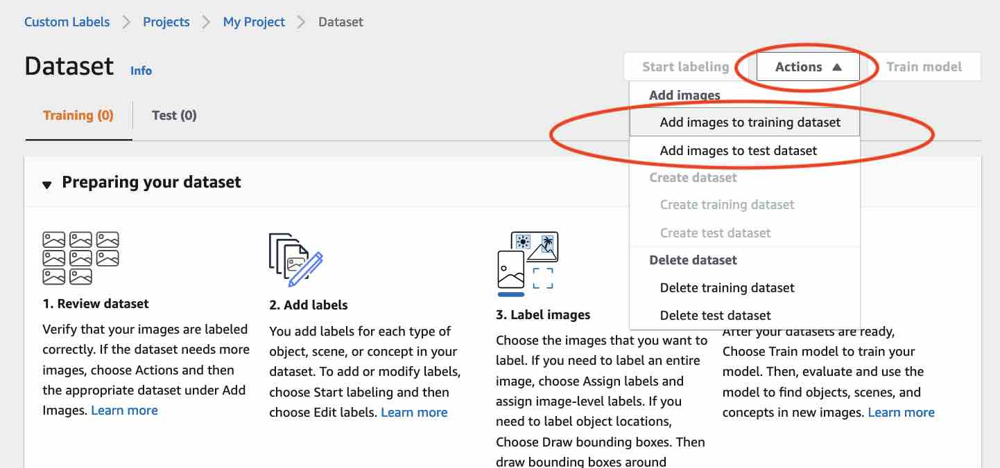 9. In the **Add images to training dataset** dialog box, choose **Choose
files**.

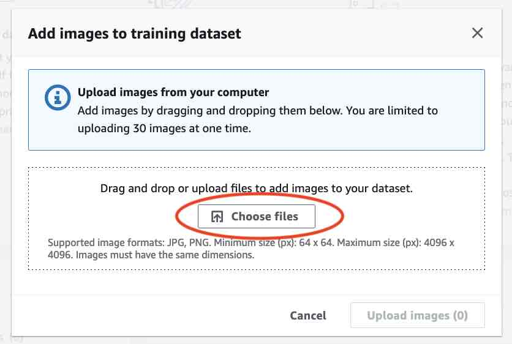 10. Choose the images you want to upload to the dataset. You can upload as many as 30 images at a
time. 11. Choose **Upload images**. It might take a few seconds for Amazon Rekognition Custom Labels to add the images to
the dataset.

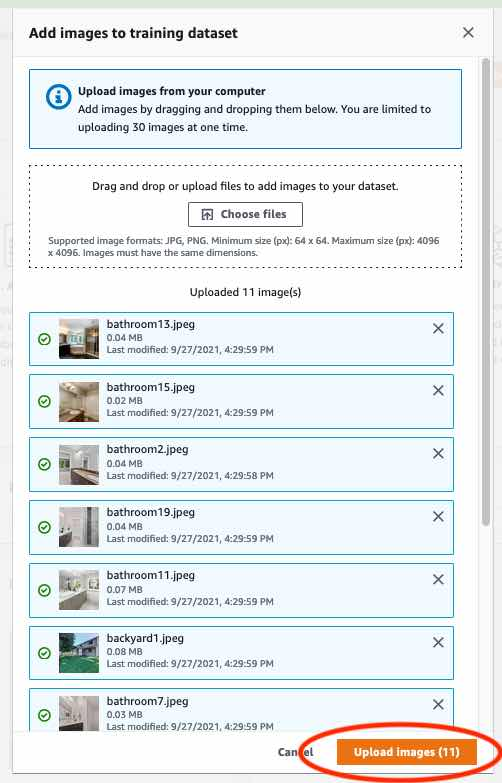 12. If you have more images to add to the training dataset, repeat steps 9-12. 13. Choose the **Test** tab. 14. Repeat steps 8 - 12 to add images to the test dataset. For step 8, choose
**Actions** and then choose
**Add images to test dataset**.

## Step 5: Add labels to the project

In this step you add a label to the project for each of the classes you identified in step [Step 2: Decide your classes](#tutorial-classify-images-decide-categories "#tutorial-classify-images-decide-categories").

###### To add a new label (console)

1. On the dataset gallery page, choose **Start labeling** to enter labeling
   mode.

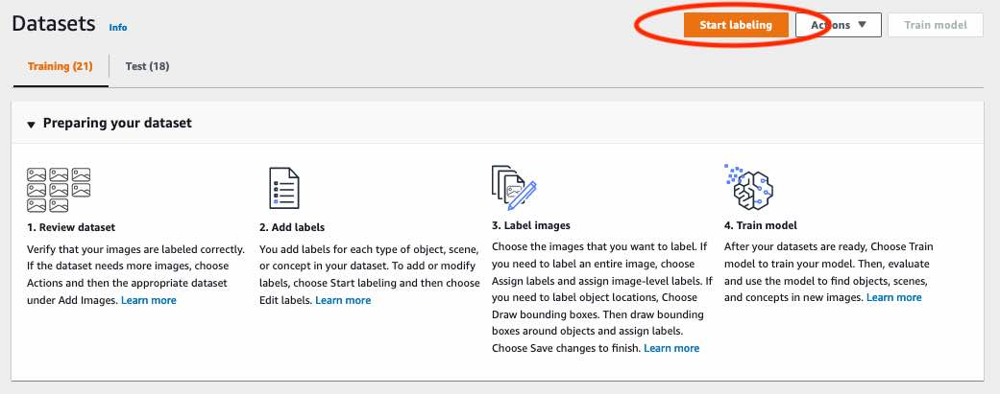 2. In the **Labels** section of the dataset gallery,
choose **Edit labels** to open the
**Manage labels** dialog box. 3. In the edit box, enter a new label name. 4. Choose **Add label**. 5. Repeat steps 3 and 4 until you have created all the labels you need. 6. Choose **Save** to save the labels that you added.

## Step 6: Assign image-level labels to training and test datasets

In this step you assign a single image level to each image in your training and test datasets. The image-level label is the class that each
image represents.

###### To assign image-level labels to an image (console)

1. On the **Datasets** page, choose the **Training** tab.
2. Choose **Start labeling** to enter labeling mode.
3. Select one or more images that you want to add labels to. You can only select images on a
   single page at a time. To select a contiguous range of images on a page:
   1. Select the first image.
   2. Press and hold the shift key.
   3. Select the second image. The images between the first and second image are also selected.
   4. Release the shift key.

4. Choose **Assign image-level labels**.

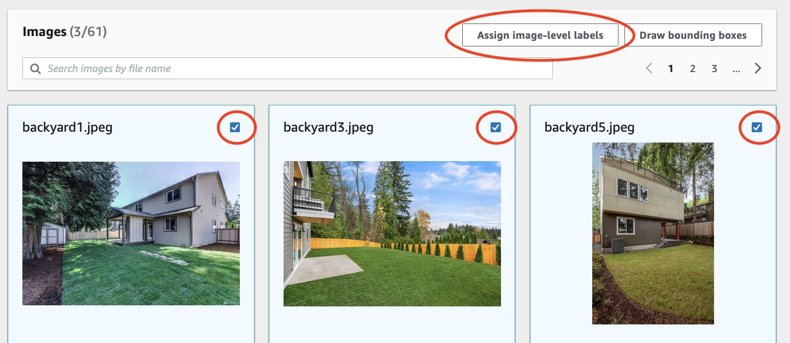 5. In **Assign image-level labels to selected images** dialog box, select a label that you
want to assign to the image or images. 6. Choose **Assign** to assign label to the image.

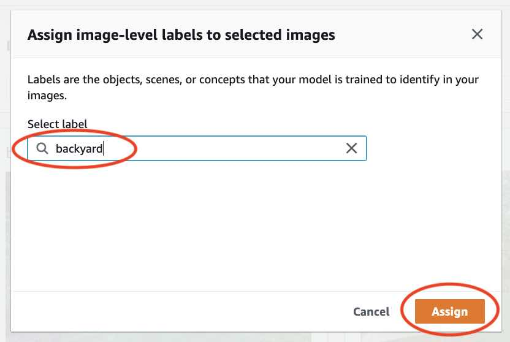 7. Repeat labeling until every image is annotated with the required labels. 8. Choose the **Test** tab. 9. Repeat steps to assign image level labels to the test dataset images.

## Step 7: Train your model

Use the following steps to train your model. For more information, see [Training an Amazon Rekognition Custom Labels model](training-model.md "training-model.md").

###### To train your model (console)

1. On the **Dataset** page, choose **Train model**.

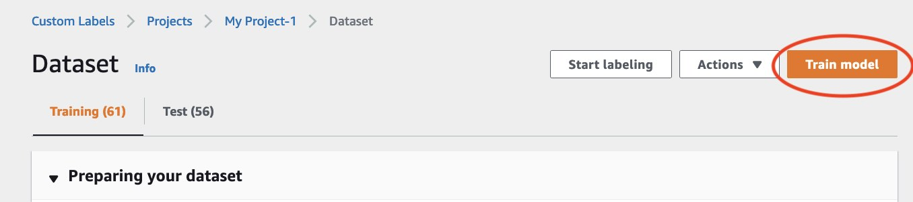 2. On the **Train model** page, choose **Train model**. The
Amazon Resource Name (ARN) for your project is in the **Choose
project** edit box.

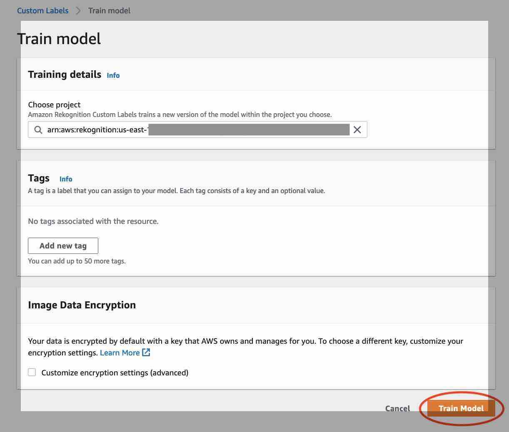 3. In the **Do you want to train your model?** dialog box, choose
**Train model**.

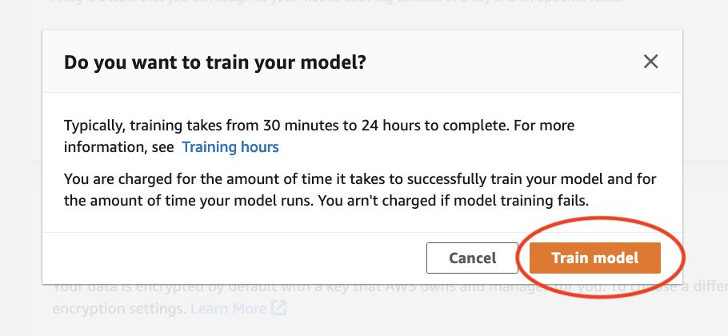 4. In the **Models** section of the project page, you can see that training is
in progress. You can check the current status by viewing the `Model
 Status` column for the model version. Training a model takes a while
to complete.

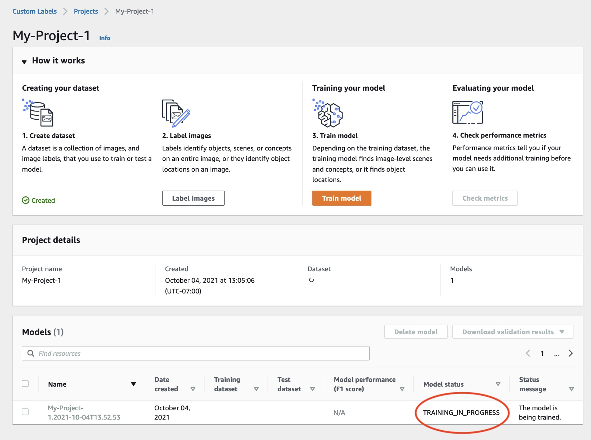 5. After training completes, choose the model name. Training is finished when the model status is **TRAINING_COMPLETED**.

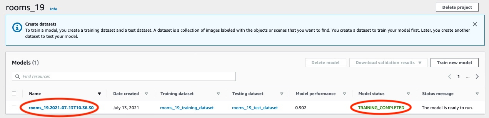 6. Choose the **Evaluate** button to see the evaluation results.
For information about evaluating a model, see [Improving a trained Amazon Rekognition Custom Labels model](improving-model.md "improving-model.md"). 7. Choose **View test results** to see the results for individual test images. For more information, see [Metrics for evaluating your model](im-metrics-use.md "im-metrics-use.md").

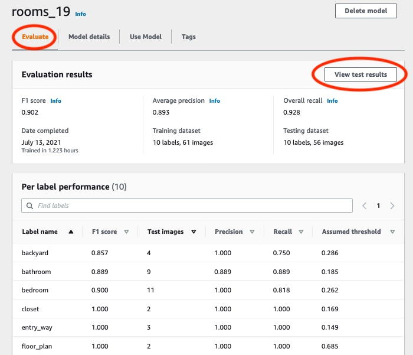 8. After viewing the test results, choose the model name to return to the model page.

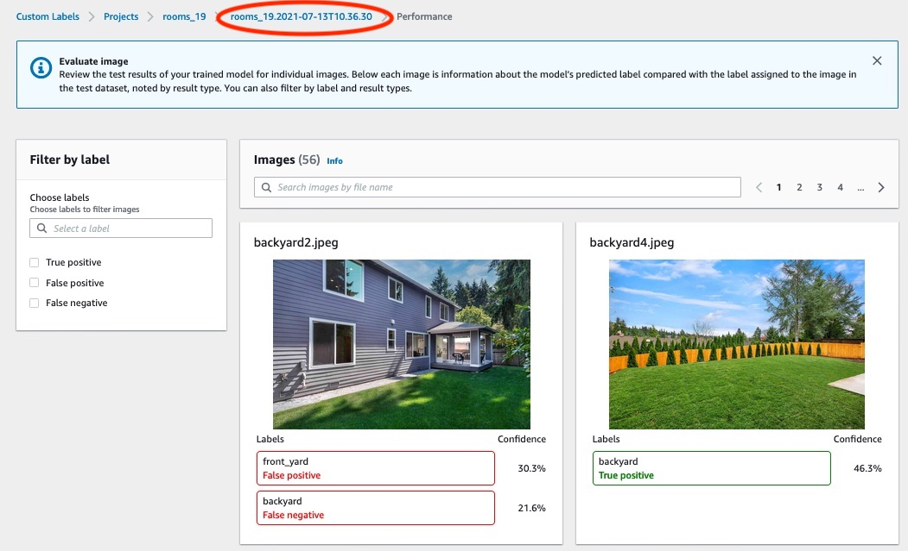

## Step 8: Start your model

In this step you start your model. After your model starts, you can use it to analyze images.

You are charged for the amount of time that your model runs. Stop your model if you don't need to analyze images. You
can restart your model at a later time. For more information, see [Running a trained Amazon Rekognition Custom Labels model](running-model.md "running-model.md").

###### To start your model

1. Choose the **Use model** tab on the model page.
2. In the **Start or stop model** section do the following:
   1. Choose **Start**.

   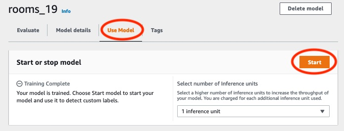 2. In the **Start model** dialog box, choose **Start**.

   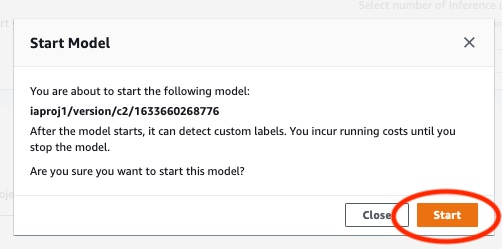

3. Wait until the model is running. The model is running when the status in the
   **Start or stop model** section is **Running**.

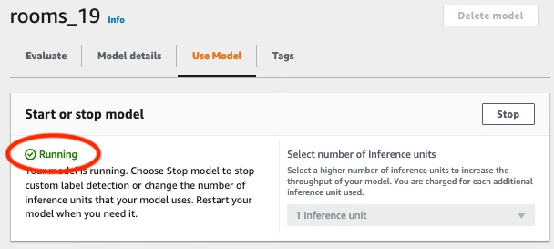

## Step 9: Analyze an image with your

model

You analyze an image by calling the [DetectCustomLabels](../APIReference/API_DetectCustomLabels.md "../APIReference/API_DetectCustomLabels.md") API. In this step, you use the
`detect-custom-labels` AWS Command Line Interface (AWS CLI) command to analyze an example
image. You get the AWS CLI command from the Amazon Rekognition Custom Labels console. The console configures
the AWS CLI command to use your model. You only need to supply an image that's stored in
an Amazon S3 bucket.

###### Note

The console also provides Python example code.

The output from `detect-custom-labels` includes a list of labels found in
the image, bounding boxes (if the model finds object locations), and the confidence that
the model has in the accuracy of the predictions.

For more information, see [Analyzing an image with a trained model](detecting-custom-labels.md "detecting-custom-labels.md").

###### To analyze an image (console)

1. If you haven't already, set up the AWS CLI. For instructions, see [Step 4: Set up the AWS CLI and AWS SDKs](su-awscli-sdk.md "su-awscli-sdk.md").
2. Choose the **Use Model** tab and then choose **API
   code**.

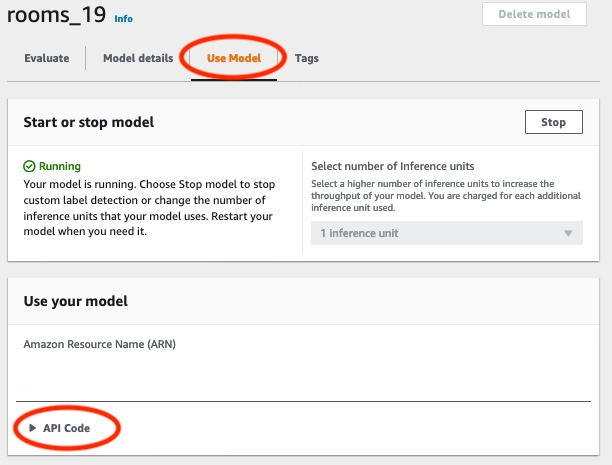 3. Choose **AWS CLI command**. 4. In the **Analyze image** section, copy the AWS CLI command that
calls `detect-custom-labels`.

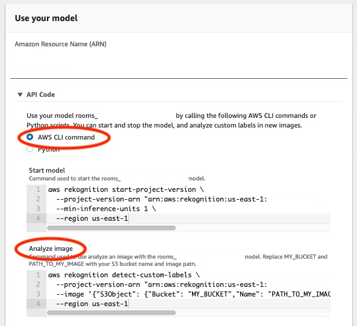 5. Upload an image to an Amazon S3 bucket. For instructions, see [Uploading Objects into
Amazon S3](../../../AmazonS3/latest/userguide/UploadingObjectsintoAmazonS3.md "../../../AmazonS3/latest/userguide/UploadingObjectsintoAmazonS3.md") in the _Amazon Simple Storage Service User Guide_. If you're
using images from the Rooms project, use one of the images you moved to a
separate folder in [Step 1: Collect your images](#tutorial-classify-images-collect-images "#tutorial-classify-images-collect-images"). 6. At the command prompt, enter the AWS CLI command that you copied in the previous
step. It should look like the following example.

The value of `--project-version-arn` should be Amazon Resource Name
(ARN) of your model. The value of `--region` should be the AWS
Region in which you created the model.

Change `MY_BUCKET` and `PATH_TO_MY_IMAGE` to the Amazon S3
bucket and image that you used in the previous step.

If you are using the [custom-labels-access](su-sdk-programmatic-access.md#su-sdk-programmatic-access-customlabels-examples "su-sdk-programmatic-access.md#su-sdk-programmatic-access-customlabels-examples") profile to get credentials, add the
`--profile custom-labels-access` parameter.

```
aws rekognition detect-custom-labels \
  --project-version-arn "`model_arn`" \
  --image '{"S3Object": {"Bucket": "`MY_BUCKET`","Name": "`PATH_TO_MY_IMAGE`"}}' \
  --region `us-east-1` \
  --profile custom-labels-access
```

The JSON output from the
AWS CLI command should look similar to the following. `Name` is the
name of the image-level label that the model found. `Confidence`
(0-100) is the model's confidence in the accuracy of the prediction.

```
{
    "CustomLabels": [
        {
            "Name": "living_space",
            "Confidence": 83.41299819946289
        }
    ]
}
```

7. Continue to use the model to analyze other images. Stop the model if you are
   no longer using it.

## Step 10: Stop your model

In this step you stop running your model. You are charged for the amount of time your
model is running. If you have finished using the model, you should stop it.

###### To stop your model

1. In the **Start or stop model** section choose
   **Stop**.

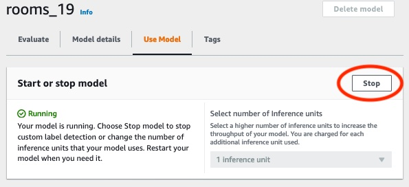 2. In the **Stop model** dialog box, enter
**stop** to confirm that you want to stop the model.

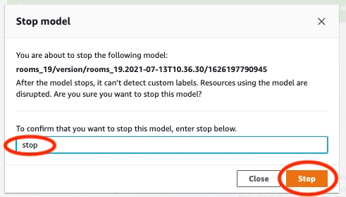 3. Choose **Stop** to stop your model. The model has stopped
when the status in the **Start or stop model** section is
**Stopped**.

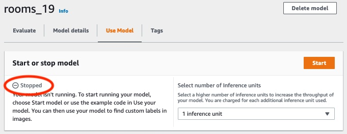
