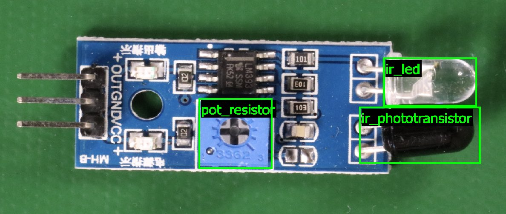

# Understanding Amazon Rekognition Custom Labels

This section gives you an overview of the workflow to train and use an Amazon Rekognition Custom Labels model
with the console and the AWS SDK.

###### Note

Amazon Rekognition Custom Labels now manages datasets within a project. You can create datasets for your projects
with the console and with the AWS SDK. If you have previously used Amazon Rekognition Custom Labels, your
older datasets might need associating with a new project. For more information, see
[Step 6: (Optional) Associate prior datasets with new projects](su-associate-prior-dataset.md "su-associate-prior-dataset.md")

###### Topics

- [Decide your model type](#tm-intro-model-type "#tm-intro-model-type")
- [Create a model](#tm-create-model "#tm-create-model")
- [Improve your model](#tm-intro-improve-model "#tm-intro-improve-model")
- [Start your model](#tm-start-model "#tm-start-model")
- [Analyze an image](#training-analyze-image "#training-analyze-image")
- [Stop your model](#tm-stop-model "#tm-stop-model")

## Decide your model type

You first decide which type of model you want to train, which depends on your business
goals. For example, you could train a model to find your logo in social media posts,
identify your products on store shelves, or classify machine parts in an assembly line.

Amazon Rekognition Custom Labels can train the following types of model:

- [Find objects, scenes, and concepts](#tm-classification "#tm-classification")
- [Find object locations](#tm-object-localization "#tm-object-localization")
- [Find the location of brands](#tm-brand-detection-localization "#tm-brand-detection-localization")

To help you decide which type of model to train, Amazon Rekognition Custom Labels provides example projects that you can use.
For more information, see [Getting started with Amazon Rekognition Custom Labels](getting-started.md "getting-started.md").

### Find objects, scenes, and concepts

The model predicts classifications for the objects, scenes, and concepts
associated with an entire image. For example, you can train a model that determines
if an image contains a _tourist attraction_, or not. For an
example project, see [Image classification](getting-started.md#gs-image-classification-example "getting-started.md#gs-image-classification-example"). The following image of a lake
is an example of the kind of image you can recognize objects, scenes, and concepts
in.

Alternatively, you can train a model that categorizes images into multiple categories.
For example, the previous image might have
categories such as _sky color_,
_reflection_, or _lake_. For an example project,
see [Multi-label image classification](getting-started.md#gs-multi-label-image-classification-example "getting-started.md#gs-multi-label-image-classification-example").

### Find object locations

The model predicts the location of an object on an image. The prediction
includes bounding box information for the object location and a label that identifies
the object within the bounding box. For example,
the following image shows bounding boxes around various parts of a circuit board,
such as a _comparator_ or _pot resistor_.

The [Object localization](getting-started.md#gs-object-localization-example "getting-started.md#gs-object-localization-example")
example project shows how Amazon Rekognition Custom Labels uses labeled bounding boxes to train a model that finds object locations.

### Find the location of brands

Amazon Rekognition Custom Labels can train a model that finds the location of brands, such as logos, on
an image. The prediction includes bounding box information for the brand location
and a label that identifies the object within the bounding box. For an example
project, see [Brand detection](getting-started.md#gs-brand-detection-example "getting-started.md#gs-brand-detection-example"). The following image is an example
of some of the brands that the model can detect.

## Create a model

The steps to create a model are creating a project, creating training and test
datasets, and training the model.

### Create a project

An Amazon Rekognition Custom Labels project is a group of resources needed to create and manage a
model. A project manages the following:

- **Datasets** – The images and image labels used to train a
  model. A project has a training dataset and a
  test dataset.
- **Models** – The software that you train to find the
  concepts, scenes, and objects unique to your business. You can have multiple
  versions of a model in a project.

We recommend that you use a project for a single use case, such as finding
circuit board parts on a circuit board.

You can create a project with the Amazon Rekognition Custom Labels console and with the
[CreateProject](../APIReference/API_CreateProject.md "../APIReference/API_CreateProject.md") API.
For more information, see [Creating a project](mp-create-project.md "mp-create-project.md").

### Create training and test datasets

A dataset is a set of images and labels that describe
those images. Within your project, you create a training dataset and a test dataset
that Amazon Rekognition Custom Labels uses to train and test your model.

A label identifies an object, scene, concept, or bounding box
around an object in an image.
Labels are either
assigned to an entire image (_image-level_) or they are
assigned to a bounding box that surrounds an object on an image.

###### Important

How you label the images in your datasets
determines the type of model that Amazon Rekognition Custom Labels creates. For example, to train a model that
finds objects, scenes and concepts, you assign image level labels to the images in your training and test datasets.
For more information,
see [Purposing datasets](md-dataset-purpose.md "md-dataset-purpose.md").

Images must be in PNG and JPEG format, and you should follow the input images
recommendations. For more information, see [Preparing images](md-prepare-images.md "md-prepare-images.md").

#### Create training and test datasets (Console)

You can start a project with a single
dataset, or with separate training and test datasets. If you
start with a single dataset, Amazon Rekognition Custom Labels splits your dataset during training to create
a training dataset (80%) and a test dataset (20%) for your project.
Start with a single dataset if you
want Amazon Rekognition Custom Labels to decide which images are used for training and testing.
For complete control over training, testing, and performance tuning, we recommend that
you start your project with separate training and test datasets.

To create the datasets for a project, you import the images in one of the following ways:

- Import images from your local computer.
- Import images from an S3 bucket. Amazon Rekognition Custom Labels can label the images
  using the folder names that contain the images.
- Import an Amazon SageMaker AI Ground Truth manifest file.
- Copy an existing Amazon Rekognition Custom Labels dataset.

For more information, see [Creating training and test datasets with images](md-create-dataset.md "md-create-dataset.md").

Depending
on where you import your images from, your images might be
unlabeled. For example, images imported from a local computer aren't labeled.
Images imported from an Amazon SageMaker AI Ground Truth manifest file are labeled. You can
use the Amazon Rekognition Custom Labels console to add, change, and assign labels. For more
information, see [Labeling images](md-labeling-images.md "md-labeling-images.md").

To create your training and test datasets with the console, see [Creating training and test datasets with images](md-create-dataset.md "md-create-dataset.md").
For a tutorial that includes creating training and test datasets, see [Classifying images](tutorial-classification.md "tutorial-classification.md").

#### Create training and test datasets (SDK)

To create your training and test datasets, you use the `CreateDataset` API.

You can create a dataset by using an Amazon Sagemaker format manifest file or by copying an
existing Amazon Rekognition Custom Labels dataset. For more information,
see [Create training and test datasets (SDK)](md-create-dataset.md#cd-create-dataset-sdk "md-create-dataset.md#cd-create-dataset-sdk")  
 If necessary, you can create your
own manifest file. For more information, see [Creating a manifest file](md-create-manifest-file.md "md-create-manifest-file.md").

### Train your model

Train your model with the training dataset. A
new version of a model is created each time it is trained. During training, Amazon Rekognition Custom Labels
test the performance of your trained model. You can use the results to evaluate and improve your model.
Training takes a while to complete. You are only
charged for a successful model training. For more information, see [Training an Amazon Rekognition Custom Labels model](training-model.md "training-model.md").
If model training fails, Amazon Rekognition Custom Labels provides debugging information that you can use. For
more information, see [Debugging a failed model training](tm-debugging.md "tm-debugging.md").

#### Train your model (Console)

To train your model with the console, see [Training a model (Console)](training-model.md#tm-console "training-model.md#tm-console").

#### Training a model (SDK)

You train an Amazon Rekognition Custom Labels model by calling [CreateProjectVersion](../APIReference/API_CreateProjectVersion.md "../APIReference/API_CreateProjectVersion.md").
For more information, see [Training a model (SDK)](training-model.md#tm-sdk "training-model.md#tm-sdk").

## Improve your model

During testing, Amazon Rekognition Custom Labels creates evaluation metrics that you can use to improve your trained model.

### Evaluate your model

Evaluate the performance of your model by using the performance metrics created during
testing. Performance metrics, such as F1, precision, and recall, allow you to
understand the performance of your trained model, and decide if you're ready to use
it in production. For more information, see [Metrics for evaluating your model](im-metrics-use.md "im-metrics-use.md").

#### Evaluate a model (console)

To view performance metrics, see
[Accessing evaluation metrics (Console)](im-access-training-results.md "im-access-training-results.md").

#### Evaluate a model (SDK)

To get performance metrics, you call [DescribeProjectVersions](../APIReference/API_DescribeProjectVersions.md "../APIReference/API_DescribeProjectVersions.md") to get the testing results. For more
information, see [Accessing Amazon Rekognition Custom Labels evaluation metrics (SDK)](im-metrics-api.md "im-metrics-api.md"). The testing results include metrics not available in the console, such as a
confusion matrix for classification results. The testing results are returned
in the following formats:

- F1 score – A single value representing the overall performance of precision and recall
  for the model. For more information, see [F1](im-metrics-use.md#im-f1-metric "im-metrics-use.md#im-f1-metric").
- Summary file location – The testing summary includes aggregated evaluation metrics for
  the entire testing dataset and metrics for each individual label.
  `DescribeProjectVersions` returns the S3 bucket and folder
  location of the summary file. For more information, see [Accessing the model summary file](im-summary-file-api.md "im-summary-file-api.md").
- Evaluation manifest snapshot location – The snapshot contains details about the test
  results, including the confidence ratings and the results of binary
  classification tests, such as false positives.
  `DescribeProjectVersions` returns the S3 bucket and
  folder location of the snapshot files. For more information, see [Interpreting the evaluation
  manifest snapshot](im-evaluation-manifest-snapshot-api.md "im-evaluation-manifest-snapshot-api.md").

### Improve your model

If improvements are needed, you can add more training images or improve dataset
labeling. For more information, see [Improving an Amazon Rekognition Custom Labels model](tr-improve-model.md "tr-improve-model.md"). You can also give feedback on the
predictions your model makes and use it to make improvements to your model. For more
information, see [Improving a model with Model feedback](ex-feedback.md "ex-feedback.md").

#### Improve your model (console)

To add images to a dataset, see [Adding more images to a dataset](md-add-images.md "md-add-images.md"). To add or change labels, see [Labeling images](md-labeling-images.md "md-labeling-images.md").

To retrain your model, see [Training a model (Console)](training-model.md#tm-console "training-model.md#tm-console").

#### Improve your model (SDK)

To add images to a dataset or change the labeling for an image, use the
`UpdateDatasetEntries` API. `UpdateDatasetEntries`
updates or adds JSON lines to a manifest file. Each JSON line contains
information for a single image, such as assigned labels or bounding box
information. For more information, see [Adding more images (SDK)](md-add-images.md#md-add-images-sdk "md-add-images.md#md-add-images-sdk"). To view the entries in a dataset, use
the `ListDatasetEntries` API.

To retrain your model, see [Training a model (SDK)](training-model.md#tm-sdk-datasets "training-model.md#tm-sdk-datasets").

## Start your model

Before you can use your model, you start the model by using the Amazon Rekognition Custom Labels console or
the `StartProjectVersion` API. You are charged for the amount of time that
your model runs. For more information, see [Running a trained Amazon Rekognition Custom Labels model](running-model.md "running-model.md").

### Start your model (console)

To start your model using the console, see [Starting an Amazon Rekognition Custom Labels model (Console)](rm-start.md#rm-start-console "rm-start.md#rm-start-console").

### Start your model

You start your model calling
[StartProjectVersion](../APIReference/API_StartProjectVersion.md "../APIReference/API_StartProjectVersion.md").
For more information, see [Starting an Amazon Rekognition Custom Labels model (SDK)](rm-start.md#rm-start-sdk "rm-start.md#rm-start-sdk").

## Analyze an image

To analyze an image with your model, you use the `DetectCustomLabels` API. You
can specify a local image, or an image stored in an S3 bucket. The operation also requires
the Amazon Resource Name (ARN) of the model that you want to use.

If your model finds objects, scenes, and concepts,
the response includes a list of image-level labels found in the image. For example, the
following image shows the image-level labels found using _Rooms_
example project.

If the model finds object locations, the response includes
list of labeled bounding boxes found in the image. A bounding box represents
the location of an object on an image. You can use the bounding box information to draw a bounding box around an object.
For example, the following image shows bounding boxes around circuit board parts found using the
_Circuit boards_ example project.

For more information,
see [Analyzing an image with a trained model](detecting-custom-labels.md "detecting-custom-labels.md").

## Stop your model

You are charged for the time that your model is running.
If you are no longer using your model, stop the model by using the Amazon Rekognition Custom Labels console, or by using
the `StopProjectVersion` API. For more information, see [Stopping an Amazon Rekognition Custom Labels model](rm-stop.md "rm-stop.md").

### Stop your model (Console)

To stop a running model with the console, see
[Stopping an Amazon Rekognition Custom Labels model (Console)](rm-stop.md#rm-stop-console "rm-stop.md#rm-stop-console").

### Stop your model (SDK)

To stop a running model, call
[StopProjectVersion](../APIReference/API_StopProjectVersion.md "../APIReference/API_StopProjectVersion.md").
For more information, see [Stopping an Amazon Rekognition Custom Labels model (SDK)](rm-stop.md#rm-stop-sdk "rm-stop.md#rm-stop-sdk").
