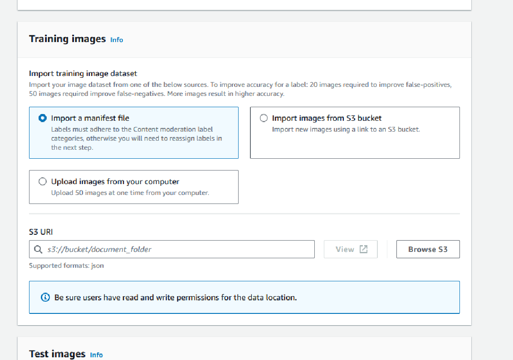

# Manual annotation

With this approach, you create your training data by uploading and annotating
images manually. You create your test data by either uploading and annotating test images or
by auto-splitting to have Rekognition automatically use a portion of your training
data as test images.

## Uploading and annotating

images

To train the adapter, you’ll need to upload a set of sample images representative
of your use case. For best results, provide as many images for training as
possible up to the limit of 10000, and ensure the images are representative of
all aspects of your use-case.

When using the AWS Console you can upload images directly from your computer,
provide a manifest file, or provide an Amazon S3 bucket that stores your images.

However, when using the Rekognition APIs with an SDK, you must provide a
manifest file that references images stored in an Amazon S3 bucket.

You can use the [Rekognition
console](https://console.aws.amazon.com/rekognition "https://console.aws.amazon.com/rekognition")'s annotation interface to annotate your images. Annotate your
images by tagging them with labels, this establishes a "ground truth" for training.
You must also designate training and testing sets, or use the auto-split feature,
before you can train an adapter. When you finish designating your datasets and
annotating your images, you can create an adapter based on the annotated images in
your testing set. You can then evaluate the performance of your adapter.

## Create a test set

You will need to provide an annotated test set or use the auto-split feature. The
training set is used to actually train the adapter. The adapter learns the patterns
contained in these annotated images. The test set is used to evaluate the model's
performance before finalizing the adapter.

## Train the adapter

Once you have finished annotating the training data, or have provided a
manifest file, you can initiate the training process for your adapter.

## Get the Adapter ID

Once the adapter has been trained, you can get the unique ID for your adapter to
use with Rekognition's image analysis APIs.

## Call the API operation

To apply your custom adapter, provide its ID when calling one of the image
analysis APIs that supports adapters. This enhances the accuracy of predictions for
your images.
