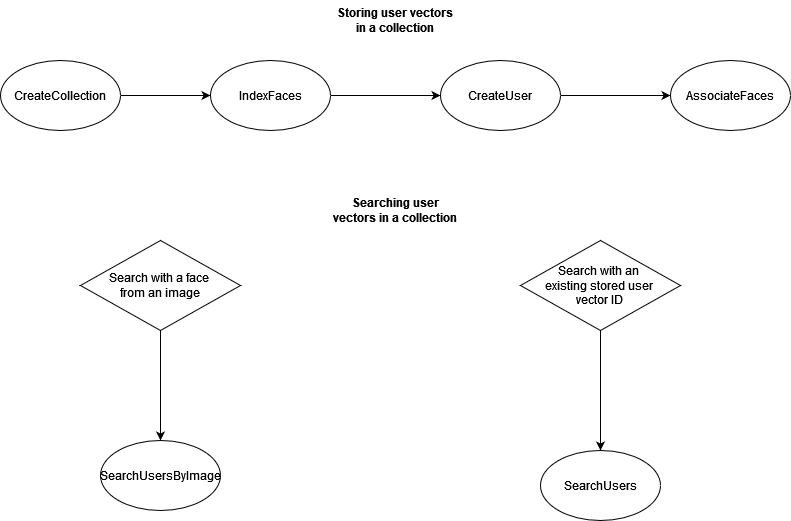
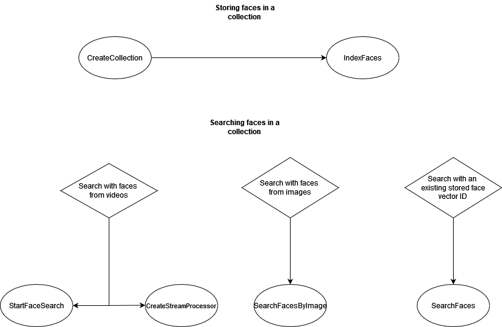

# Searching faces in a collection

Amazon Rekognition lets you use an input face to search for matches in a collection of stored
faces. You start by storing information about detected faces in server-side containers
called "collections". Collections store both individual faces and users (several faces of
the same person). Individual faces are stored as face vectors, a mathematical representation
of the face (not an actual image of the face). Different images of the same person can be
used to create and store multiple face vectors in the same collection. You can then
aggregate multiple face vectors of the same person to create a user vector. User vectors can
offer higher face search accuracy with more robust depictions, containing varying degrees of
lighting, sharpness, pose, appearance, etc.

Once you've created a collection you can use an input face to search for matching user
vectors or face vectors in a collection. Searching against user vectors can significantly
improve accuracy compared to searching against individual face vectors. You can use faces
detected in images, stored videos, and streaming videos to search against stored face
vectors. You can use faces detected in images to search against stored user vectors.

To store face information, you’ll need to do the following:

1. Create a Collection - To store facial information, you must first create ([CreateCollection](../APIReference/API_CreateCollection.md "../APIReference/API_CreateCollection.md")) a face collection in one of the AWS Regions in your
   account. You specify this face collection when you call the `IndexFaces`
   operation.
2. Index Faces - The [IndexFaces](../APIReference/API_IndexFaces.md "../APIReference/API_IndexFaces.md") operation detects face(s) in an image, extracts, and stores
   the face vector(s) in the collection. You can use this operation to detect faces in
   an image and persist information about facial features that are detected into a
   collection. This is an example of a _storage-based_
   API operation because the service stores the face vector information on the
   server.
   To create a user and associate multiple face vectors with a user, you'll need to do the
   following:

3. Create a User - You must first create a user with [CreateUser](../APIReference/API_CreateUser.md "../APIReference/API_CreateUser.md"). You can improve face matching accuracy by aggregating
   multiple face vectors of the same person into a user vector. You can associate up to
   100 face vectors with a user vector.
4. Associate Faces - After creating the user, you can add existing face vectors to
   that user with the [AssociateFaces](../APIReference/API_AssociateFaces.md "../APIReference/API_AssociateFaces.md") operation. Face vectors must reside in the same
   collection as a user vector in order to be associated to that user vector.
   After creating a collection and storing face and user vectors, you can use the following
   operations to search for face matches:

- [SearchFacesByImage](../APIReference/API_SearchFacesByImage.md "../APIReference/API_SearchFacesByImage.md") - To search against stored individual faces with a
  face from an image.
- [SearchFaces](../APIReference/API_SearchFaces.md "../APIReference/API_SearchFaces.md") - To search against stored individual faces with a supplied
  face ID.
- [SearchUsers](../APIReference/API_SearchUsers.md "../APIReference/API_SearchUsers.md") - To search against stored users with a supplied face ID or
  user ID.
- [SearchUsersByImage](../APIReference/API_SearchUsersByImage.md "../APIReference/API_SearchUsersByImage.md") - To search against stored users with a face from an
  image.
- [StartFaceSearch](../APIReference/API_StartFaceSearch.md "../APIReference/API_StartFaceSearch.md") - To search for faces in a stored video.
- [CreateStreamProcessor](../APIReference/API_CreateStreamProcessor.md "../APIReference/API_CreateStreamProcessor.md") - To search for faces in a streaming
  video.

###### Note

Collections store face vectors, which are mathematical representations of faces.
Collections do not store images of faces.

The following diagrams shows the order for calling operations, based on your goals for
using collections:

**For maximum accuracy matching with User Vectors:**

**For high accuracy matching with individual Face
Vectors:**

You can use collections in a variety of scenarios. For example, you might create a face
collection which stores detected faces from scanned employee badge images and government
issued IDs by using the `IndexFaces` and `AssociateFaces` operations.
When an employee enters the building, an image of the employee's face is captured and sent
to the `SearchUsersByImage` operation. If the face match produces a sufficiently
high similarity score (say 99%), you can authenticate the employee.
