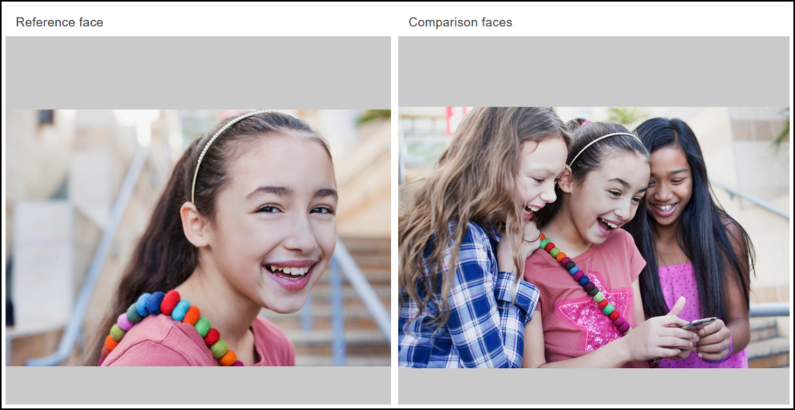
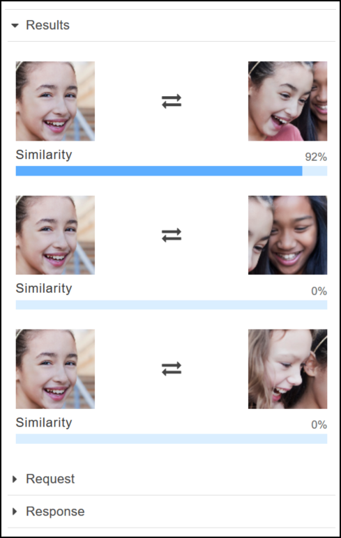

# Exercise 3: Compare faces in images (console)

This section shows you how to use the Amazon Rekognition console to compare faces within a set
of images with multiple faces in them. When you specify a **Reference
face** (source) and a **Comparison faces** (target)
image, Rekognition compares the largest face in the source image (that is, the reference face)
with up to 100 faces detected in the target image (that is, the comparison faces), and
then finds how closely the face in the source matches the faces in the target image. The
similarity score for each comparison is displayed in the **Results**
pane.

If the target image contains multiple faces, Rekognition matches the face in the source image with up
to 100 faces detected in target image, and then assigns a similarity score to each match.

If the source image contains multiple faces, the service detects the largest face in the source image and uses it to
compare with each face detected in the target image.

For more information, see [Comparing faces in images](faces-comparefaces.md "faces-comparefaces.md").

For example, with the sample image shown on the left as a source image and the sample
image on the right as a target image, Rekognition detects the face in the source image,
compares it with each face detected in the target image, and displays a similarity score for each pair.

The following shows the faces detected in the target image and the similarity score
for each face.

## Compare faces in an image you provide

You can upload your own source and target images for Rekognition to compare the faces in the images or you can
specify a URL for the location of the images.

###### Note

The image must be less than 5MB in size and must be of JPEG or PNG format.

###### To compare faces in your images

1. Open the Amazon Rekognition console at
   [https://console.aws.amazon.com/rekognition/](https://console.aws.amazon.com/rekognition/ "https://console.aws.amazon.com/rekognition/").
2. Choose **Face comparison**.
3. For your source image, do one of the following:
   - Upload an image – Choose **Upload** on the left, go to the location
     where you stored your source image, and then select the image.
   - Use a URL – Type the URL of your source image in the text
     box, and then choose **Go**.

4. For your target image, do one of the following:
   - Upload an image – Choose **Upload** on the right, go to the location
     where you stored your source image, and then select the image.
   - Use a URL – Type the URL of your source image in the text
     box, and then choose **Go**.

5. Rekognition matches the largest face in your source image with up to 100 faces in the target image and then
   displays the similarity score for each pair in the **Results** pane.
