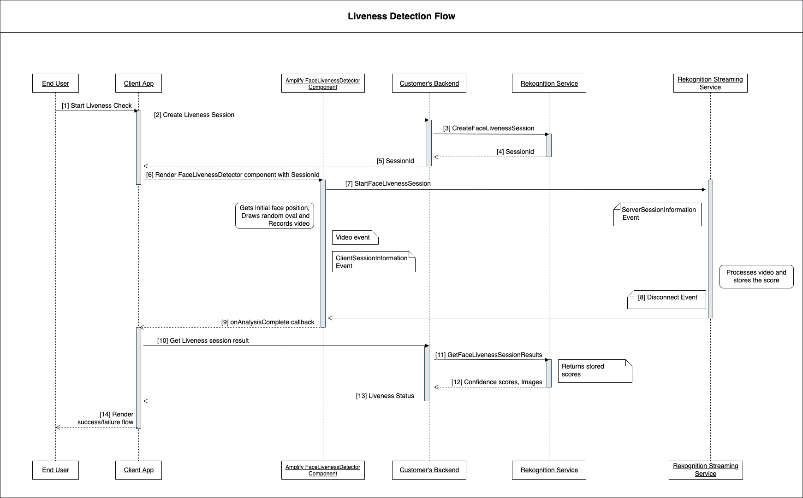
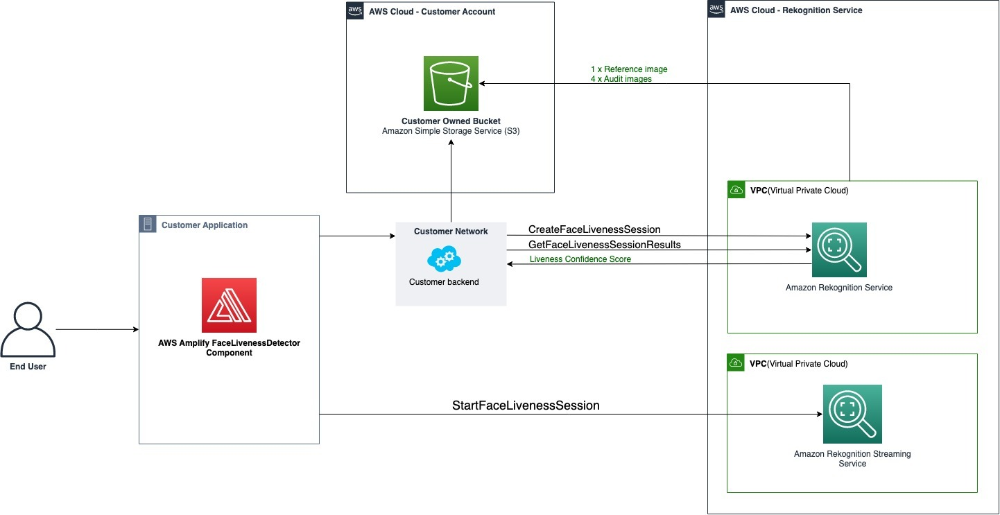

# Architecture and Sequence Diagrams

The following diagrams detail how Amazon Rekognition Face Liveness operates regarding the
feature's architecture and sequence of operations:

The Face Liveness check process involves several steps as outlined in the
following:

1. The user initiates a Face Liveness check in the Client App.
2. The Client App calls the customer's backend, which in turn calls the Amazon Rekognition service. The
   service creates a Face Liveness Session and returns a unique SessionId.
   **Note:** After a SessionId is sent it expires
   in 3 minutes, so there is only a 3 minute window to complete Steps 3 through 7
   below. A new sessionID must be used for every Face Liveness check. If a given sessionID is used for subsequent
   Face Liveness checks, the checks will fail. Additionally, a SessionId expires 3 minutes after
   it's sent, making all Liveness data associated with the session (e.g., sessionID, reference image, audit images, etc.) unavailable.
3. The Client App renders the FaceLivenessDetector Amplify component using the
   obtained SessionId and appropriate callbacks.
4. The FaceLivenessDetector component establishes a connection to the Amazon Rekognition
   streaming service, renders an oval on the user’s screen, and displays a sequence
   of colored lights. FaceLivenessDetector records and streams video in real-time
   to the Amazon Rekognition streaming service.
5. The Amazon Rekognition streaming service processes the video in real-time, stores the
   results, and returns a DisconnectEvent to the FaceLivenessDetector component
   when the streaming is complete.
6. The FaceLivenessDetector component calls the `onAnalysisComplete`
   callback to signal to the Client App that the streaming is complete and that
   scores are ready for retrieval.
7. The Client App calls the customer’s backend to get a Boolean flag indicating
   whether the user was live or not. Customer backend makes the request to the
   Amazon Rekognition service to get the confidence score, reference, and audit images.
   Customer backend uses these attributes to determine whether the user is live and
   returns an appropriate response to the Client App.
8. Finally, the Client App passes the response to the FaceLivenessDetector
   component, which appropriately renders the success/failure message to complete
   the flow.
