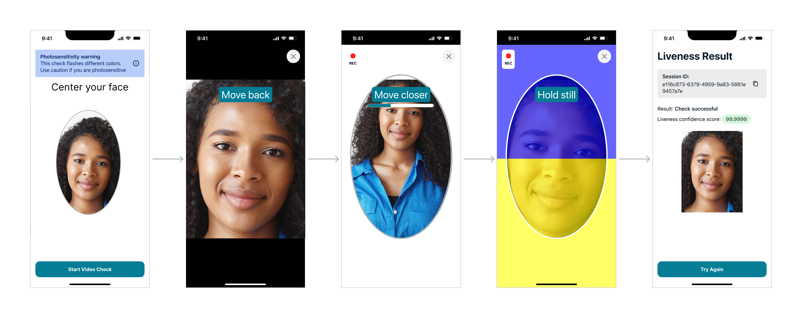

# Detecting face liveness

Amazon Rekognition Face Liveness helps you verify that a user going through facial verification is
physically present in front of a camera. It detects spoof attacks presented to a camera or
trying to bypass a camera. Users can complete a Face Liveness check by taking a short video
selfie where they follow a series of prompts intended to verify their presence.

Face Liveness is determined with a probabilistic calculation, and then a confidence score
(between 0–100) is returned after the check. The higher the score, the greater the
confidence that the person taking the check is live. Face Liveness also returns a frame,
called a reference image that can be used for face comparison and search. As with any
probability-based system, Face Liveness cannot guarantee perfect results. Use it with other
factors to make a risk-based decision about the personal identity of users.

Face Liveness uses multiple components:

- AWS Amplify SDK ([React](https://ui.docs.amplify.aws/react/connected-components/liveness "https://ui.docs.amplify.aws/react/connected-components/liveness"), [Swift
  (iOS](https://ui.docs.amplify.aws/swift/connected-components/liveness "https://ui.docs.amplify.aws/swift/connected-components/liveness")), and [Android](https://ui.docs.amplify.aws/android/connected-components/liveness "https://ui.docs.amplify.aws/android/connected-components/liveness")) with FaceLivenessDetector component
- AWS SDKs
- AWS Cloud APIs
  When you configure your application to integrate with Face Liveness feature, it uses the
  following API operations:

- [CreateFaceLivenessSession](../APIReference/API_CreateFaceLivenessSession.md "../APIReference/API_CreateFaceLivenessSession.md") - Starts a Face Liveness session, letting the
  Face Liveness detection model be used in your application. Returns a SessionId for
  the created session. Also allows you to set your ChallengePrefrence, so you can use
  the FaceMovementChallenge option.
- [StartFaceLivenessSession](../APIReference/API_rekognitionstreaming_StartFaceLivenessSession.md "../APIReference/API_rekognitionstreaming_StartFaceLivenessSession.md") - Called by the AWS Amplify
  FaceLivenessDetector. Starts an event stream containing information about relevant
  events and attributes in the current session.
- [GetFaceLivenessSessionResults](../APIReference/API_GetFaceLivenessSessionResults.md "../APIReference/API_GetFaceLivenessSessionResults.md") - Retrieves the results of a specific
  Face Liveness session, including a Face Liveness confidence score, reference image,
  and audit images.
  You will use the AWS Amplify SDK to integrate the Face Liveness feature with your
  face-based verification workflows for web applications. When users onboard or authenticate
  through your application, send them to the Face Liveness check workflow in the Amplify SDK.
  The Amplify SDK handles user interface and real-time feedback for users while they capture
  their video selfie.

When using FaceMovementAndLightChallenge the user’s face moves into the oval displayed on
their device, the Amplify SDK displays a sequence of colored lights on the screen. It then
securely streams the selfie video to the cloud APIs. Alternatively, when using FaceMovementChallenge,
the user’s face moves into the oval displayed on their device, but there are no sequence of
colored lights. While 'FaceMovementAndLightChallenge' remains the best setting to maximize accuracy,
'FaceMovementChallenge' allows customers to prioritize faster speed of liveness checks over accuracy. When selecting
between these settings, customers should consider their use case requirements including expected
attack types, desired false accept and false reject rates, and additional checks such as geolocation
(e.g. based on IP), One Time Pass codes (OTPs), etc. Customers should make this decision after testing
Liveness performance with various confidence score thresholds on their specific content.
In addition, with both liveness check types the application owners should implement controls to secure the
device the video stream is sent from. After the
analysis is complete, you receive the following on the backend:

- A Face Liveness confidence score (between 0 and 100)
- A high-quality image called reference image that can be used for face match or
  face search
- A set of up to four images, called audit images, selected from the selfie video
  Face Liveness can be leveraged for a variety of use cases. For example, Face Liveness can
  be used along with face matching (with [CompareFaces](../APIReference/API_CompareFaces.md "../APIReference/API_CompareFaces.md") and
  [SearchFacesByImage](../APIReference/API_SearchFacesByImage.md "../APIReference/API_SearchFacesByImage.md")) for identity verification, for [age estimation](../APIReference/API_DetectFaces.md "../APIReference/API_DetectFaces.md") on
  platforms with age-based access restriction, and for detecting real human users while
  detering bots.

You can learn more about the use cases for which the service is intended, how machine
learning (ML) is used by the service, and key considerations in the responsible design and
use of the service in [Rekognition Face Liveness AI service card](https://aws.amazon.com/machine-learning/responsible-machine-learning/rekognition-face-liveness/ "https://aws.amazon.com/machine-learning/responsible-machine-learning/rekognition-face-liveness/").

You can set thresholds for Face Liveness and face match confidence scores. Your chosen
thresholds should reflect your use case. You then send an identity verification
approval/denial to the user based on the score being above or below the thresholds. If
denied, ask the user to try again or send them to another method.

The following graphic demonstrates the user flow, from instructions to liveness check to
returned result:

