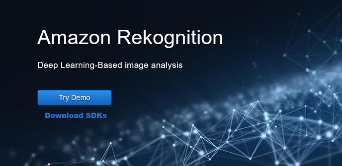

# Step 4: Getting started using the Amazon Rekognition console

The Amazon Rekognition console allows you to manage resources related to Rekognition Custom Labels and the Custom Moderation feature.
The console only provides demos of other Rekognition features.

This section shows you how to use a subset of Amazon Rekognition's capabilities such as object and
scene detection, facial analysis, and face comparison in a set of images. For more
information, see [How Amazon Rekognition works](how-it-works.md "how-it-works.md"). You can also
use the Amazon Rekognition API or AWS CLI to detect objects and scenes, detect faces, and compare and search
faces. For more information, see [Step 3: Getting started using the AWS CLI and AWS
SDK API](get-started-exercise.md "get-started-exercise.md").

This section also shows you how to see aggregated Amazon CloudWatch metrics for Rekognition by using the Rekognition console.

###### Topics

- [Set up console permissions](#rekognition-console-permissions "#rekognition-console-permissions")
- [Exercise 1: Detect objects and scenes
  (Console)](detect-labels-console.md "detect-labels-console.md")
- [Exercise 2: Analyze faces in an image
  (console)](detect-faces-console.md "detect-faces-console.md")
- [Exercise 3: Compare faces in images (console)](compare-faces-console.md "compare-faces-console.md")
- [Exercise 4: See aggregated metrics
  (console)](aggregated-metrics.md "aggregated-metrics.md")



## Set up console permissions

To use the Rekognition console you need to have the appropriate permissions for the role or account accessing the console.
For some operations, Rekognition will automatically create an Amazon S3 bucket to store files handled during operation.
If you want to store your training files in a bucket other than this console bucket,
you will need additional permissions.

###

Allowing console access

To use the Rekognition console, you can use an IAM policy like the following one, which covers Amazon S3
and the Rekognition console. For information about assigning permissions,
see Assigning permissions.

JSON

```
`{
 "Version":"2012-10-17",
 "Statement": [
 {
 "Sid": "RekognitionFullAccess",
 "Effect": "Allow",
 "Action": [
 "rekognition:*"
 ],
 "Resource": "*"
 },
 {
 "Sid": "RekognitionConsoleS3BucketSearchAccess",
 "Effect": "Allow",
 "Action": [
 "s3:ListAllMyBuckets",
 "s3:ListBucket",
 "s3:GetBucketAcl",
 "s3:GetBucketLocation"
 ],
 "Resource": "*"
 },
 {
 "Sid": "RekognitionConsoleS3BucketFirstUseSetupAccess",
 "Effect": "Allow",
 "Action": [
 "s3:CreateBucket",
 "s3:PutBucketVersioning",
 "s3:PutLifecycleConfiguration",
 "s3:PutEncryptionConfiguration",
 "s3:PutBucketPublicAccessBlock",
 "s3:PutBucketCors",
 "s3:GetBucketCors"
 ],
 "Resource": "arn:aws:s3:::rekognition-custom-projects-*"
 },
 {
 "Sid": "RekognitionConsoleS3BucketAccess",
 "Effect": "Allow",
 "Action": [
 "s3:ListBucket",
 "s3:GetBucketLocation",
 "s3:GetBucketVersioning"
 ],
 "Resource": "arn:aws:s3:::rekognition-custom-projects-*"
 },
 {
 "Sid": "RekognitionConsoleS3ObjectAccess",
 "Effect": "Allow",
 "Action": [
 "s3:GetObject",
 "s3:DeleteObject",
 "s3:GetObjectAcl",
 "s3:GetObjectTagging",
 "s3:GetObjectVersion",
 "s3:PutObject"
 ],
 "Resource": "arn:aws:s3:::rekognition-custom-projects-*/*"
 },
 {
 "Sid": "RekognitionConsoleManifestAccess",
 "Effect": "Allow",
 "Action": [
 "groundtruthlabeling:*"
 ],
 "Resource": "*"
 },
 {
 "Sid": "RekognitionConsoleTagSelectorAccess",
 "Effect": "Allow",
 "Action": [
 "tag:GetTagKeys",
 "tag:GetTagValues"
 ],
 "Resource": "*"
 },
 {
 "Sid": "RekognitionConsoleKmsKeySelectorAccess",
 "Effect": "Allow",
 "Action": [
 "kms:ListAliases"
 ],
 "Resource": "*"
 }
 ]
}`

```

###

Accesssing external Amazon S3 buckets

When you first open the Rekognition console in a new AWS Region,
Rekognition creates a bucket (console bucket) that's used to store project files.
Alternatively, you can use your own Amazon S3 bucket (external bucket) to upload the images or manifest
file to the console. To use an external bucket, add the following policy block to the preceding policy.

```

{
            "Sid": "s3ExternalBucketPolicies",
            "Effect": "Allow",
            "Action": [
                "s3:GetBucketAcl",
                "s3:GetBucketLocation",
                "s3:GetObject",
                "s3:GetObjectAcl",
                "s3:GetObjectVersion",
                "s3:GetObjectTagging",
                "s3:ListBucket",
                "s3:PutObject"
            ],
            "Resource": [
                "arn:aws:s3:::`amzn-s3-demo-bucket`*"
            ]
}

```

###

Assigning permissions

To provide access, add permissions to your users, groups, or roles:

- Users and groups in AWS IAM Identity Center (successor to AWS Single
  Sign-On):

Create a permission set. Follow the instructions in [Create a permission set](../../../singlesignon/latest/userguide/howtocreatepermissionset.md "../../../singlesignon/latest/userguide/howtocreatepermissionset.md") in the _AWS
IAM Identity Center (successor to AWS Single Sign-On) User
Guide_.

- Users managed in IAM through an identity provider:

Create a role for identity federation. Follow the instructions in
[Creating a role for a third-party identity provider
(federation)](../../../IAM/latest/UserGuide/id_roles_create_for-idp.md "../../../IAM/latest/UserGuide/id_roles_create_for-idp.md") in the _IAM User
Guide_.

- IAM users:
  - Create a role that your user can assume. Follow the
    instructions in [Creating a role for an IAM user](../../../IAM/latest/UserGuide/id_roles_create_for-user.md "../../../IAM/latest/UserGuide/id_roles_create_for-user.md") in the
    _IAM User
    Guide_.
  - (Not recommended) Attach a policy directly to a user or
    add a user to a user group. Follow the instructions in
    [Adding permissions to a user (console)](../../../IAM/latest/UserGuide/id_users_change-permissions.md#users_change_permissions-add-console "../../../IAM/latest/UserGuide/id_users_change-permissions.md#users_change_permissions-add-console") in the
    _IAM User
    Guide_.
