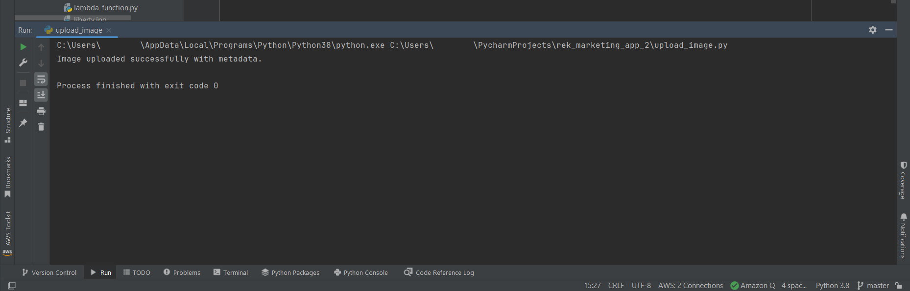
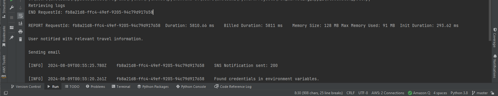

# Using Amazon Rekognition (REK) to detect labels for

marketing applications

This tutorial guides you through building a sample Python application that could be used to
send emails to people, based on on images uploaded to a website. The sample application is
designed to engage users in a social media marketing campaign by sending them personalized emails
about travel deals if landmarks are recognized in their photos.

The solution integrates various AWS services, including Amazon Rekognition, Amazon S3, DynamoDB, CloudWatch, and
Amazon SES. The application uses Amazon Rekognition to detect labels in images uploaded by accounts recognized
in a DynamoDB database, and then the account holder is sent a marketing email based on the
labels detected in the image. The full solution architecture is as follows:

- Store user data in DynamoDB database.
- User uploads image data and metadata (user account number) to Amazon S3.
- A Lambda function invokes [DetectLabels](../APIReference/API_DetectLabels.md "../APIReference/API_DetectLabels.md") to identify
  and record the labels in the uploaded image, look up the user email in DynamoDB, and send a
  marketing email to the user who uploaded the image.
- Results of Lambda function are logged in CloudWatch for later review.
  Here is an overview of all the steps in the tutorial:

1. Create and populate a DynamoDB table.
2. Write a Lambda function with Logging and Notification.
3. Set up the Lambda function and permissions.
4. Upload images and metadata with Amazon S3.
5. Poll CloudWatch logs.

###### Topics

- [Prerequisites](#label-marketing-prereq "#label-marketing-prereq")
- [Creating and populating a DynamoDB table](#label-marketing-tutorial-ddb "#label-marketing-tutorial-ddb")
- [Creating a Lambda Function with Logging and Notification](#label-marketing-tutorial-lambda "#label-marketing-tutorial-lambda")
- [Setting up permissions and the Lambda function](#label-marketing-tutorial-permissions "#label-marketing-tutorial-permissions")
- [Uploading Images to Amazon S3 with Metadata](#label-marketing-tutorial-uploading "#label-marketing-tutorial-uploading")
- [Polling CloudWatch Logs from the Client](#label-marketing-tutorial-cloudwatch "#label-marketing-tutorial-cloudwatch")

## Prerequisites

Before you begin this tutorial, you will need:

- An AWS account and appropriate IAM permissions.
- Python and Boto3 installed on your development environment.
- Basic understanding of Lambda, Amazon S3, DynamoDB, Amazon SES, and CloudWatch.
- Basic familiarity with Lambda and Amazon SES.

## Creating and populating a DynamoDB table

To begin this tutorial, we'll create a DynamoDB table to store customer data such as: email
address, age, phone number, and membership status, using an "AccountNumber" variable as
the primary key. We'll also insert some sample data into the table.

### Creating the DynamoDB table

First, we'll create the DynamoDB table. Here's how to set it up using Python and Boto3. We
create a function called `create_user_table` and connect to the DynamoDB resource within
it. In the code sample below, replace the value of "region_name" with the name of the region
your account operates in, then run the code cell to create your table.

```
import boto3
def create_user_table(dynamodb=None):
    if not dynamodb:
        dynamodb = boto3.resource('dynamodb', region_name='us-east-1')

    table = dynamodb.create_table(
        TableName='CustomerDataTable',
        KeySchema=[
            {
                'AttributeName': 'AccountNumber',
                'KeyType': 'HASH'  # Partition key
            },
        ],
        AttributeDefinitions=[
            {
                'AttributeName': 'AccountNumber',
                'AttributeType': 'S'
            },
        ],
        ProvisionedThroughput={
            'ReadCapacityUnits': 10,
            'WriteCapacityUnits': 10
        }
    )

    # Wait until the table exists.
    table.wait_until_exists()
    print("Table status:", table.table_status)

# Create the DynamoDB table.
create_user_table()

```

Running this script has set up a DynamoDB table named `CustomerDataTable` with
`AccountNumber` as the primary key.

### Inserting sample data

Now we'll want to insert some sample data into the table. This sample data will help us test
the complete functionality of the application.

We’ll create a second function that adds sample data to the same
`CustomerDataTable` we created previously. Three sample entries are created by the
code below, and each entry includes an account number, email address, age, phone number, and
membership status. In the code sample below, replace the value of `region_name` with
the name of the region your account operates in, then run the code cell to create your table. If
you would like to test the email delivery portion of the app, replace the value of
`EmailAddress` in the first customer entry below with an email address you can
receive email at. Save and run the code.

```

import boto3

def insert_sample_data(dynamodb=None):
    if not dynamodb:
        dynamodb = boto3.resource('dynamodb', region_name='us-east-1')

    table = dynamodb.Table('CustomerDataTable')

    # Sample data
    customers = [
        {
            'AccountNumber': 'ACC1000',
            'EmailAddress': 'email-for-delivery-here',
            'Age': 30,
            'PhoneNumber': '123-456-7890',
            'MembershipStatus': 'Active'
        },
        {
            'AccountNumber': 'ACC1001',
            'EmailAddress': 'jane.doe@example.com',
            'Age': 25,
            'PhoneNumber': '098-765-4321',
            'MembershipStatus': 'Inactive'
        },
        {
            'AccountNumber': 'ACC1002',
            'EmailAddress': 'pat.candella@example.com',
            'Age': 35,
            'PhoneNumber': '555-555-5555',
            'MembershipStatus': 'Active'
        }
    ]
        # Inserting data
    for customer in customers:
            print(f"Adding customer: {customer['AccountNumber']}")
            table.put_item(Item=customer)

# Insert sample data into DynamoDB
insert_sample_data()

```

With the DynamoDB table set up and populated, we can now proceed to integrate this
data retrieval into the Lambda function. This lets our application retrieve user details
based on the account number that will be identified in the upcoming image processing workflow.

## Creating a Lambda Function with Logging and Notification

Now, we can create an Lambda function. We want to ensure that the Lambda function,
which is triggered on image upload, can read both the image data and account metadata and use it to
perform a lookup in the DynamoDB table for the associated user data. This means that not only will we need to
invoke Amazon Rekognition's DetectLabels function, we also need a function that takes in the AccountNumber and uses it to
retrieve the associated email address from DynamoDB. Additionally, we need a function that sends an email to the email
address using Amazon SES. Finally, we use a logger to log info about the process. This data will be displayed by CloudWatch.

### Creating the Lambda function

Here's an outline of how a Lambda function might handle these requirements. In the following code
sample, ensure that the correct DynamoDB table is specified, if you have used something other than CustomerDataTable
as the name of your table. Additionally, in the "send_marketing_email" function, you should replace the
value of the "Source" argument with an email address you have access to that will function as the sending email.

```
import json
import boto3
import logging

logger = logging.getLogger()
logger.setLevel(logging.INFO)

def lambda_handler(event, context):
    s3_bucket = event['Records'][0]['s3']['bucket']['name']
    s3_object_key = event['Records'][0]['s3']['object']['key']
    print(s3_bucket)
    print(s3_object_key)

    s3 = boto3.client('s3')
    try:
        s3_response = s3.head_object(Bucket=s3_bucket, Key=s3_object_key)
        account_number = s3_response['Metadata']['account_number']
    except Exception as e:
        logger.error(f"Failed to retrieve object or metadata: {str(e)}")
        raise e  # Optionally re-raise to handle the error upstream or signal a failure

    rekognition = boto3.client('rekognition')
    try:
        labels_response = rekognition.detect_labels(Image={'S3Object': {'Bucket': s3_bucket, 'Name': s3_object_key}})
        #logger.info(f"Detected labels: {json.dumps(labels_response['Labels'], indent=4)}")
    except Exception as e:
        #logger.info(f"Detected label: {label['Name']}")
        raise e

    #logger.info(f"Detected labels: {json.dumps(labels_response['Labels'], indent=4)}")

    landmark_detected = any(label['Name'] == 'Landmark' and label['Confidence'] > 20 for label in labels_response['Labels'])
    if landmark_detected:
        result = notify_user_based_on_landmark(account_number)
        print(result)
        #logger.info(f"Detected label: {label['Name']}")
        #logger.info(f"Notification sent: {result}")
    return {
        'statusCode': 200,
        'body': json.dumps('Process completed successfully!')
    }

def notify_user_based_on_landmark(account_number):
     # Retrieve user data from DynamoDB
    dynamodb = boto3.resource('dynamodb')
    table = dynamodb.Table('CustomerDataTable')
    user_info = table.get_item(Key={'AccountNumber': account_number})

    # Send email if user is found
    if 'Item' in user_info:
        send_marketing_email(user_info['Item']['EmailAddress'])
    return "User notified with relevant travel information."

def send_marketing_email(email):
    ses = boto3.client('ses')
    response = ses.send_email(
        Source='your-email@example.com',
        Destination={'ToAddresses': [email]},
        Message={
            'Subject': {'Data': 'Explore New Destinations!'},
            'Body': {
                'Text': {'Data': 'Check out our exclusive travel packages inspired by the landmark in your uploaded image!'}
            }
        }
    )
    return f"Email sent to {email} with status {response['ResponseMetadata']['HTTPStatusCode']}"
    print("succeess")

```

Now that we have written the Lambda function, we need to configure permissions for Lambda and
create an instance of our Lambda function in the AWS Management Console.

## Setting up permissions and the Lambda function

**Create or Update IAM Role**

Before we can use a Lambda function to handle any images uploaded by users, we must handle the permissions for it.
The Lambda function needs an IAM role scoped to it that has policies which allow it to interact with Amazon S3,
DynamoDB, Amazon SES, Amazon Rekognition, and CloudWatch.

To configure your IAM role for the Lambda function:

1. Open AWS Management Console.
2. Go to IAM > Roles > Create role.

Choose "Create role". 3. Select Lambda as the service that will use this role. Click "Next". 4. Attach the following policies (Note that these policies are selected solely for
demonstration purposes, in a real production setting you would want to limit the permissions to
only those that are needed.):

    * AmazonS3ReadOnlyAccess
    * AmazonRekognitionReadOnlyAccess
    * AmazonDynamoDBFullAccess
    * AmazonSESFullAccess
    * AWSLambdaExecute
    * AWSLambdaBasicExecutionRole (for CloudWatch logging)

Click "Next". 5. Name the role and a description, then create the role by choosing "Create role". 6. Once we have configured the proper permissions for Lambda, we can create an instance of the
Lambda function using the AWS Management Console.

Go to the Lambda service in the AWS Management Console. 7. Click "Create function." Choose "Author from scratch." 8. Enter a function name and select the Python runtime. Under "Change default execution
role", select "Use an existing role" and then choose the IAM role you created earlier. 9. Now you have to create and update the code in the lambda function tab. Go the the tab
called "lambda_function", and replace the code there with the proceeding Lambda code
sample.

Save the changes and deploy the changes. 10. Now you have to configure an Amazon S3 Event as the Lambda Trigger.

On your Lambda function's configuration tab/page, go to Trigger, click on "Add trigger." 11. Select Amazon S3 from the list of available triggers. 12. To configure the trigger: Select the bucket from which the function should be triggered.

Choose the event type, PUT. Optionally, you can specify a prefix or suffix if you only
want to process files with certain names or types. 13. Activate the trigger by clicking "Add" and save the configuration.

### Verifying Amazon SES Email Addresses

Before you can use Amazon SES to sent emails, you need to verify the email addresses of
both the sender and recipient. To do this:

1. Go to the Amazon SES console. Navigate to "Identity Management", then to "Email Addresses".
2. Click on "Verify a New Email Address". Enter the email address you want to verify, and click
   "Verify This Email Address". You will receive an email with a verification link. Click the
   link to complete the verification process.
3. After you have verified the email addresses for both accounts, have set up your Lambda function
   with the correct permissions, and created some sample customer data, you can test the Lambda function by
   uploading a test image to your chosen Amazon S3 bucket.

## Uploading Images to Amazon S3 with Metadata

Now we can upload a test image to our chosen Amazon S3 bucket using the AWS Console or the
script we prepared earlier. Write a script that uploads an image to the Amazon S3 bucket you
previously specified in your Lambda function. In the code sample below, specify the path
of your image as the first argument to "upload_image_to_s3", the bucket name as the
second argument, and the account number of the user uploading the image as the final
argument.

```
import boto3
def upload_image_to_s3(file_name, bucket, account_number):
    s3 = boto3.client('s3')
    try:
        with open(file_name, 'rb') as data:
            s3.upload_fileobj(
                Fileobj=data,
                Bucket=bucket,
                Key=file_name,
                ExtraArgs={
                    'Metadata': {'account_number': account_number}
                }
            )
        print("Image uploaded successfully with metadata.")
    except Exception as e:
        print("Failed to upload image")
        print(e)

# Usage
upload_image_to_s3('path-to-image-here', 's3-bucket-name-here', 'user-account-number-here')

```

In this function, the `ExtraArgs` parameter in the `upload_fileobj`
method is used to include user-defined metadata (`account_number`) along with the
image. This metadata can later be used by AWS to process the image accordingly.

Save and run the script. This will upload the image.



A few minutes after uploading the image, you should receive an email at the address you
previously associated with the account specified here.

## Polling CloudWatch Logs from the Client

Check the CloudWatch logs for your Lambda function to see if it was triggered and executed as
expected. Logs can be found under CloudWatch > Logs > Log groups >
/AWS/lambda/your_function_name. You can also write a script to access and print the
logs. The following code sample polls the Lambda group for logs, printing out the logs
that were generated in the last hour. Save and run the code.

```
import boto3
import time

def fetch_lambda_logs(log_group_name, start_time):
    client = boto3.client('logs')
    query = "fields @timestamp, @message | sort @timestamp desc | limit 20"
    start_query_response = client.start_query(
        logGroupName=log_group_name,
        startTime=int(start_time),
        endTime=int(time.time()),
        queryString=query,
    )
    query_id = start_query_response['queryId']
    response = None
    while response is None or response['status'] == 'Running':
        time.sleep(1)  # Wait for 1 second before checking the query status again
        response = client.get_query_results(queryId=query_id)
    return response['results']

# Usage
log_group = '/aws/lambda/RekMediaFunction'
logs = fetch_lambda_logs(log_group, int(time.time()) - 3600)  # Fetch logs from the last hour
print("Retrieving logs")
for log in logs:
    #print(log)
    print(log[1]['value'])

```

Running the code should print out the logs and you should be able to see that the user
was notified via an email containing the relevant travel information.



You have successfully created an application capable of detecting labels in images
uploaded to an Amazon S3 bucket and then emailing the user who uploaded the image with a
promotional message. Be sure to delete any resources you no longer need so you aren't
charged for them.
