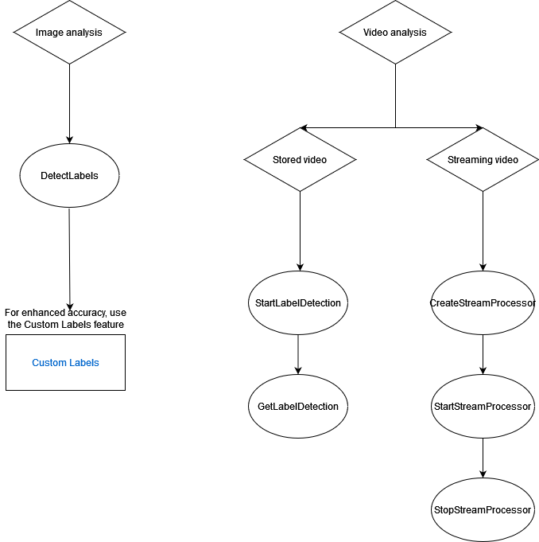
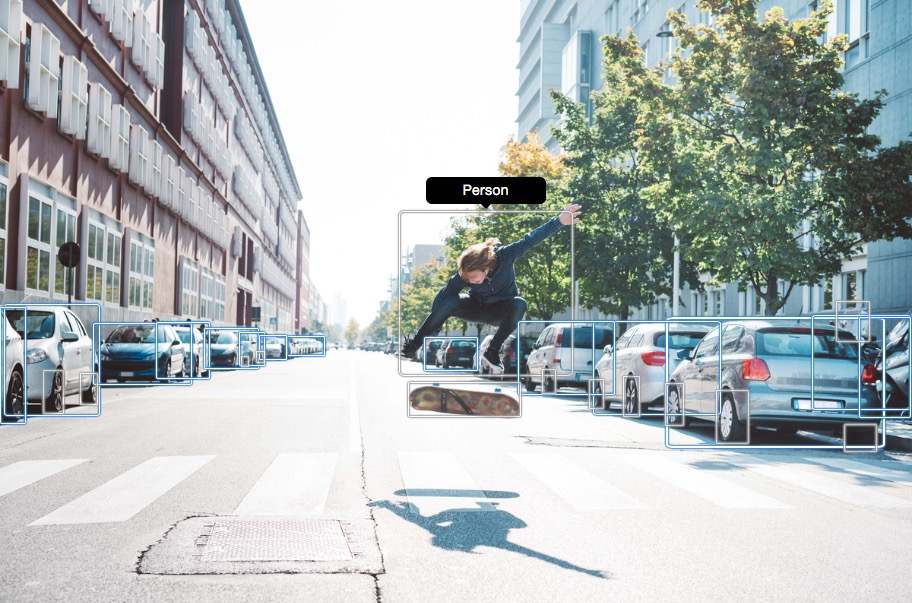
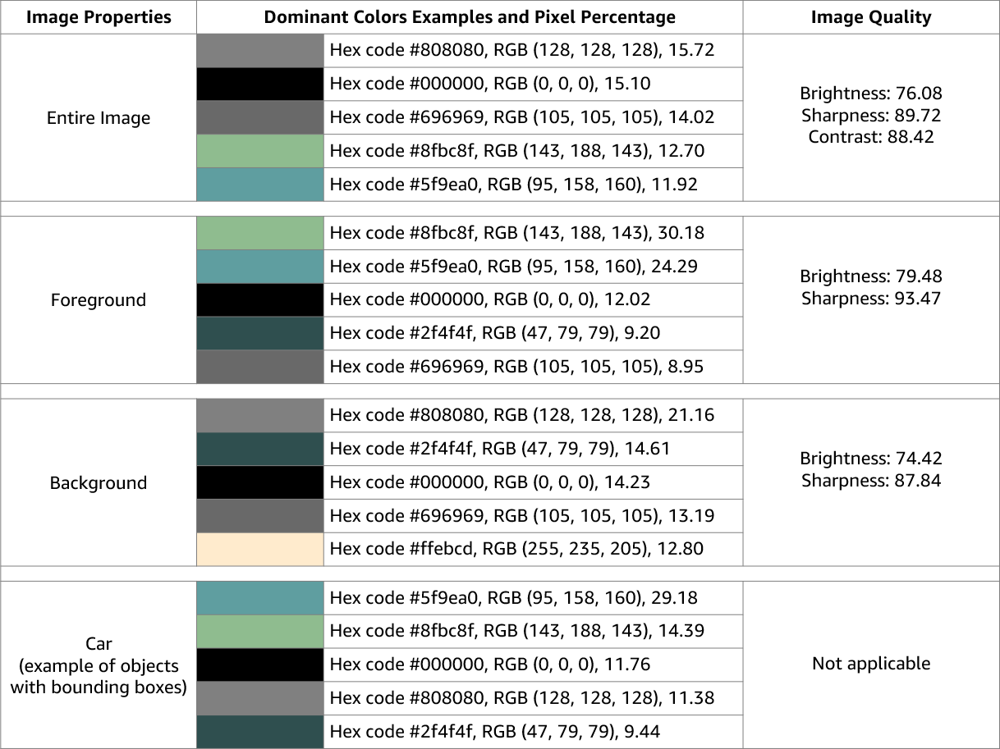

# Detecting objects and concepts

This section provides information for detecting labels in images and videos with Amazon Rekognition Image
and Amazon Rekognition Video.

A label or a tag is an object or concept (including scenes and actions) found in an image or
video based on its contents. For example, an image of people on a tropical beach may contain
labels such as Palm Tree (object), Beach (scene), Running (action), and Outdoors (concept).

**Labels supported by Rekognition label detection
operations**

- To download the latest list of labels and object bounding boxes supported by Amazon Rekognition,
  click [here](samples/AmazonRekognitionLabels_v3.0.md "samples/AmazonRekognitionLabels_v3.0.md").
- To download the
  previous list of labels and object bounding boxes, click [here](samples/AmazonRekognitionLabels_v2.0.md "samples/AmazonRekognitionLabels_v2.0.md").

###### Note

Amazon Rekognition makes gender binary (man, woman, girl, etc.) predictions based on the
physical appearance of a person in a particular image. This kind of prediction is not
designed to categorize a person’s gender identity, and you shouldn't use Amazon Rekognition to
make such a determination. For example, a male actor wearing a long-haired wig and
earrings for a role might be predicted as female.

Using Amazon Rekognition to make gender binary predictions is best suited for use cases where
aggregate gender distribution statistics need to be analyzed without identifying
specific users. For example, the percentage of users who are women compared to men on a
social media platform.

We don't recommend using gender binary predictions to make decisions that impact an
individual's rights, privacy, or access to services.

Amazon Rekognition returns labels in English. You can use [Amazon Translate](https://aws.amazon.com/translate/ "https://aws.amazon.com/translate/") to translate English labels into
[other languages](../../../translate/latest/dg/what-is.md#language-pairs "../../../translate/latest/dg/what-is.md#language-pairs").

The following diagram shows shows the order for calling operations, depending on your
goals for using the Amazon Rekognition Image or Amazon Rekognition Video operations:

## Label Response Objects

### Bounding Boxes

Amazon Rekognition Image and Amazon Rekognition Video can return the bounding box for common object labels such as
cars, furniture, apparel or pets. Bounding box information isn't returned for less
common object labels. You can use bounding boxes to find the exact locations of
objects in an image, count instances of detected objects, or to measure an object's
size using bounding box dimensions.

For example, in the following image, Amazon Rekognition Image is able to detect the presence of a
person, a skateboard, parked cars and other information. Amazon Rekognition Image also returns the
bounding box for a detected person, and other detected objects such as cars and
wheels.

### Confidence Score

Amazon Rekognition Video and Amazon Rekognition Image provide a percentage score for how much confidence Amazon Rekognition
has in the accuracy of each detected label.

### Parents

Amazon Rekognition Image and Amazon Rekognition Video use a hierarchical taxonomy of ancestor labels to categorize
labels. For example, a person walking across a road might be detected as a
_Pedestrian_. The parent label for
_Pedestrian_ is _Person_. Both of these
labels are returned in the response. All ancestor labels are returned and a given
label contains a list of its parent and other ancestor labels. For example,
grandparent and great grandparent labels, if they exist. You can use parent labels
to build groups of related labels and to allow querying of similar labels in one or
more images. For example, a query for all _Vehicles_ might return
a car from one image and a motor bike from another.

### Categories

Amazon Rekognition Image and Amazon Rekognition Video return information on label categories. Labels are part of
categories that group individual labels together based on common functions and
contexts, such as ‘Vehicles and Automotive’ and ‘Food and Beverage’. A label
category can be a subcategory of a parent category.

### Aliases

In addition to returning labels, Amazon Rekognition Image and Amazon Rekognition Video returns any aliases
associated with the label. Aliases are labels with the same meaning or labels that
are visually interchangeable with the primary label returned. For example, ‘Cell
Phone’ is an alias of ‘Mobile Phone’.

In previous versions, Amazon Rekognition Image returned aliases like 'Cell Phone' in the same list
of primary label names that contained 'Mobile Phone'. Amazon Rekognition Image now returns 'Cell
Phone' in a field called "aliases" and 'Mobile Phone' in the list of primary label
names. If your appliction relies on the structures returned by a previous version of
Rekognition, you may need to transform the current response returned by the image or
video label detection operations into the previous response structure, where all
labels and aliases are returned as primary labels.

If you need to transform the current response from the DetectLabels API (for label
detection in images) into the previous response structure, see the code example in
[Transforming the DetectLabels
response](labels-detect-labels-image.md#detectlabels-transform-response "labels-detect-labels-image.md#detectlabels-transform-response").

If you need to transform the current response from the GetLabelDetection API (for
label detection in stored videos) into the previous response structure, see the code
example in [Transforming the
GetLabelDetection Response](labels-detecting-labels-video.md#getlabeldetection-transform-response "labels-detecting-labels-video.md#getlabeldetection-transform-response").

### Image Properties

Amazon Rekognition Image returns information about image quality (sharpness, brightness, and
contrast) for the entire image. Sharpness and brightness are also returned for the
foreground and background of the image. Image Properties can also be used to detect
dominant colors of the entire image, foreground, background, and objects with
bounding boxes.

The following is an example of the ImageProperties data contained in the response
of a DetectLabels operation for the proceeding image:

Image Properties isn't available for Amazon Rekognition Video.

### Model Version

Amazon Rekognition Image and Amazon Rekognition Video both return the version of the label detection model used to
detect labels in an image or stored video.

### Inclusion and Exclusion Filters

You can filter the results returned by Amazon Rekognition Image and Amazon Rekognition Video label detection
operations. Filter results by providing filtration criteria for labels and
categories. Label filters can be inclusive or exclusive.

See [Detecting labels in an image](labels-detect-labels-image.md "labels-detect-labels-image.md") for more information regarding
filtration of results obtained with `DetectLabels`.

See [Detecting labels in a video](labels-detecting-labels-video.md "labels-detecting-labels-video.md") for more information regarding
filtration of results obtained by `GetLabelDetection`.

### Sorting and Aggregating Results

Results obtained from certain Amazon Rekognition Video operations can be sorted and aggregated
according to timestamps and video segments. When retrieving the results of a Label
Detection or Content Moderation job, with `GetLabelDetection` or
`GetContentModeration` respectively, you can use the
`SortBy` and `AggregateBy` arguments to specify how you
want your results returned. You can use `SortBy` with
`TIMESTAMP` or `NAME` (Label names), and use
`TIMESTAMPS` or `SEGMENTS` with the AggregateBy
argument.
