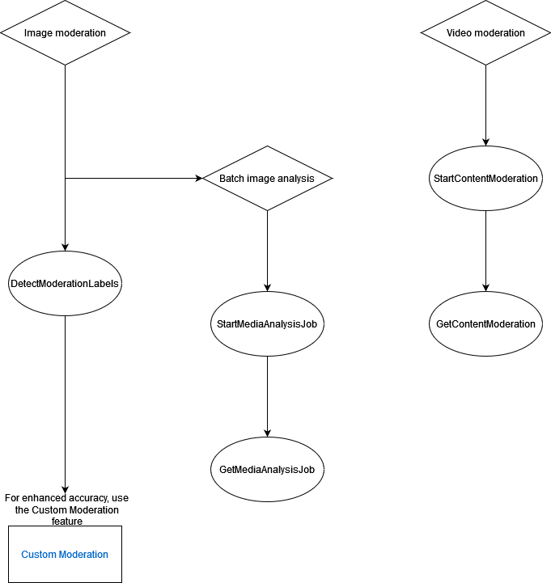

# Moderating content

You can use Amazon Rekognition to detect content that is inappropriate, unwanted, or offensive.
You can use Rekognition moderation APIs in social media, broadcast media, advertising, and e-commerce situations to create a safer user experience,
provide brand safety assurances to advertisers, and comply with local and global regulations.

Today, many companies rely entirely on human moderators to review third-party or user-generated content, while others simply
react to user complaints to take down offensive or inappropriate images, ads, or videos. However, human moderators alone cannot
scale to meet these needs at sufficient quality or speed, which leads to a poor user experience, high costs to achieve scale, or
even a loss of brand reputation. By using Rekognition for image and video moderation, human moderators can review a much
smaller set of content, typically 1-5% of the total volume, already flagged by machine learning. This enables them to focus on
more valuable activities and still achieve comprehensive moderation coverage at a fraction of their existing cost. To set up
human workforces and perform human review tasks, you can use Amazon Augmented AI, which is already integrated with Rekognition.

You can enhance the accuracy of the moderation deep learning model with the Custom
Moderation feature. With Custom Moderation, you train a custom moderation adapter by
uploading your images and annotating these images. The trained adapter can then be provided
to the [DetectModerationLabels](../APIReference/API_DetectModerationLabels.md "../APIReference/API_DetectModerationLabels.md") operation to to enhance its performance on your images.
See [Enhancing accuracy with Custom
Moderation](moderation-custom-moderation.md "moderation-custom-moderation.md") for more information.

**Labels supported by Rekognition content moderation
operations**

- To download a list of the moderation labels, click [here](samples/rekognition-moderation-labels.md "samples/rekognition-moderation-labels.md").

###### Topics

- [Using the image and video moderation APIs](moderation-api.md "moderation-api.md")
- [Testing Content Moderation
  version 7 and transforming the API response](moderation-response-transform.md "moderation-response-transform.md")
- [Detecting inappropriate images](procedure-moderate-images.md "procedure-moderate-images.md")
- [Detecting inappropriate stored videos](procedure-moderate-videos.md "procedure-moderate-videos.md")
- [Enhancing accuracy with Custom
  Moderation](moderation-custom-moderation.md "moderation-custom-moderation.md")
- [Reviewing inappropriate content with Amazon Augmented
  AI](a2i-rekognition.md "a2i-rekognition.md")
  The following diagram shows shows the order for calling operations, depending on your
  goals for using the image or video components of Content Moderation:

