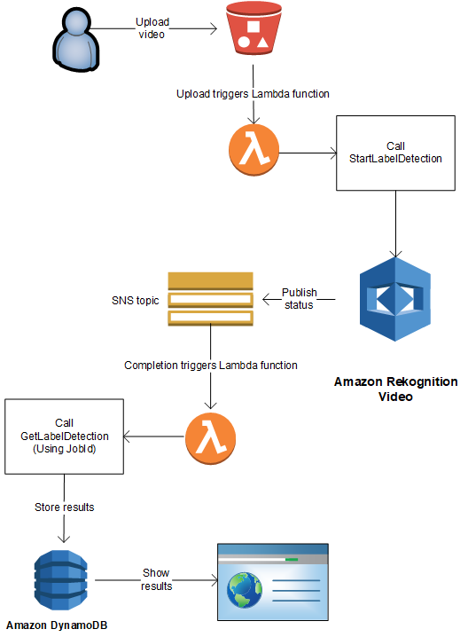
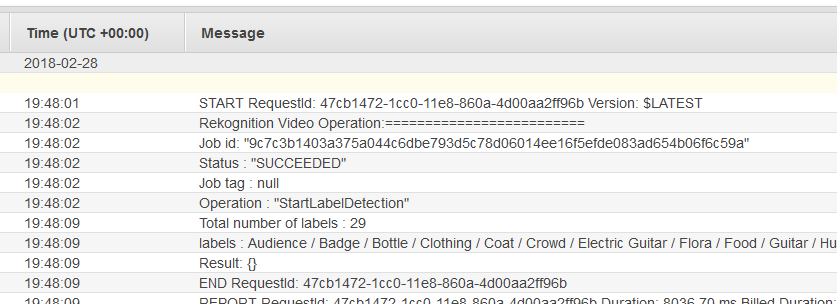

# Creating an Amazon Rekognition Lambda

function

This tutorial shows how to get the results of a video analysis operation for label
detection by using a Java Lambda function.

###### Note

This tutorial uses the AWS SDK for Java 1.x. For a tutorial using Rekognition and the AWS SDK for Java version 2, see the
[AWS Documentation SDK examples GitHub repository](https://github.com/awsdocs/aws-doc-sdk-examples/tree/master/javav2/usecases/video_analyzer_application "https://github.com/awsdocs/aws-doc-sdk-examples/tree/master/javav2/usecases/video_analyzer_application").

You can use Lambda functions with Amazon Rekognition Video operations. For example, the following
diagram shows a website that uses a Lambda function to automatically start analysis of a
video when it's uploaded to an Amazon S3 bucket. When the Lambda function is triggered, it
calls [StartLabelDetection](../APIReference/API_StartLabelDetection.md "../APIReference/API_StartLabelDetection.md") to start detecting labels in the
uploaded video. For information about using Lambda to process event notifications from an Amazon S3 bucket,
see [Using AWS Lambda with Amazon S3 Events](../../../lambda/latest/dg/with-s3.md "../../../lambda/latest/dg/with-s3.md").

A second Lambda function is triggered when the analysis completion status
is sent to the registered Amazon SNS topic. The second Lambda function calls [GetLabelDetection](../APIReference/API_GetLabelDetection.md "../APIReference/API_GetLabelDetection.md") to get the analysis results. The results are then
stored in a database in preparation for displaying on a webpage. This second lambda function is
the focus of this tutorial.


In this tutorial, the Lambda function is triggered when Amazon Rekognition Video sends the completion
status for the video analysis to the registered Amazon SNS topic. It then collects video
analysis results by calling [GetLabelDetection](../APIReference/API_GetLabelDetection.md "../APIReference/API_GetLabelDetection.md"). For demonstration
purposes, this tutorial writes label detection results to a CloudWatch log. In your
application's Lambda function, you should store the analysis results for later use. For
example, you can use Amazon DynamoDB to save the analysis results. For more information, see
[Working with
DynamoDB](url-ddb-dev.md "url-ddb-dev.md").

The following procedures show you how to:

- Create the Amazon SNS topic and set up permissions.
- Create the Lambda function by using the AWS Management Console and subscribe it to the Amazon SNS
  topic.
- Configure the Lambda function by using the AWS Management Console.
- Add sample code to an AWS Toolkit for Eclipse project and upload it to the Lambda
  function.
- Test the Lambda function by using the AWS CLI.

###### Note

Use the same AWS Region throughout the tutorial.

## Prerequisites

This tutorial assumes that you're familiar with the AWS Toolkit for Eclipse. For more
information, see [AWS Toolkit for Eclipse](../../../toolkit-for-eclipse/v1/user-guide/welcome.md "../../../toolkit-for-eclipse/v1/user-guide/welcome.md").

## Create the SNS topic

The completion status of an Amazon Rekognition Video video analysis operation is sent to an Amazon SNS
topic. This procedure creates the Amazon SNS topic and the IAM service role that gives
Amazon Rekognition Video access to your Amazon SNS topics. For more information, see [Calling Amazon Rekognition Video operations](api-video.md "api-video.md").

###### To create an Amazon SNS topic

1. If you haven't already, create an IAM service role to give Amazon Rekognition Video
   access to your Amazon SNS topics. Note the Amazon Resource Name (ARN). For more
   information, see [Giving access to multiple Amazon SNS
   topics](api-video-roles.md#api-video-roles-all-topics "api-video-roles.md#api-video-roles-all-topics").
2. [Create an Amazon SNS topic](../../../sns/latest/dg/CreateTopic.md "../../../sns/latest/dg/CreateTopic.md") by
   using the [Amazon SNS
   console](https://console.aws.amazon.com/sns/v2/home "https://console.aws.amazon.com/sns/v2/home").You only need to specifiy the topic name. Prepend the topic name with
   _AmazonRekognition_. Note the topic ARN.

## Create the Lambda function

You create the Lambda function by using the AWS Management Console. Then you use an AWS Toolkit for Eclipse
project to upload the Lambda function package to AWS Lambda. It's also possible to
create the Lambda function with the AWS Toolkit for Eclipse. For more information, see [Tutorial: How to Create, Upload, and Invoke an AWS Lambda
Function](../../../toolkit-for-eclipse/v1/user-guide/lambda-tutorial.md "../../../toolkit-for-eclipse/v1/user-guide/lambda-tutorial.md").

###### To create the Lambda function

1. Sign in to the AWS Management Console, and open the AWS Lambda console at
   [https://console.aws.amazon.com/lambda/](https://console.aws.amazon.com/lambda/ "https://console.aws.amazon.com/lambda/").
2. Choose **Create function**.
3. Choose **Author from scratch**.
4. In **Function name**, type a name for your function.
5. In **Runtime**, choose **Java 8**.
6. Choose **Choose or create an execution role**.
7. In **Execution role**, choose **Create a new role with basic Lambda permissions**.
8. Note the name of the new role that's displayed at the bottom of the **Basic information** section.
9. Choose **Create function**.

## Configure the Lambda function

After you create the Lambda function, you configure it to be triggered by the Amazon SNS
topic that you create in [Create the SNS topic](#lambda-create-sns-topic "#lambda-create-sns-topic"). You also adjust the memory
requirements and timeout period for the Lambda function.

###### To configure the Lambda function

1. In **Function Code**, type
   `com.amazonaws.lambda.demo.JobCompletionHandler` for
   **Handler**.
2. In **Basic settings**, choose **Edit**.
   The **Edit basic settings** dialog is shown.
   1. Choose **1024**
      for **Memory**.
   2. Choose **10**
      seconds for **Timeout**.
   3. Choose **Save**.

3. In **Designer**, choose **+ Add trigger**. The Add trigger dialog is shown.
4. In **Trigger configuration** choose **SNS**.

In **SNS topic**, choose the Amazon SNS topic that
you created in [Create the SNS topic](#lambda-create-sns-topic "#lambda-create-sns-topic"). 5. Choose **Enable trigger**. 6. To add the trigger, choose **Add**. 7. Choose **Save** to save the Lambda function.

## Configure the IAM Lambda role

To call Amazon Rekognition Video operations, you add the
_AmazonRekognitionFullAccess_ AWS managed policy to the IAM
Lambda role. Start operations, such as [StartLabelDetection](../APIReference/API_StartLabelDetection.md "../APIReference/API_StartLabelDetection.md"),
also require pass role permissions for the IAM service role that Amazon Rekognition Video uses to
access the Amazon SNS topic.

###### To configure the role

1. Sign in to the AWS Management Console and open the IAM console at [https://console.aws.amazon.com/iam/](https://console.aws.amazon.com/iam/ "https://console.aws.amazon.com/iam/").
2. In the navigation pane, choose **Roles**.
3. In the list, choose the name of the execution role that you created in [Create the Lambda function](#lambda-create-function "#lambda-create-function").
4. Choose the **Permissions** tab.
5. Choose **Attach policies**.
6. Choose _AmazonRekognitionFullAccess_ from the list of
   policies.
7. Choose **Attach policy**.
8. Again, choose the execution role.
9. Choose **Add inline
   policy**.
10. Choose the **JSON** tab.
11. Replace the existing policy with the following policy. Replace
    `servicerole` with the IAM service role that you created in
    [Create the SNS topic](#lambda-create-sns-topic "#lambda-create-sns-topic").
12. Choose **Review policy**.
13. In **Name\***, type a name for the policy.
14. Choose **Create policy**.

## Create

the
AWS Toolkit for Eclipse Lambda project

When the Lambda function is triggered, the following code gets the completion
status from the Amazon SNS topic, and calls [GetLabelDetection](../APIReference/API_GetLabelDetection.md "../APIReference/API_GetLabelDetection.md") to
get the analysis results. A count of labels detected, and a list of labels detected
is written to a CloudWatch log. Your Lambda function should store the video analysis
results for later use.

###### To create the AWS Toolkit for Eclipse Lambda project

1. [Create an AWS Toolkit for EclipseAWS Lambda project](../../../toolkit-for-eclipse/v1/user-guide/lambda-tutorial.md#lambda-tutorial-create-handler-class "../../../toolkit-for-eclipse/v1/user-guide/lambda-tutorial.md#lambda-tutorial-create-handler-class").
   - For **Project name:**, type a project name of
     your choosing.
   - For **Class Name:**, enter _JobCompletionHandler_.
   - For **Input type:**, choose **SNS
     Event**.
   - Leave the other fields unchanged.

2. In the **Eclipse Project** explorer, open the generated
   Lambda handler method (JobCompletionHandler.java) and replace the contents with the following:

```
//Copyright 2018 Amazon.com, Inc. or its affiliates. All Rights Reserved.
//PDX-License-Identifier: MIT-0 (For details, see https://github.com/awsdocs/amazon-rekognition-developer-guide/blob/master/LICENSE-SAMPLECODE.)

package com.amazonaws.lambda.demo;

import com.amazonaws.services.lambda.runtime.Context;
import com.amazonaws.services.lambda.runtime.LambdaLogger;
import com.amazonaws.services.lambda.runtime.RequestHandler;
import com.amazonaws.services.lambda.runtime.events.SNSEvent;
import java.util.List;
import com.amazonaws.regions.Regions;
import com.amazonaws.services.rekognition.AmazonRekognition;
import com.amazonaws.services.rekognition.AmazonRekognitionClientBuilder;
import com.amazonaws.services.rekognition.model.GetLabelDetectionRequest;
import com.amazonaws.services.rekognition.model.GetLabelDetectionResult;
import com.amazonaws.services.rekognition.model.LabelDetection;
import com.amazonaws.services.rekognition.model.LabelDetectionSortBy;
import com.amazonaws.services.rekognition.model.VideoMetadata;
import com.fasterxml.jackson.databind.JsonNode;
import com.fasterxml.jackson.databind.ObjectMapper;


public class JobCompletionHandler implements RequestHandler<SNSEvent, String> {

   @Override
   public String handleRequest(SNSEvent event, Context context) {

      String message = event.getRecords().get(0).getSNS().getMessage();
      LambdaLogger logger = context.getLogger();

      // Parse SNS event for analysis results. Log results
      try {
         ObjectMapper operationResultMapper = new ObjectMapper();
         JsonNode jsonResultTree = operationResultMapper.readTree(message);
         logger.log("Rekognition Video Operation:=========================");
         logger.log("Job id: " + jsonResultTree.get("JobId"));
         logger.log("Status : " + jsonResultTree.get("Status"));
         logger.log("Job tag : " + jsonResultTree.get("JobTag"));
         logger.log("Operation : " + jsonResultTree.get("API"));

         if (jsonResultTree.get("API").asText().equals("StartLabelDetection")) {

            if (jsonResultTree.get("Status").asText().equals("SUCCEEDED")){
               GetResultsLabels(jsonResultTree.get("JobId").asText(), context);
            }
            else{
               String errorMessage = "Video analysis failed for job "
                     + jsonResultTree.get("JobId")
                     + "State " + jsonResultTree.get("Status");
               throw new Exception(errorMessage);
            }

         } else
            logger.log("Operation not StartLabelDetection");

      } catch (Exception e) {
         logger.log("Error: " + e.getMessage());
         throw new RuntimeException (e);


      }

      return message;
   }

   void GetResultsLabels(String startJobId, Context context) throws Exception {

      LambdaLogger logger = context.getLogger();

      AmazonRekognition rek = AmazonRekognitionClientBuilder.standard().withRegion(Regions.US_EAST_1).build();

      int maxResults = 1000;
      String paginationToken = null;
      GetLabelDetectionResult labelDetectionResult = null;
      String labels = "";
      Integer labelsCount = 0;
      String label = "";
      String currentLabel = "";

      //Get label detection results and log them.
      do {

         GetLabelDetectionRequest labelDetectionRequest = new GetLabelDetectionRequest().withJobId(startJobId)
               .withSortBy(LabelDetectionSortBy.NAME).withMaxResults(maxResults).withNextToken(paginationToken);

         labelDetectionResult = rek.getLabelDetection(labelDetectionRequest);

         paginationToken = labelDetectionResult.getNextToken();
         VideoMetadata videoMetaData = labelDetectionResult.getVideoMetadata();

         // Add labels to log
         List<LabelDetection> detectedLabels = labelDetectionResult.getLabels();

         for (LabelDetection detectedLabel : detectedLabels) {
            label = detectedLabel.getLabel().getName();
            if (label.equals(currentLabel)) {
               continue;
            }
            labels = labels + label + " / ";
            currentLabel = label;
            labelsCount++;

         }
      } while (labelDetectionResult != null && labelDetectionResult.getNextToken() != null);

      logger.log("Total number of labels : " + labelsCount);
      logger.log("labels : " + labels);

   }


}


```

3. The Rekognition namespaces aren't resolved. To correct this:
   - Pause your mouse over the underlined portion of the line
     `import
com.amazonaws.services.rekognition.AmazonRekognition;`.
   - Choose **Fix project set up...** .
   - Choose the latest version of the Amazon Rekognition archive.
   - Choose **OK** to add the archive to the
     project.

4. Save the file.
5. Right-click in your Eclipse code window, choose **AWS
   Lambda**, and then choose **Upload function to AWS
   Lambda**.
6. On the **Select Target Lambda Function** page, choose the
   AWS Region to use.
7. Choose **Choose an existing lambda function**, and select
   the Lambda function that you created in [Create the Lambda function](#lambda-create-function "#lambda-create-function").
8. Choose **Next**. The **Function Configuration** dialog box is shown.
9. In **IAM Role** choose the IAM
   role that you created in [Create the Lambda function](#lambda-create-function "#lambda-create-function").
10. Choose **Finish**, and the Lambda function is uploaded to
    AWS.

## Test the Lambda function

Use the following AWS CLI command to test the Lambda function by starting the label
detection analysis of a video. After analysis is finished, the Lambda function is
triggered. Confirm that the analysis succeeded by checking the CloudWatch Logs logs.

###### To test the Lambda function

1. Upload an MOV or MPEG-4 format video file to your S3 bucket. For
   test purposes, upload a video that's no longer than 30 seconds in
   length.

For instructions, see [Uploading Objects
into Amazon S3](../../../AmazonS3/latest/userguide/UploadingObjectsintoAmazonS3.md "../../../AmazonS3/latest/userguide/UploadingObjectsintoAmazonS3.md") in the
_Amazon Simple Storage Service User Guide_. 2. Run the following AWS CLI command to start detecting labels in a
video.

```
aws rekognition start-label-detection --video "S3Object={Bucket="`bucketname`",Name="`videofile`"}" \
--notification-channel "SNSTopicArn=`TopicARN`,RoleArn=`RoleARN`" \
--region `Region`


```

Update the following values:

    * Change `bucketname` and `videofile` to the
     Amazon S3 bucket name and file name of the video that you want to detect
     labels in.
    * Change `TopicARN` to the ARN of the Amazon SNS topic that
     you created in [Create the SNS topic](#lambda-create-sns-topic "#lambda-create-sns-topic").
    * Change `RoleARN` to the ARN of the IAM role that you
     created in [Create the SNS topic](#lambda-create-sns-topic "#lambda-create-sns-topic").
    * Change `Region` to the AWS Region that you are using.

3. Note the value of `JobId` in the response. The response looks
   similar to the following JSON example.

```
{
    "JobId": "547089ce5b9a8a0e7831afa655f42e5d7b5c838553f1a584bf350ennnnnnnnnn"
}
```

4. Open the [https://console.aws.amazon.com/cloudwatch/](https://console.aws.amazon.com/cloudwatch/ "https://console.aws.amazon.com/cloudwatch/") console.
5. When the analysis completes, a log entry for the Lambda function appears in
   the **Log Group**.
6. Choose the Lambda function to see the log streams.
7. Choose the latest log stream to see the log entries made by the Lambda
   function. If the operation succeeded, it looks similar to the following output,
   which shows the details of video recognition operation, including the job ID,
   operation type "StartLabelDetection", and a list of detected label categories
   like Bottle, Clothing, Crowd, and Food:



The value of **Job id** should match the value of
`JobId` that you noted in step 3.
