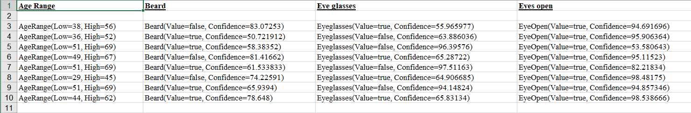

# Creating AWS video analyzer applications

You can create a Java web application that analyzes videos for label detection by using the AWS SDK for Java version 2.
The application created in this AWS tutorial lets you upload a video (MP4 file) to an Amazon S3 bucket.
Then the appliction uses the Amazon Rekognition service to analyze the video. The results are used to populate a data model and then a
report is generated and emailed to a specific user by using the Amazon Simple Email Service.

The following illustration shows a report that is generated after the application completes
analyzing the video. The columns in the table below show Age Range, Beard, Eye glasses, and Eyes
open, as well as confidence values for different attribute predictions.

In this tutorial, you create a Spring Boot application that invokes various AWS services. The Spring Boot APIs are used to
build a model, different views, and a controller. For more information, see [Spring Boot](https://spring.io/projects/spring-boot "https://spring.io/projects/spring-boot").

This service uses the following AWS services:

- Amazon Rekognition
- [Amazon S3](../../../AmazonS3/latest/userguide/Welcome.md "../../../AmazonS3/latest/userguide/Welcome.md")
- [Amazon SES](../../../ses/latest/dg/Welcome.md "../../../ses/latest/dg/Welcome.md")
- [AWS Elastic Beanstalk](../../../elasticbeanstalk/latest/dg/Welcome.md "../../../elasticbeanstalk/latest/dg/Welcome.md")
  The AWS services included in this tutorial are included in the AWS Free Tier. We recommend that you terminate all of the resources you create in the tutorial
  when you are finished with them to avoid being charged.

## Prerequisites

Before you begin, you need to complete the steps in [Setting Up the AWS SDK for Java](../../../sdk-for-java/latest/developer-guide/setup.md "../../../sdk-for-java/latest/developer-guide/setup.md").
Then make sure that you have the following:

- Java 1.8 JDK.
- Maven 3.6 or later.
- An Amazon S3 bucket named **video[somevalue]**. Be sure to use this bucket name in your Amazon S3 Java code. For more information, see [Creating a bucket](../../../AmazonS3/latest/userguide/creating-bucket.md "../../../AmazonS3/latest/userguide/creating-bucket.md").
- An IAM role. You need this for the **VideoDetectFaces** class that you will create. For more information, see [Configuring Amazon Rekognition Video](api-video-roles.md "api-video-roles.md").
- A valid Amazon SNS topic. You need this for the **VideoDetectFaces** class that you will create. For more information, see [Configuring Amazon Rekognition Video](api-video-roles.md "api-video-roles.md").

## Procedure

In the course of the tutorial, you do the following:

1. Create a project
2. Add the POM dependencies to your project
3. Create the Java classes
4. Create the HTML files
5. Create the script files
6. Package the project into a JAR file
7. Deploy the application to AWS Elastic Beanstalk

To proceed with the tutorial, follow the detailed instructions in the [AWS Documentation SDK examples GitHub repository](https://github.com/awsdocs/aws-doc-sdk-examples/tree/master/javav2/usecases/video_analyzer_application "https://github.com/awsdocs/aws-doc-sdk-examples/tree/master/javav2/usecases/video_analyzer_application").
