# Custom Moderation adapter tutorial

This tutorial shows you how to create, train, evaluate, use, and manage adapters using
the Rekognition Console. To create, use, and manage adapters with the AWS SDK, see [Managing adapters with the AWS CLI and
SDKs](managing-adapters.md "managing-adapters.md").

Adapters let you enhance the accuracy of Rekognition’s API operations, customizing the
model’s behavior to fit your own needs and use cases. After you create an adapter with
this tutorial, you’ll be able to use it when analyzing your own images with operations
like [DetectModerationLabels](../APIReference/API_DetectModerationLabels.md "../APIReference/API_DetectModerationLabels.md"), as well as retrain the adapter for further, future
improvements.

In this tutorial you’ll learn how to:

- Create a project using Rekognition Console
- Annotate your training data
- Train your adapter on your training dataset
- Review your adapter’s performance
- Use your adapter for image analysis

## Prerequisites

Before completing this tutorial it’s recommended that you read through [Creating and using adapters](creating-and-using-adapters.md "creating-and-using-adapters.md").

To create an adapter, you can use the Rekognition Console tool to create a project,
upload and annotate your own images, and then train an adapter on these images.
See [Creating a project and training
an adapter](#using-adapters-tutorial-annotation "#using-adapters-tutorial-annotation") to get started.

Alternatively, you can use Rekognition’s Console or API to retrieve predictions
for images and then verify the predictions before training an adapter on these
predictions. See
[Bulk
analysis, prediction verification, and training an adapter](#using-adapters-tuorial-annotation-bulk-analysis "#using-adapters-tuorial-annotation-bulk-analysis") to get started.

## Image annotation

You can annotate images yourself by labeling images with the Rekognition console,
or use Rekognition Bulk analysis to annotate images which you can then verify have been correctly
labeled. Choose one of the topics below to get started.

###### Topics

- [Creating a project and training
  an adapter](#using-adapters-tutorial-annotation "#using-adapters-tutorial-annotation")
- [Bulk
  analysis, prediction verification, and training an adapter](#using-adapters-tuorial-annotation-bulk-analysis "#using-adapters-tuorial-annotation-bulk-analysis")

### Creating a project and training

an adapter

Complete the following steps to train your adapter by annotating images using the Rekognition console.

**Create a project**

Before you can train or use an adapter you must create the project that will
contain it. You must also provide the images used to train your adapter. To
create a project, an adapter, and your image datasets:

1. Sign in to the AWS Management Console and open the Rekognition console at https://console.aws.amazon.com/rekognition/.
2. In the left pane, choose **Custom Moderation.** The Rekognition Custom
   Moderation landing page is shown.

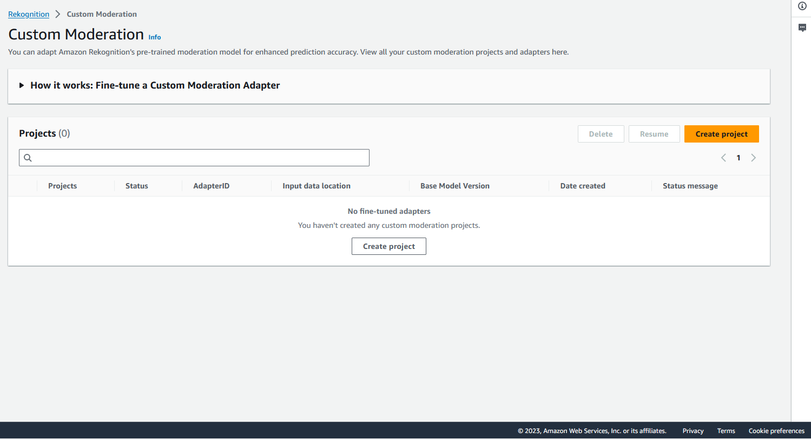 3. The Custom Moderation landing page shows you a list of all your projects and adapters, and
there is also a button to create an adapter. Choose **Create project** to create a new project and
adapter. 4. If this is your first time creating an adapter you will be prompted to create an Amazon S3 bucket
to store files related to your project and your adapter. Choose **Create Amazon S3 bucket**. 5. On the following page, fill in the **adapter name** and the
**project name**. Provide an adapter
description if you wish.

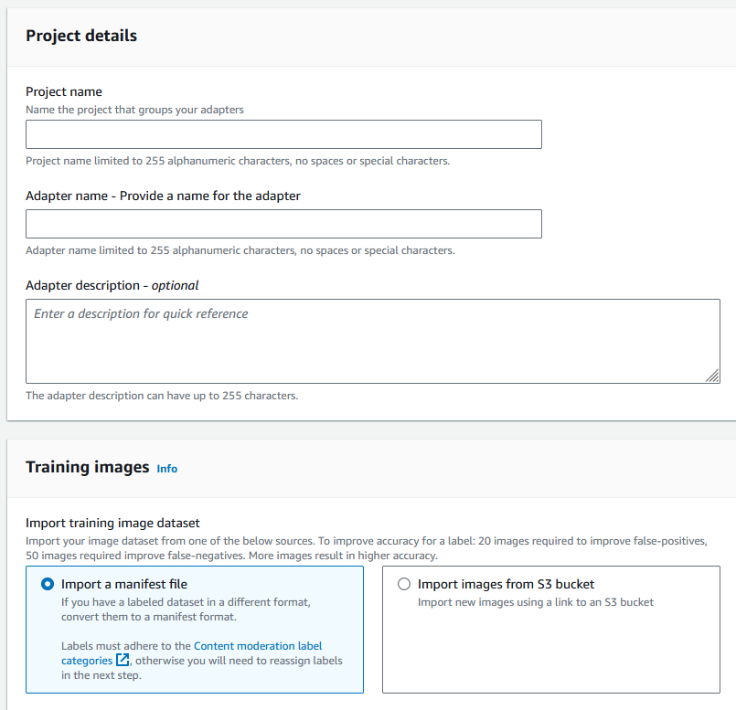 6. In this step, you’ll also provide the images for your adapter. You can select: **Import images from your computer**, **Import manifest file**, or **Import images from Amazon S3 bucket**. If you choose to import your
images from an Amazon S3 bucket, provide the path to the bucket and folder that
contains your training images. If you upload your images directly from your
computer, note that you can only upload up to 30 images at one time. If you
are using a manifest file that contains annotations, you can skip the steps
listed below covering image annotation and proceed to the section on
[Reviewing adapter performance](#using-adapters-tutorial-performance "#using-adapters-tutorial-performance"). 7. In the **Test dataset details** section, choose **Autosplit** to have Rekognition automatically select the
appropriate percentage of your images as testing data, or you can choose
**Manually import manifest file**. 8. After filling in this information, select **Create
Project**.

**Train an adapter**

To train an adapter on your own un-annotated images:

1. Select the project that contains your adapter and then choose the option to **Assign label to images**.
2. On the **Assign label to images** page, you can see all the
   images that have been uploaded as training images. You can filter these
   images by both labeled/unlabeled status and by label category using the two
   attribute selection panels on the left. You can add additional images to
   your training dataset by selecting the **Add
   images** button.

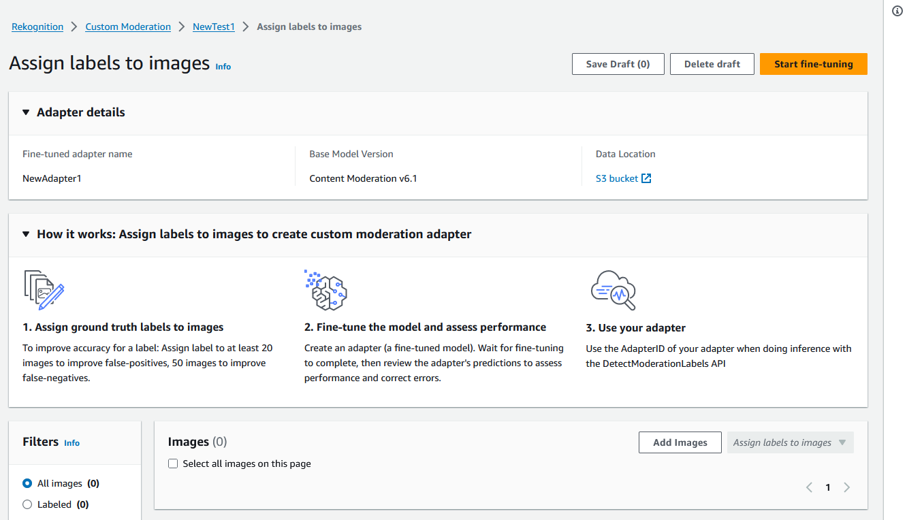 3. After adding images to the training dataset, you must annotate your images with labels. After
uploading your images, the "Assign labels to images" page will update to
show the images you’ve uploaded. You will be prompted to select the label
appropriate for you images from a drop-down list of labels supported by
Rekognition Moderation. You can select more than one label. 4. Continue this process until you have added labels to each of the images in your training data. 5. After you have labeled all your data, select **Start training**
to start training the model, which creates your adapter.

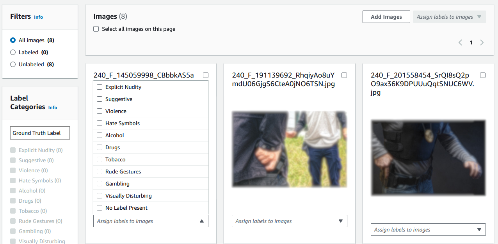 6. Before you start the training process you can add any **Tags** to
the adapter that you’d like to. You can also provide the adapter with a
custom encryption key or use an AWS KMS key. Once you have finished adding
any tags you want and customizing the encryption to your liking, select
**Train adapter** to start the training
process for your adapter. 7. Wait for your adapter to finish training. Once training has completed,
you’ll receive a notification that your adapter has finished being created.

Once the status of your adapter is “Training completed” you can review your adapter’s metrics

### Bulk

analysis, prediction verification, and training an adapter

Complete the following steps to train your adapter by verifying bulk analysis predictions from
Rekognition’s Content Moderation model.

To train an adapter by verifying predictions from Rekognition’s
Content Moderation model, you must:

1. Carry out Bulk analysis on your images
2. Verify the predictions returned for your images

You can obtain predictions for images by carrying out Bulk analysis with
Rekognition’s base model or an adapter you have already created.

**Run bulk analysis on your images**

To train an adapter on predictions you have verified, you must first start
a Bulk analysis job to analyze a batch of images using Rekognition’s base
model or an adapter of your choice. To run a Bulk analysis job:

1. Sign in to the AWS Management Console and open the Amazon Rekognition console at [https://console.aws.amazon.com/rekognition/](https://console.aws.amazon.com/rekognition/ "https://console.aws.amazon.com/rekognition/").
2. In the left pane, choose **Bulk
   analysis**. The Bulk analysis landing page appears.
   Choose **Start Bulk Analysis**. The
   Bulk Analysis feature overview showing steps to upload images, wait
   for analysis, review results, and optionally verify model
   predictions. Lists recent Bulk Analysis jobs for Content Moderation
   using the base model.

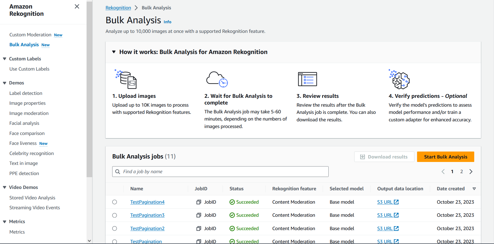 3. If this is your first time creating an adapter you will be
prompted to create an Amazon Simple Storage Service bucket to store files related to your
project and your adapter. Choose **Create Amazon S3
bucket**. 4. Select the adapter you want to use for the bulk analysis by using
the **Choose an adapter** drop-down
menu. If no adapter is chosen the base model will be used by
default. For the purposes of this tutorial do not choose an
adapter.

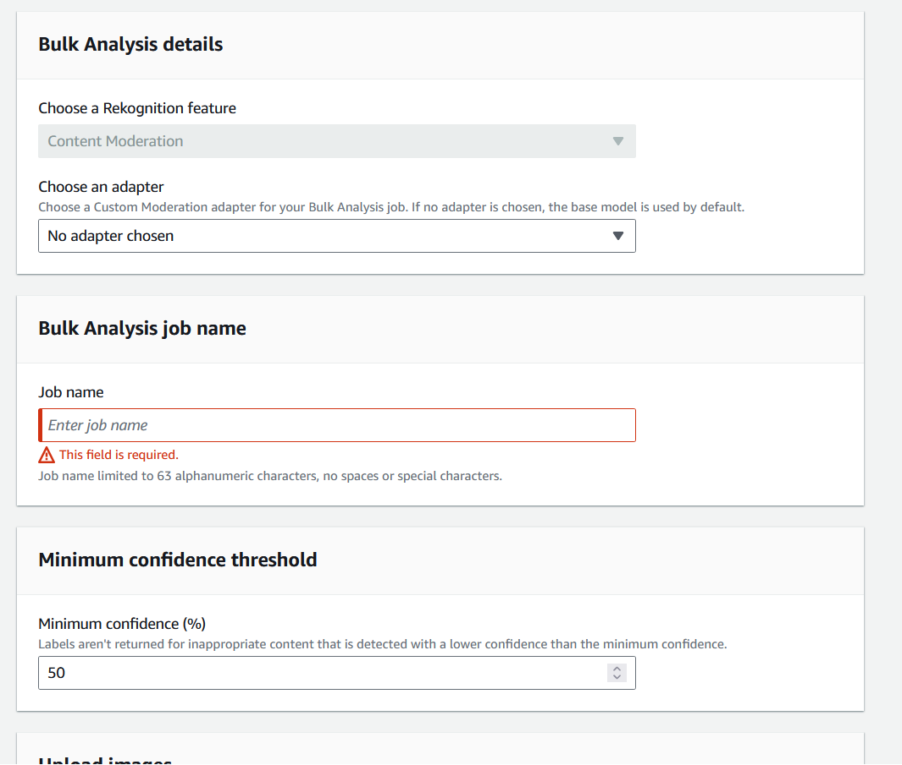 5. In the **Bulk analysis job name**
field, fill in the bulk analysis job name. 6. Choose a value for the **Minimum confidence
threshold**. Label predictions with less than your
chosen confidence threshold won’t be returned. Note that when you’re
evaluating the model’s performance later on, you won’t be able to adjust
the confidence threshold below your chosen minimum confidence threshold. 7. In this step, you’ll also provide the images you want to analyze
with Bulk analysis. These images may also be used to train your
adapter. You can choose **Upload images from
your computer** or **Import images
from Amazon S3 bucket**. If you choose to import your
documents from an Amazon S3 bucket, provide the path to the bucket and
folder that contains your training images. If you upload your
documents directly from your computer, note that you can only upload
50 images at one time. 8. After filling in this information, choose **Start analysis**. This will start the analysis process
using Rekognition’s base model. 9. You can check the status of your Bulk analysis job by checking the Bulk Analysis status of
the job on the main Bulk Analysis page. When the Bulk Analysis status becomes “Succeeded”,
the results of the analysis are ready for review.

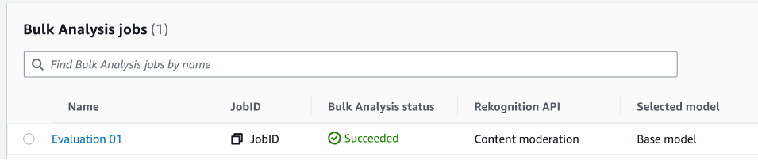 10. Choose the analysis you created from the list of
**Bulk Analysis
jobs**. 11. On the Bulk Analysis details page you can see the predictions that
Rekognition’s base model has made for the images you uploaded. 12. Review the base model’s performance. You can change the confidence
threshold that your adapter must have to assign a label to an image
by using the Confidence threshold slider. The number of Flagged and
Unflagged instances will change as you adjust the confidence
threshold. The Label Categories panel displays the top-level
categories that Rekognition recognizes, and you can select a
category in this list to display any images that have been assigned
that label.

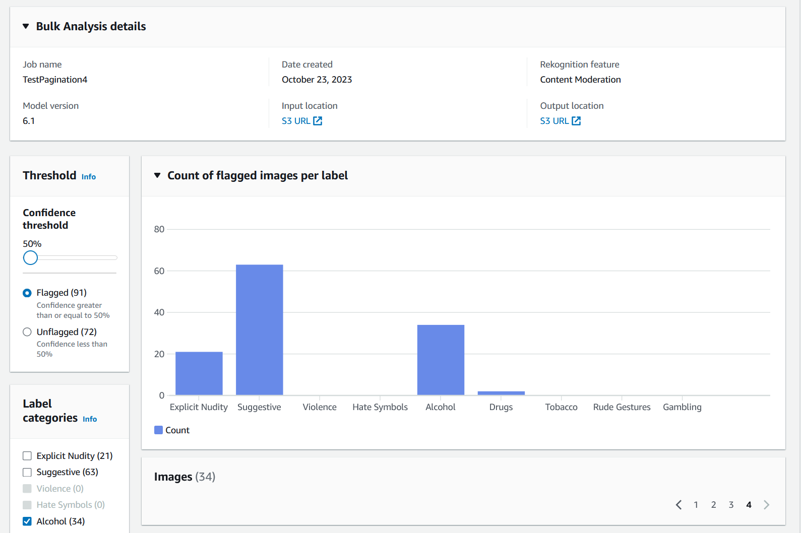

**Verify predictions**

If you have reviewed the accuracy of Rekognition’s base model or a chosen
adapter, and want to improve this accuracy, you can utilize the verification
workflow:

1. After you are finished reviewing the base model performance, you
   will want to verify the predictions. Correcting the predictions will
   allow you to train an adapter. Choose **Verify
   predictions** from the top of the Bulk analysis
   page.

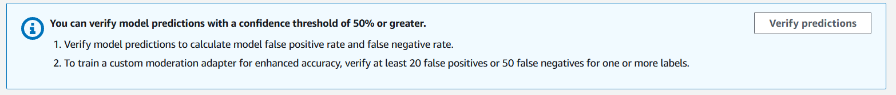 2. On the Verify predictions page, you can see all the images that you provided to Rekognition’s base
model, or a chosen adapter, along with the predicted label for each image. You must verify each
prediction as correct or incorrect using the buttons under the image. Use the “X” button to mark
a prediction as incorrect and the check-mark button to mark a prediction as correct. To train an
adapter you will need to verify at least 20 false-positive predictions and 50 false negative predictions
for a given label. The more predictions you verify, the better the adapter’s performance will be.

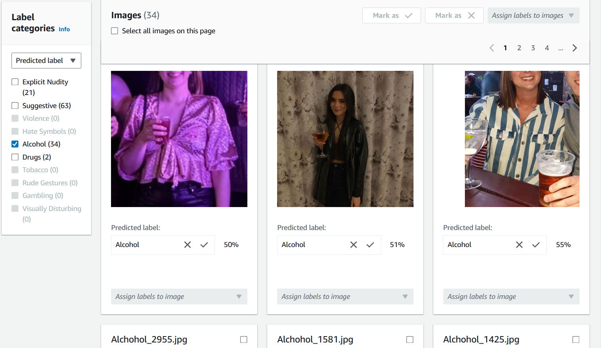

After you verify a prediction, the text below the image will
change to show you the type of prediction you have verified. Once
you have verified an image you can also add additional labels to the
image using the **Assign labels to
image** menu. You can see which images are flagged or
unflagged by the model for your chosen confidence threshold or
filter images by category.

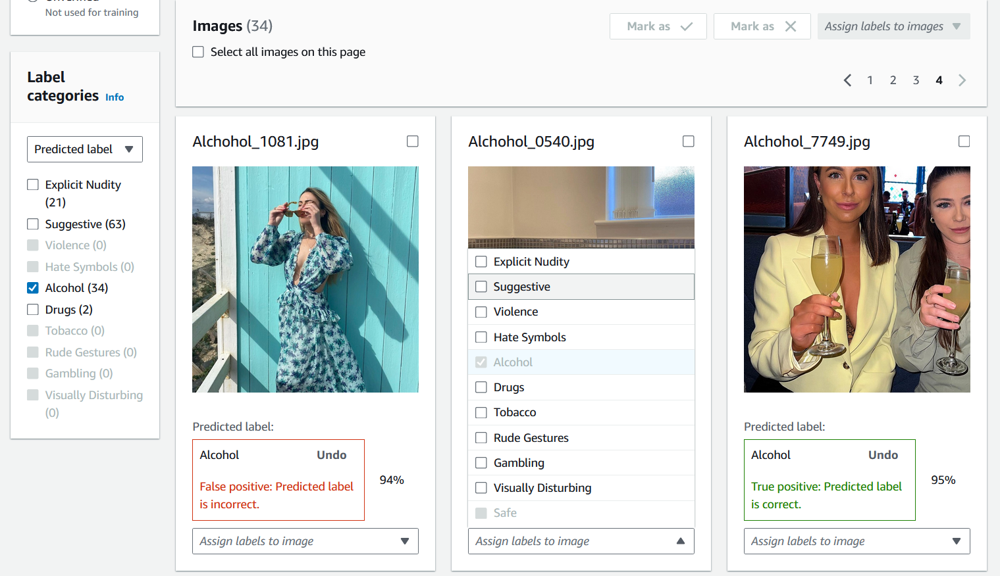 3. Once you have finished verifying all the predictions you want
to verify, you can see statistics regarding your verified
predictions in the **Per label
performance** section of the Verification page. You can
also return to the Bulk analysis details page to view these
statistics.

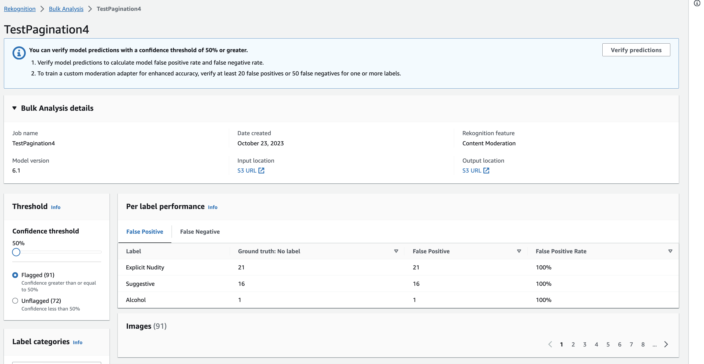 4. When you are satisfied with the statistics regarding the
**Per label performance**, go to
the **Verify predictions** page again
then select the **Train an adapter**
button to begin training your adapter.

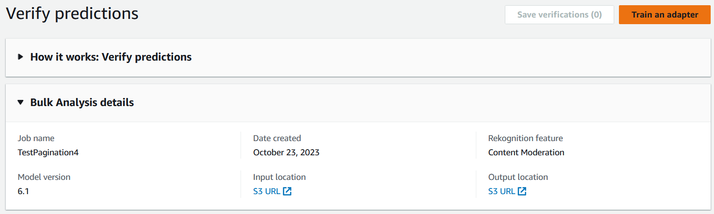 5. On the Train an adapter page you will be prompted to create a
project or choose an existing project. Name the project and the
adapter that will be contained by the project. You must also specify
the source of your test images. When specifying the images you can
choose Autosplit to have Rekognition automatically use a portion of your
training data as test images, or you can manually specify a manifest
file. It’s recommended to choose Autosplit.

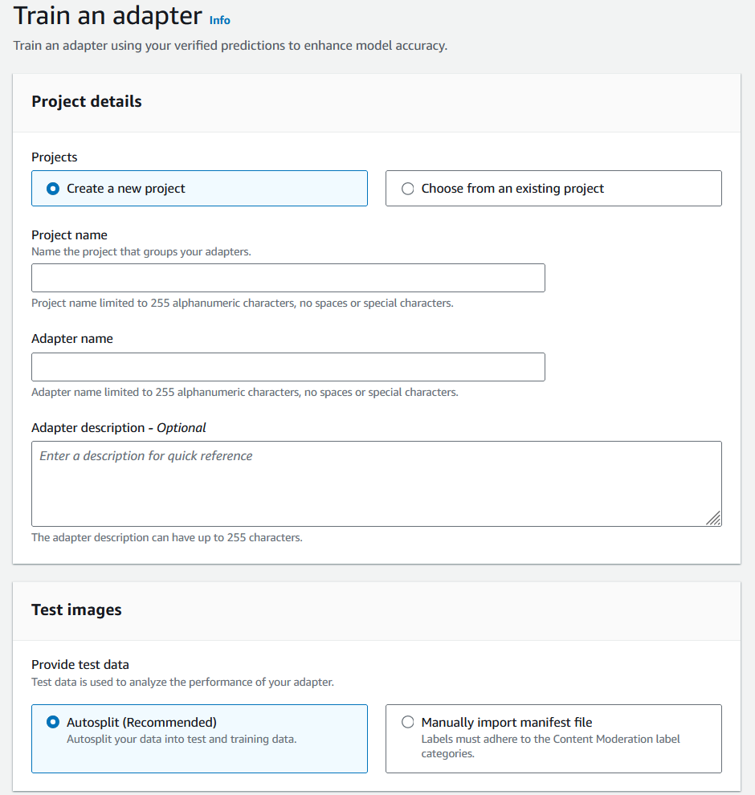 6. Specify any tags you desire, as well a AWS KMS key if you don’t
want to use the default AWS key. It is recommended to leave
**Auto-update** enabled. 7. Choose **Train adapter**.

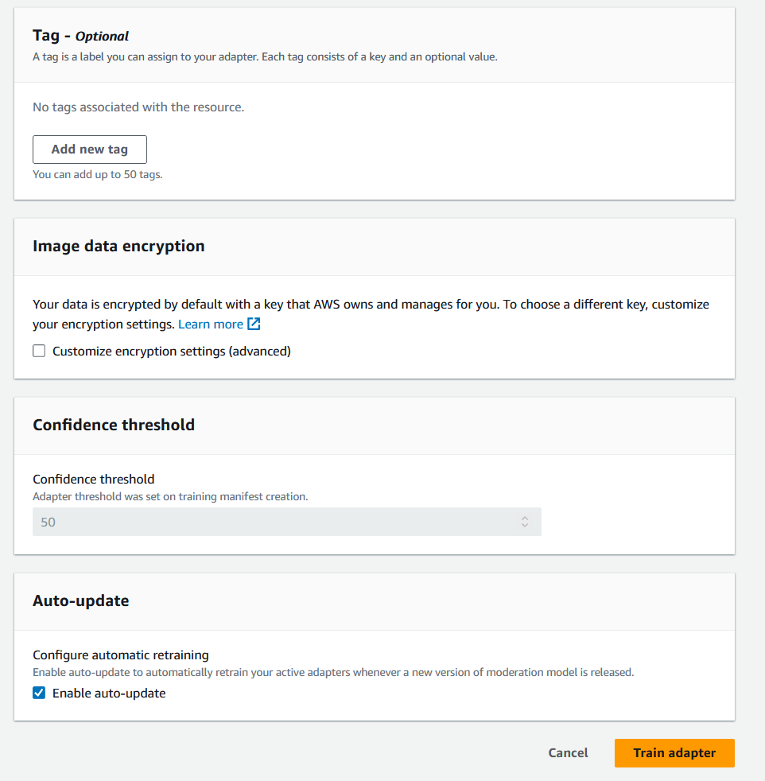 8. Once the status of your adapter on the Custom Moderation
landing page has become "Training complete", you can review your
adapter’s performance. See [Reviewing adapter performance](#using-adapters-tutorial-performance "#using-adapters-tutorial-performance") for more
information.

## Reviewing adapter performance

To review your adapter performance:

1. When using the console, you’ll be able to see the status of any adapters associated with a
   project under the Projects tab on the Custom Moderation landing page.
   Navigate to the Custom Moderation landing page.

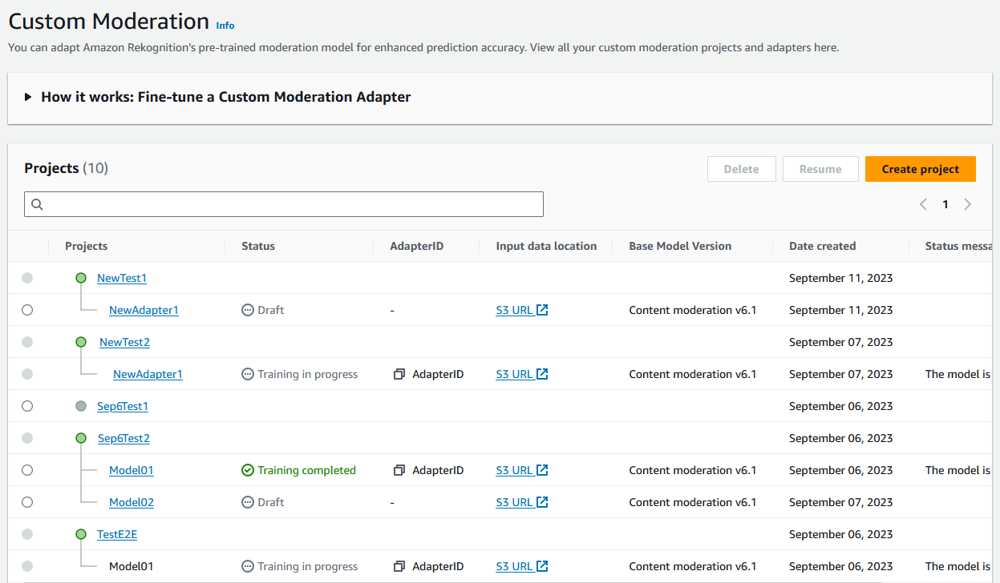 2. Select the adapter you want to review from this list. On the following Adapter details page,
you can see a variety of metrics for the adapter.

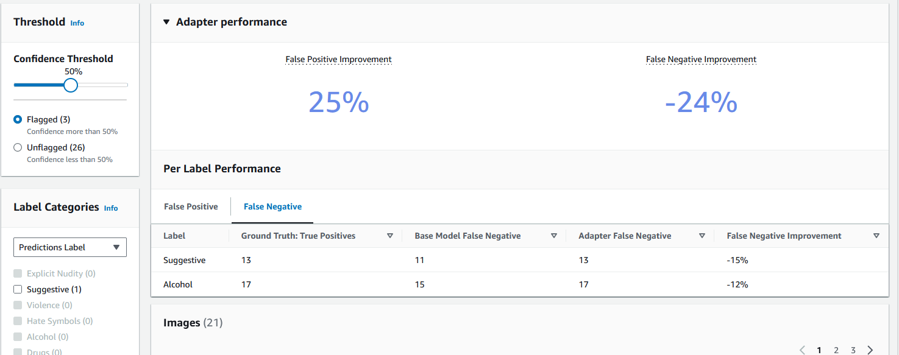 3. With the **Threshold** panel you can change the minimum
confidence threshold that your adapter must have to assign a label to an
image. The number of Flagged and Unflagged instances will change as you
adjust the confidence threshold. You can also filter by label category to
see metrics for the categories you have selected. Set your chosen
threshold. 4. You can assess the performance of your adapter on your test data by examining the metrics in
the Adapter Performance panel. These metrics are calculated by comparing the
adapter's extractions to the "ground truth" annotations on the test set.

The adapter performance panel shows the False Positive Improvement and False
Negative Improvement rates for the adapter that you created. The Per Label
Performance tab can be used to compare the adapter and base model performance on
each label category. It shows counts of false positive and false negative
predictions by both the base model and the adapter, stratified by label category. By
reviewing these metrics you can determine where the adapter needs improvement. For
more information on these metrics, see [Evaluating and improving your adapter](using-adapters-evaluating-improving.md "using-adapters-evaluating-improving.md").

To improve the performance, you can collect more training images and then create a
new adapter based inside of the project. Simply return to the Custom Moderation
landing page and create a new adapter inside of your project, providing more
training images for the adapter to be trained on. This time choose the **Add to an existing project option** instead of **Create a new project**, and select the project you want to
create the new adapter in from the **Project name**
dropdown menu. As before, annotate your images or provide a manifest file with
annotations.

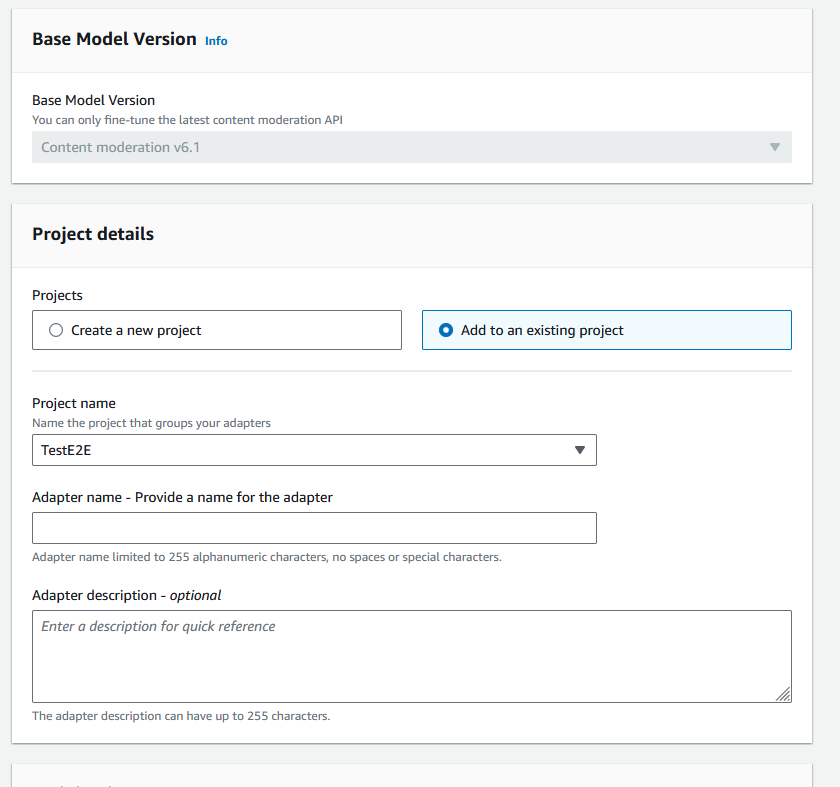

## Using your adapter

After you have created your adapter you can supply it to a supported Rekognition
operation like [DetectModerationLabels](../APIReference/API_DetectModerationLabels.md "../APIReference/API_DetectModerationLabels.md"). To see code samples you can use to carry
out inference with your adapter, select the “Use adapter” tab, where you can see
code samples for both the AWS CLI and Python. You can also visit the
respective section of the documentation for the operation you have created an
adapter for to see more code samples, setup instructions, and a sample JSON.

## Deleting your adapter

and project

You can delete individual adapters, or delete your project. You must delete
each adapter associated with your project before you can delete the project
itself.

1. To delete an adapter associated with the project, choose the adapter
   and then choose **Delete**.
2. To delete a project, choose the project you want to delete and then
   choose **Delete**.
