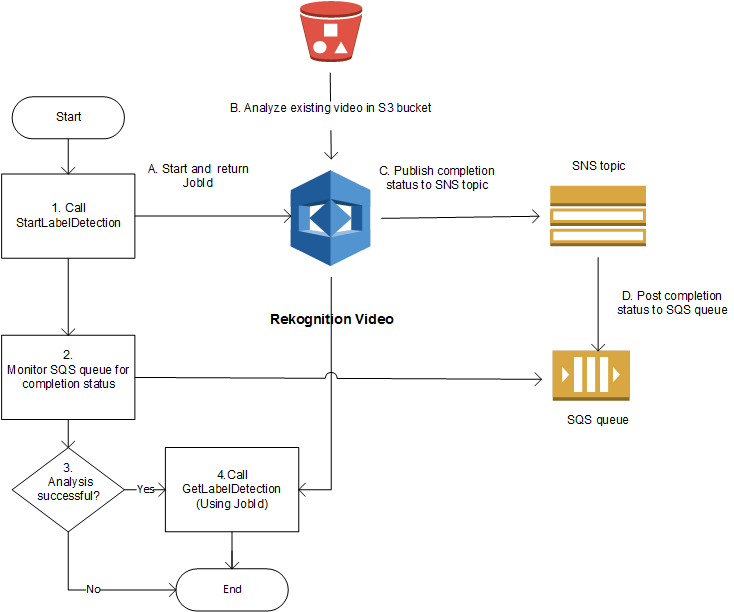

# Working with stored video analysis operations

Amazon Rekognition Video is an API that you can use to analyze videos. With Amazon Rekognition Video, you can detect
labels, faces, people, celebrities, and adult (suggestive and explicit) content in videos
that are stored in an Amazon Simple Storage Service (Amazon S3) bucket. You can use Amazon Rekognition Video in categories such as
media/entertainment and public safety. Previously, scanning videos for objects or people
would have taken many hours of error-prone viewing by a human being. Amazon Rekognition Video automates the
detection of items and when they occur throughout a video.

This section covers the types of analysis that Amazon Rekognition Video can perform, an overview of the
API, and examples for using Amazon Rekognition Video.

###### Topics

- [Types of analysis](#video-recognition-types "#video-recognition-types")
- [Amazon Rekognition Video API overview](#video-api-overview "#video-api-overview")
- [Calling Amazon Rekognition Video operations](api-video.md "api-video.md")
- [Configuring Amazon Rekognition Video](api-video-roles.md "api-video-roles.md")
- [Analyzing a video stored in an Amazon S3
  bucket with Java or Python (SDK)](video-analyzing-with-sqs.md "video-analyzing-with-sqs.md")
- [Analyzing a video with the AWS Command Line Interface](video-cli-commands.md "video-cli-commands.md")
- [Reference: Video analysis results
  notification](video-notification-payload.md "video-notification-payload.md")
- [Troubleshooting Amazon Rekognition Video](video-troubleshooting.md "video-troubleshooting.md")

## Types of analysis

You can use Amazon Rekognition Video to analyze videos for the following information:

- [Video Segments](segments.md "segments.md")
- [Labels](labels.md "labels.md")
- [Suggestive and explicit adult content](moderation.md "moderation.md")
- [Text](text-detection.md "text-detection.md")
- [Celebrities](celebrities.md "celebrities.md")
- [Faces](faces.md "faces.md")
- [People](persons.md "persons.md")

For more information, see [How Amazon Rekognition works](how-it-works.md "how-it-works.md").

## Amazon Rekognition Video API overview

Amazon Rekognition Video processes a video that's stored in an Amazon S3 bucket. The design pattern is an
asynchronous set of operations. You start video analysis by calling a `Start`
operation such as [StartLabelDetection](../APIReference/API_StartLabelDetection.md "../APIReference/API_StartLabelDetection.md"). The completion status of the request is
published to an Amazon Simple Notification Service (Amazon SNS) topic. To get the completion status from the Amazon SNS
topic, you can use an Amazon Simple Queue Service (Amazon SQS) queue or an AWS Lambda function. After you have
the completion status, you call a `Get` operation, such as [GetLabelDetection](../APIReference/API_GetLabelDetection.md "../APIReference/API_GetLabelDetection.md"), to get the
results of the request.

The following diagram shows the process for detecting labels in a video that's stored
in an Amazon S3 bucket. In the diagram, an Amazon SQS queue gets the completion status from the
Amazon SNS topic. Alternatively, you can use an AWS Lambda function.

The process is the same for other Amazon Rekognition Video operations. The following table lists the
`Start` and `Get` operations for each of the non-storage
Amazon Rekognition operations.

| Detection                            | Start Operation                                                                                                                  | Get Operation                                                                                                              |
| ------------------------------------ | -------------------------------------------------------------------------------------------------------------------------------- | -------------------------------------------------------------------------------------------------------------------------- | --------------------------------------------------------------------------------------------------------------------------------------------------------------------------------------------------------------------------------------------------------------------------------------------------------------------------------------------------------------------------------------------------------------------------------------------------------------------------------------------------------------------------------------------------------------------------------------------------------------------------------------------------------------------------------------------------------------------------------------------------------------------------------------------------------------------------------------------------------------------------------------------------------------------------------------------------------------------------------------------------------------------------------------------------------------------------------------------------------------------------------------------------------------------------------------------------------------------------------------------------------------------------------------------------------------------------------------------------------------------------------------------------------------------------------------------------------------------------------------------------------------------------------------------------------------------------------------------------------------------------------------------------------------------------------------------------------------------------------------------------------------------------------------------------------------------------------------------------------------------------------------------------------------------------------------------------------------------------------------------------------------------------------------------------------------------------------------------------------------------------------------------------------------------------------------------------------------------------------------------------------------------------------------------------------------------------------------------------------------------------------------------------------------------------------------------------------------------------------------------------------------------------------------------------------------------------------------------------------------------------------------------------------------------------------------------------------------------------------------------------------------------------------------------------------------------------------------------------------------------------------------------- |
| Video Segments                       | [StartSegmentDetection](../APIReference/API_StartSegmentDetection.md "../APIReference/API_StartSegmentDetection.md")             | [GetSegmentDetection](../APIReference/API_GetSegmentDetection.md "../APIReference/API_GetSegmentDetection.md")             |
| Labels                               | [StartLabelDetection](../APIReference/API_StartLabelDetection.md "../APIReference/API_StartLabelDetection.md")                   | [GetLabelDetection](../APIReference/API_GetLabelDetection.md "../APIReference/API_GetLabelDetection.md")                   |
| Explicit or suggestive adult content | [StartContentModeration](../APIReference/API_StartContentModeration.md "../APIReference/API_StartContentModeration.md")          | [GetContentModeration](../APIReference/API_GetContentModeration.md "../APIReference/API_GetContentModeration.md")          |
| Text                                 | [StartTextDetection](../APIReference/API_StartTextDetection.md "../APIReference/API_StartTextDetection.md")                      | [GetTextDetection](../APIReference/API_GetTextDetection.md "../APIReference/API_GetTextDetection.md")                      |
| Celebrities                          | [StartCelebrityRecognition](../APIReference/API_StartCelebrityRecognition.md "../APIReference/API_StartCelebrityRecognition.md") | [GetCelebrityRecognition](../APIReference/API_GetCelebrityRecognition.md "../APIReference/API_GetCelebrityRecognition.md") |
| Faces                                | [StartFaceDetection](../APIReference/API_StartFaceDetection.md "../APIReference/API_StartFaceDetection.md")                      | [GetFaceDetection](../APIReference/API_GetFaceDetection.md "../APIReference/API_GetFaceDetection.md")                      |
| People                               | [StartPersonTracking](../APIReference/API_StartPersonTracking.md "../APIReference/API_StartPersonTracking.md")                   | [GetPersonTracking](../APIReference/API_GetPersonTracking.md "../APIReference/API_GetPersonTracking.md")                   | For `Get` operations other than `GetCelebrityRecognition`, Amazon Rekognition Video returns tracking information for when entities are detected throughout the input video. For more information about using Amazon Rekognition Video, see [Calling Amazon Rekognition Video operations](api-video.md "api-video.md"). For an example that does video analysis by using Amazon SQS, see [Analyzing a video stored in an Amazon S3 bucket with Java or Python (SDK)](video-analyzing-with-sqs.md "video-analyzing-with-sqs.md"). For AWS CLI examples, see [Analyzing a video with the AWS Command Line Interface](video-cli-commands.md "video-cli-commands.md"). ### Video formats and storage Amazon Rekognition operations can analyze videos that are stored in Amazon S3 buckets. For a list of all limits on video analysis operation, see [Guidelines and quotas in Amazon Rekognition](limits.md "limits.md"). The video must be encoded using the H.264 codec. The supported file formats are MPEG-4 and MOV. A codec is software or hardware that compresses data for faster delivery and decompresses received data into its original form. The H.264 codec is commonly used for recording, compressing, and distributing video content. A video file format can contain one or more codecs. If your MOV or MPEG-4 format video file doesn't work with Amazon Rekognition Video, check that the codec used to encode the video is H.264. Any Amazon Rekognition Video API that analyzes audio data only supports AAC audio codecs. The maximum file size for a stored video is 10GB. ### Searching for people You can use facial metadata that's stored in a collection to search for people in a video. For example, you can search an archived video for a specific person or for multiple people. You store facial metadata from source images in a collection by using the [IndexFaces](../APIReference/API_IndexFaces.md "../APIReference/API_IndexFaces.md") operation. You can then use [StartFaceSearch](../APIReference/API_StartFaceSearch.md "../APIReference/API_StartFaceSearch.md") to start asynchronously searching for faces in the collection. You use [GetFaceSearch](../APIReference/API_GeFaceSearch.md "../APIReference/API_GeFaceSearch.md") to get the search results. For more information, see [Searching stored videos for faces](procedure-person-search-videos.md "procedure-person-search-videos.md"). Searching for people is an example of a storage-based Amazon Rekognition operation. For more information, see [Storage-based API operations](how-it-works-storage-non-storage.md#how-it-works-storage-based "how-it-works-storage-non-storage.md#how-it-works-storage-based"). You can also search for people in a streaming video. For more information, see [Working with streaming video events](streaming-video.md "streaming-video.md"). |
