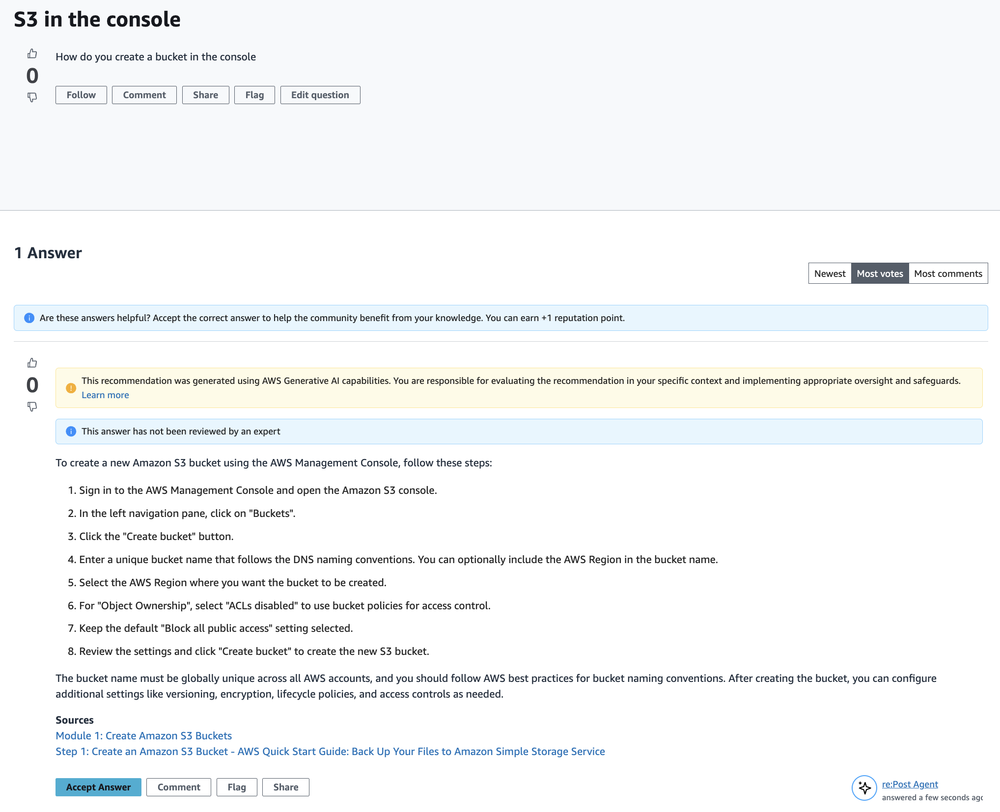

# Get an answer to your question from re:Post Agent

When you wait for the other users in your private re:Post to answer your question, re:Post Agent reviews the question and provides an answer. re:Post Agent is an AI-powered persona that provides the first response to your questions within a few seconds.

###### Note

The AWS generative AI capabilities generate the answer. However, you are responsible for evaluating the recommendation in your specific context and implementing appropriate oversight and safeguards. For more information, see [AWS Responsible AI Policy](https://aws.amazon.com/ai/responsible-ai/policy/ "https://aws.amazon.com/ai/responsible-ai/policy/").

###### Note

re:Post Agent might not generate an answer under the following conditions:

- Your question is related to security or compliance.
- Your question doesn't adhere to the community guidelines.
- re:Post Agent doesn't have enough information to answer the question.
  If the answer that re:Post Agent provided is accurate, you can choose **Accept
  Answer**.

The answer that re:Post Agent generated is displayed under the question.

The following is an example of a re:Post Agent response to a question:

###### Important

re:Post Agent isn't available in Asia Pacific (Singapore) and Europe (Ireland) Regions yet.
