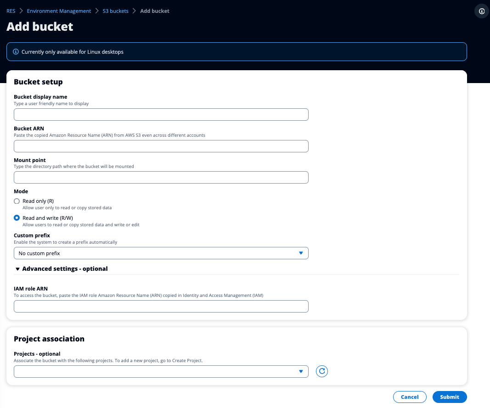

# Add an Amazon S3 bucket

###### To add an S3 bucket to your RES environment:

1. Choose **Add bucket**.
2. Enter the bucket details such as bucket name, ARN, and mount point.

###### Important

    * The bucket ARN, mount point, and mode provided cannot be changed
     after creation.
    * The bucket ARN can contain a prefix which will isolate the onboarded
     S3 bucket to that prefix.

3. Select a mode in which to onboard your bucket.

###### Important

    * See [Data Isolation](S3-buckets-data-isolation.md "S3-buckets-data-isolation.md") for more information
     related to data isolation with specific modes.

4. Under **Advanced Options**, you may provide an IAM role ARN
   to mount the buckets for cross account access. Follow the steps in [Cross account bucket access](S3-buckets-cross-account-access.md "S3-buckets-cross-account-access.md")
   to create the required IAM role for cross account access.
5. (Optional) Associate the bucket with projects, which can be changed later. However,
   an S3 bucket cannot be mounted to a project's existing VDI sessions. Only sessions
   launched after the project has been associated with the bucket will mount the bucket.
6. Choose **Submit**.

