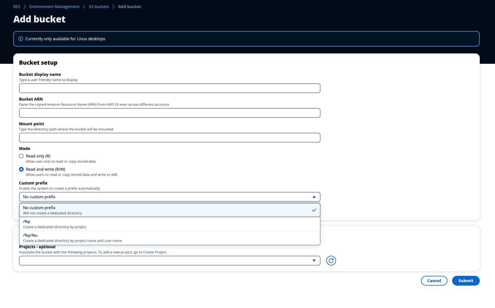

# Data Isolation

When you add an S3 bucket to RES, you have options to isolate the data within the
bucket to specific projects and users. On the **Add Bucket** page,
you can select a mode of Read Only (R) or Read and Write (R/W).

**Read Only**

If `Read Only (R)` is selected, data isolation is enforced based on the
prefix of the bucket ARN (Amazon Resource Name). For example, if an admin adds a bucket
to RES using the ARN
`arn:aws:s3:::`bucket-name``/example-data`/` 
 and associates this bucket with Project A and Project B, then users launching VDIs 
 from within Project A and Project B can only read the data located in 
 ``bucket-name`under the path 
`/example-data``. They will not have access to
data outside of that path. If there is no prefix appended to the bucket ARN, the entire
bucket will be made available to any project associated with it.

**Read and Write**

If `Read and Write (R/W)` is selected, data isolation is still enforced
based on the prefix of the bucket ARN, as described above. This mode has additional
options to allow administrators to provide variable-based prefixing for the S3 bucket.
When `Read and Write (R/W)` is selected, a Custom Prefix section becomes
available that offers a dropdown menu with the following options:

- No custom prefix
- /%p
- /%p/%u

**No custom data isolation**

When `No custom prefix` is selected for **Custom Prefix**,
the bucket is added without any custom data isolation. This allows any projects
associated with the bucket to have read and write access. For example, if an admin
adds a bucket to RES using the ARN
`arn:aws:s3:::`bucket-name``with`No
custom prefix` selected and associates this bucket with Project A and
Project B, users launching VDIs from within Project A and Project B will have
unrestricted read and write access to the bucket.

**Data isolation on a per-project level**

When `/%p` is selected for **Custom Prefix**, data
in the bucket is isolated to each specific project associated with it. The
`%p` variable represents the project code. For example, if an admin adds
a bucket to RES using the ARN
`arn:aws:s3:::`bucket-name``with`/%p`
 selected and a **Mount Point** of`/bucket`, 
 and associates this bucket with Project A and Project B, then User A in Project A can 
 write a file to `/bucket`. User B in Project A can also see 
 the file that User A wrote in `/bucket`. However, if User B 
 launches a VDI in Project B and looks in `/bucket`, they will 
 not see the file that User A wrote, as the data is isolated by project. The file User A 
 wrote is found in the S3 bucket under the prefix `/ProjectA`while User B 
 can only access`/ProjectB` when using their VDIs from Project B.

**Data isolation on a per-project, per-user level**

When `/%p/%u` is selected for **Custom Prefix**, data
in the bucket is isolated to each specific project and user associated with that project.
The `%p` variable represents the project code, and `%u` represents
the username. For example, an admin adds a bucket to RES using the ARN
`arn:aws:s3:::`bucket-name``with`/%p/%u`
 selected and a Mount Point of`/bucket`. This bucket is associated 
 with Project A and Project B. User A in Project A can write a file to 
 `/bucket`. Unlike the prior scenario with only `%p` 
 isolation, User B in this case will not see the file User A wrote in Project A in 
 `/bucket`, as the data is isolated by both project and user. The 
 file User A wrote is found in the S3 bucket under the prefix `/ProjectA/UserA`
 while User B can only access`/ProjectA/UserB` when using their VDIs in Project A.
