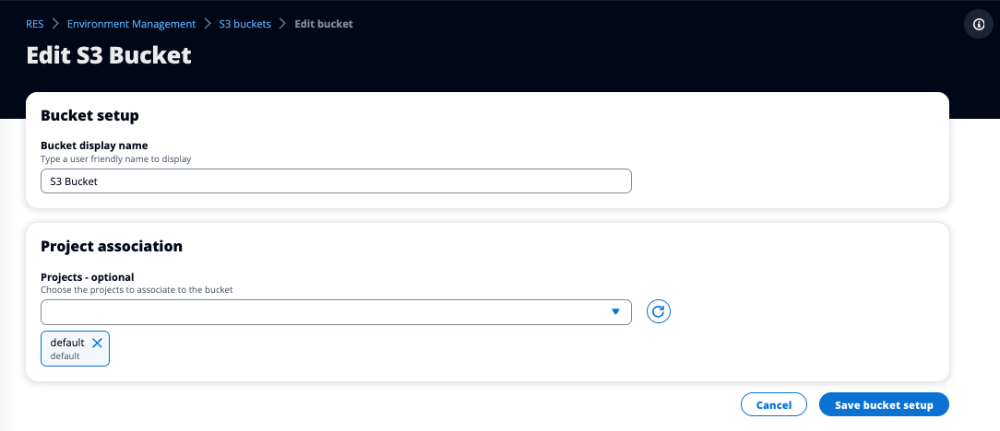

# Edit an Amazon S3 bucket

1. Select an S3 bucket in the S3 buckets list.
2. From the **Actions** menu, select **Edit**.
3. Enter your updates.

###### Important

    * Associating a project with an S3 bucket will **not**
     mount the bucket to that project's existing virtual desktop infrastructure
     (VDI) instances. The bucket will only be mounted to VDI sessions
     launched in a project after the bucket has been associated with that
     project.
    * Disassociating a project from an S3 bucket will not impact the data in the
     S3 bucket, but will result in desktop users losing access to that data.

4. Choose **Save bucket setup**.

