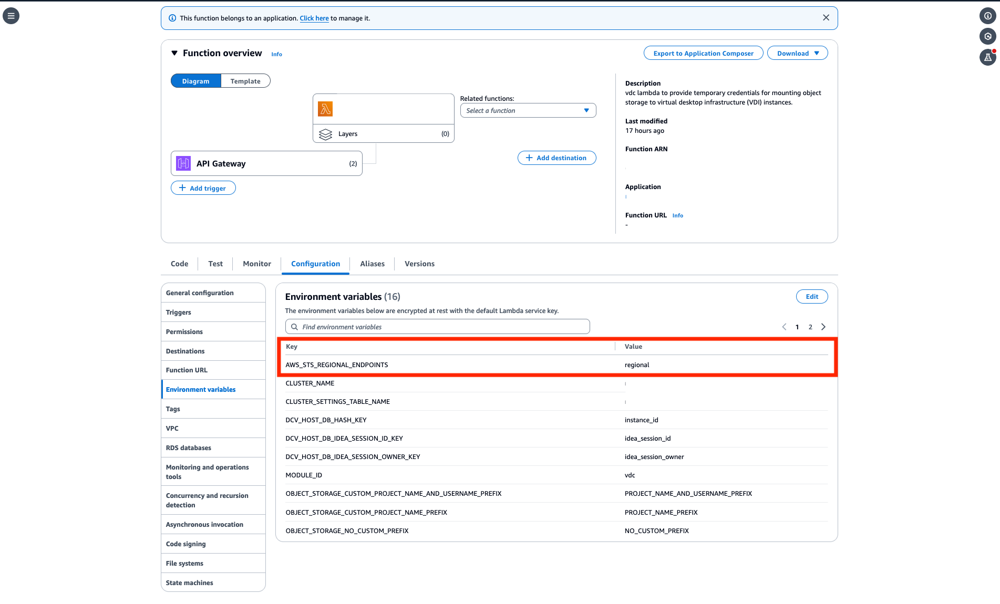

# Amazon S3 bucket prerequisites for isolated VPC deployments

If you're deploying Research and Engineering Studio in an isolated VPC, follow these steps to update the
lambda configuration parameters after you deploy RES in your AWS account.

1. Log into the Lambda Console of the AWS account where Research and Engineering Studio is deployed.
2. Find and navigate to the Lambda function named
   ``<RES-EnvironmentName>`-vdc-custom-credential-broker-lambda`.
3. Select the **Configuration** tab of the function.

 4. On the left hand side, choose **Environment variables**
to view that section. 5. Choose **Edit** and add the following new environment
variable to the function:

    * Key: `AWS_STS_REGIONAL_ENDPOINTS`
    * Value: `regional`

6. Choose **Save**.
